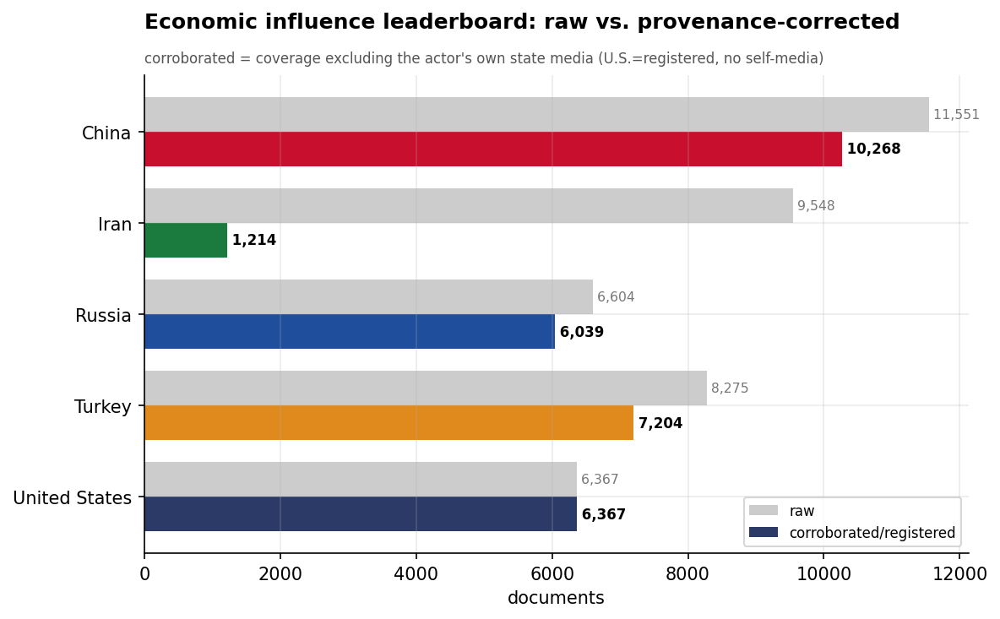
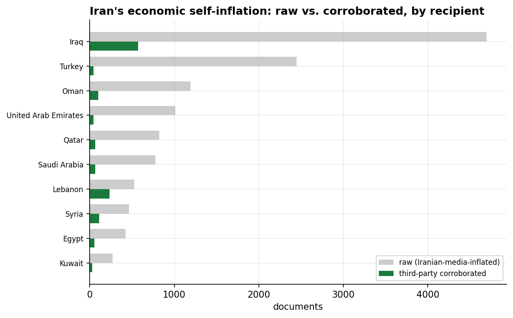
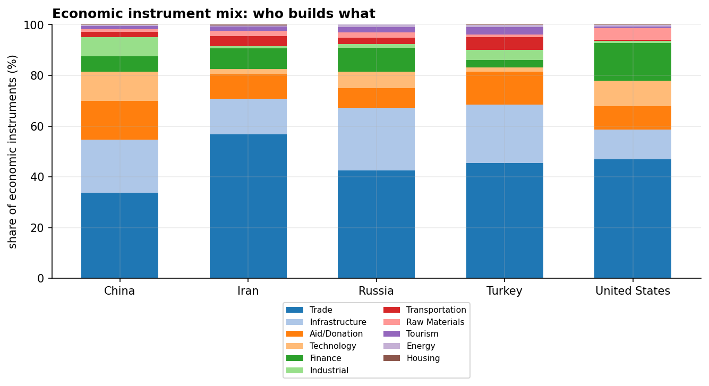
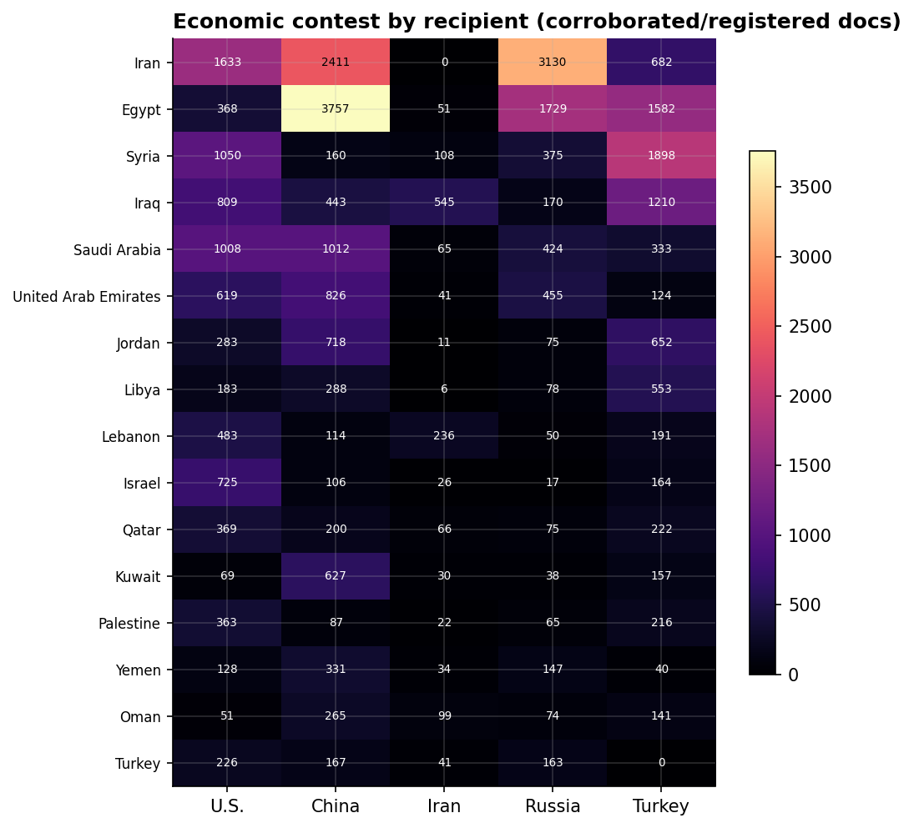

# The Economic Influence Contest in MENA
### A Cross-Actor Category Assessment (China · Iran · Russia · Turkey · United States) — for Policy Analysis

*Observation window: 2024-08-01 to 2026-07-31 (open-source media corpus; refreshed 2026-08-25). Category filter:
**Economic** only — diplomacy and crisis reporting removed to isolate the material competition.
Method and caveats per `docs/INSIGHT_REPORT_PROMPT.md`. Intensity = **third-party-corroborated**
documents (coverage excluding the actor's own state media; the U.S. has no state media in the
corpus, so its figure is **registered coverage**). Confidence: **(H)/(M)/(L)**.*

---

## 1. Key Findings (BLUF)

- **China is the uncontested economic hegemon of MENA.** With 10,268 corroborated economic
  documents — 45% more than the next actor — it leads the economic file in Egypt and across the
  Gulf. No other actor competes on China's breadth of economic instruments. **(H)**
- **Iran's economic influence is a mirage.** Stripping Iranian state media, its economic
  footprint collapses from 9,548 raw documents to **1,214 corroborated — an 87% self-reported
  share**, by far the largest gap of any actor. This is the sanctions effect made visible: Iran
  *narrates* economic activity it cannot *transact*. **(H)**
- **The economic map sorts into three clean lanes:** **China the developer** (Egypt + Gulf),
  **Turkey the reconstructor** (Syria, Iraq, Libya), and **Russia the energy patron** (Iran). The
  U.S. leads no recipient on economics — it registers transactionally, not as a patron. **(H)**
- **The highest-materiality economic events confirm the lanes:** the **China-Egypt $10B
  integrated steel complex**, the **Russia-Iran $25B Hormoz nuclear power plant**, the
  **$216B Saudi-Qatar-Turkey Syria reconstruction** commitment, and **China's $12.75B SCO Tianjin
  package**. **(H)**
- **All five actors lead with Trade, but China alone fields the full toolkit** — Infrastructure
  (4,736), Technology (2,632), Industrial, and Finance — while Russia's economics is narrow
  (trade + nuclear energy) and the U.S.'s tilts to Finance. **(M)**
- **The strategies run on named programs, and they are competing for the same ground.** China's
  **Belt and Road** (Suez Canal Economic Zone, New Administrative Capital, China State Construction),
  Russia's **nuclear + North-South Transport Corridor** (El Dabaa, Bushehr, Rasht-Astara), and
  Turkey's **Development Road** through Iraq amount to **four rival connectivity-corridor visions** —
  the most strategically durable dimension of the contest, and one the dollar figures obscure. The
  U.S. has **no programmatic equivalent** — its economic influence is transactional. **(M)**
- **Caveat that reshapes the read:** arms and defense deals are classified **Military/Sales, not
  Economic**, so U.S. and Russian defense-industrial influence is **undercounted here** — the
  natural next category to run. **(H)**

---

## 2. The Leaderboard: China Dominates, Iran Collapses

On provenance-corrected volume the economic order is **China (10,268) › Turkey (7,204) › United
States (6,367) › Russia (6,039) › Iran (1,214)**. The two extremes are the story. China's lead is
structural and broad. Iran's position — last by a factor of five — is the single most striking
result of the economic filter: in the all-category view Iran appears formidable, but its economic
substance is almost entirely a product of its own media. **(H)**

The mirage is uniform across Iran's recipients: in every economic relationship, raw Iranian-media
volume dwarfs the third-party-corroborated reality. Iran's economic statecraft is, in
externally-validated terms, marginal — a finding the diplomacy-dominated signal completely
obscures. **(H)**

---

## 3. Instrument Mix: Who Builds What

Every actor's economic activity is Trade-anchored, but the composition diverges sharply:

- **China — the full developmental toolkit.** Trade (7,692), Infrastructure (4,736),
  Aid/Donation (3,476), Technology (2,632), Industrial (1,728), Finance (1,339). China is the only
  actor building across the entire value chain — ports, industrial zones, technology, and
  concessional aid simultaneously. **(H)**
- **Russia — narrow, energy-anchored.** Trade and Infrastructure with a thin tail; its economic
  weight comes not from breadth but from a few enormous **energy** projects (the $25B Hormoz
  nuclear plant for Iran; El Dabaa for Egypt) that the subcategory counts understate. **(M)**
- **Turkey — reconstruction-trade.** Trade (4,664), Infrastructure (2,353), Aid (1,342) — an
  instrument set tuned to rebuilding Syria and engaging Iraq/Libya. **(M)**
- **United States — finance-tilted and transactional.** Trade (5,463) with a comparatively heavy
  **Finance** share (1,731) — investment and procurement deals rather than development finance. **(M)**
- **Iran — uniformly thin** across every instrument; nothing it does economically registers at
  scale externally. **(H)**

---

## 4. Recipient Competition: Three Lanes

| Recipient | Economic leader | Corroborated docs | Lane |
|-----------|-----------------|------------------:|------|
| Egypt | **China** | 3,757 | developer |
| Iran | **Russia** | 3,130 | energy patron |
| Syria | **Turkey** | 1,898 | reconstructor |
| Iraq | **Turkey** | 1,210 | reconstructor |
| Saudi Arabia | **China** | 980 | developer |
| UAE | **China** | 817 | developer |
| Jordan | **China** | 674 | developer |
| Kuwait | **China** | 622 | developer |

- **China owns the development file** — Egypt and the entire Gulf, plus Jordan. It is the economic
  patron of the Arab world's wealthiest and most strategically central states. **(H)**
- **Russia owns Iran's economy** — the $25B Hormoz nuclear deal anchors a sanctions-era energy
  partnership no Western actor can contest. **(H)**
- **Turkey owns reconstruction** — Syria above all, where its economic weight is reconstruction-led
  and tied to the $216B Saudi-Qatar-Turkey commitment. **(M)**
- **The U.S. leads no recipient economically.** Its economic presence is transactional (finance,
  procurement) and does not amount to patronage of any single state — the clearest evidence of the
  "U.S. security + Chinese capital" division of labor in the Gulf. **(H)**

*August 2026 (now in-window) and September post-window note (corpus extends to 2026-09-09):
August's economic story is **Chinese capital in the Hashemite core** — King Abdullah II's Beijing
state visit (24 bilateral agreements) and the **SDIC 28% stake in Arab Potash Company** lifted
China→Jordan to 705 corroborated docs and Jordan into China's #3 recipient slot; Turkey→Egypt set
a third consecutive record (48 → 94 → 151 corroborated docs Jun→Aug); Iran's one substantive
economic item remains the Shalamcheh–Basra railway; the China→Iraq pipeline pause kept easing
(26 → 28) with still no new headline project. The September post-window opens with **Xi's Egypt
state visit**, whose substantive economic deliverable is the **third-phase expansion of the
Chinese-Egyptian (Suez) industrial zone** (242 articles, materiality 8.0).*

---

## 5. The Megadeals

The highest-materiality economic events name the competition concretely:

| Deal | Actor | Scale |
|------|-------|-------|
| Integrated Steel Production Complex, Egypt | China | $10B |
| Hormoz Nuclear Power Plant, Iran | Russia | $25B |
| Syria Reconstruction (w/ Saudi Arabia, Qatar) | Turkey | $216B |
| SCO Tianjin investment package | China | $12.75B |
| Suez Canal Economic Zone (Xinyi solar glass; green chemical; contracts) | China | $0.5–1B each |
| Gaza Peace Council reconstruction commitment | United States | $10B |

China's megadeals are industrial and developmental (steel, the Suez Canal Economic Zone cluster of
solar-glass, green-chemical, and pipe factories); Russia's are energy-strategic (the $25B Hormoz
nuclear plant); Turkey's are reconstruction; the U.S.'s largest economic commitment is Gaza
*reconstruction aid* rather than commercial investment. The materiality data reinforces the lanes.
**(H)**

---

## 6. The Initiatives Driving the Strategies

Behind the volume counts are concrete, named programs. Each actor's economic strategy is carried by
a distinct portfolio of flagship projects, implementing organizations, and multilateral frameworks.

### China — the Belt and Road developer
China's economic statecraft is the most **programmatic** of the five. It runs through an explicit
framework stack — the **Belt and Road Initiative**, the **Shanghai Cooperation Organization**, the
**Forum on China-Africa Cooperation (FOCAC)**, and the industrial-policy banner **"Made in China
2025"** — executed by state champions, above all **China State Construction Engineering Corporation**
and **TEDA** (the Tianjin zone operator). Its flagship physical assets cluster in Egypt: the
**Suez Canal Economic Zone** (an industrial park hosting Chinese solar-glass, green-chemical, and
pipe factories), the **New Administrative Capital** (China is building Egypt's new seat of
government), and Gulf ports such as **Mubarak Al-Kabeer Port** in Kuwait. The strategy is integrated:
build the zone, finance the factories, supply the technology, and wrap it in a multilateral forum.
**(H)**

### Russia — nuclear lock-in plus the North-South Corridor
Russia's economics is **narrow but strategically sticky**, organized around two pillars. The first
is **civil nuclear power** — **El Dabaa** (Egypt, Rosatom-built), **Bushehr** (Iran), and the new
**$25B Hormoz** plant (Iran) — multi-decade dependencies that bind recipients to Moscow far beyond
any news cycle, implemented by **Rosatom** (CEO Alexey Likhachev) with contractors **Stroytransgaz**
and **Titan-2 Holding**. The second is **connectivity**: the **North-South Transport Corridor
(INSTC)** and its missing link, the **Rasht-Astara Railway** (Russia-Iran), plus a **Russian
Industrial Zone** in the Suez Economic Zone and the **Eurasian Economic Union** framework. The logic
is sanctions-resilient: energy lock-in and an overland corridor that bypasses Western-controlled
sea lanes. **(H)**

### Turkey — corridors, reconstruction, and national champions
Turkey's economic vehicle set is tuned to **trade corridors and post-conflict rebuilding**. Its
signature program is the **Development Road Project** — the ~$17B Iraq corridor from Basra to the
Turkish border, an explicit competitor to both the INSTC and the Suez route. In Syria it leads
reconstruction nodes such as **Damascus International Airport**, and it advances national champions
like the EV maker **TOGG** and conglomerate **Eroglu Global Holding**, coordinated through bilateral
**High-Level Strategic Cooperation Council** mechanisms and the **Organization of Islamic
Cooperation**. **(M)**

### United States — transactional, not programmatic
The U.S. has **no flagship development framework** in MENA. Its top economic-context entities are
multilateral bodies it works *through* (UN, EU, GCC) and access infrastructure like the **Rafah
Crossing** and the **Iraq-Turkey oil pipeline** — not American-built projects. U.S. economic
influence is **deal-by-deal** (Gulf investment and procurement) rather than a coherent
build-and-finance program; there is no U.S. counterpart to the Belt and Road. **(H)**

### Iran — the mirage's blueprint
What Iran *claims* reveals its intended strategy even where execution is absent: connectivity to the
Shia neighborhood via the **Shalamcheh-Basra Railway** (Iran-Iraq) and the **Khosravi/Mehran border
crossings**, participation in the **North-South Corridor** through **Rasht-Astara** (dependent on
Russia), and multilateral framing via the **Economic Cooperation Organization** and **D-8**. With
its economic footprint 87% self-reported, however, these are largely aspirational — a blueprint
narrated more than built. **(M)**

### The deeper pattern: four rival connectivity corridors
The initiatives resolve into a **contest over how trade physically moves through the region**:
China's **maritime Belt and Road** anchored on the Suez Canal Economic Zone; the Russia-Iran
**North-South Transport Corridor** (Rasht-Astara) bypassing Western sea lanes; Turkey's
**Development Road** through Iraq; and Iran's aspirational rail links into Iraq. Egypt's Suez Zone is
the one node where China *and* Russia both build. The corridor competition — not the headline dollar
figures — is the most strategically durable dimension of the economic contest. **(M)**

---

## 7. Data Gaps & Coverage Priorities

- **Arms are missing by construction.** Defense and arms deals are tagged **Military/Sales**, not
  Economic — so the U.S. (e.g., the US-Qatar $96B aircraft agreement) and Russia are
  systematically **undercounted** in this slice. The economic picture is *civilian* economic
  influence; **run the Military category next** to capture the defense-industrial competition.
- **Announced ≠ committed.** All dollar figures are media-reported announcements. **AidData (China
  GCDF) was checked** for direct corroboration of reported Chinese projects (TEDA/Suez Canal
  Economic Zone): reported 2024+ projects exist, but **no clean record-level match** (same project,
  financier, value) could be confirmed in-window, so AidData is **omitted** rather than loosely
  cited. Disbursement tracking against announced megadeals is the key collection gap.
- **Iran's mirage is a monitoring metric.** The 87% self-report gap is a clean gauge of the
  distance between Iran's economic rhetoric and reality; watch whether sanctions relief narrows it.
- **The Gulf hedge is the strategic headline.** China is the economic patron of the same Gulf
  states the U.S. anchors on security — the most consequential pattern the economic lens exposes.

---

*Visuals plot corroborated/registered economic coverage; underlying numbers in sibling CSVs under
`assets/`. Derived artifact `analytics.subcat_clean` (instrument-label normalization) documented in
`docs/reports/_derived/manifest.md`. Cross-actor synthesis: [`../../README.md`](../../README.md).
First in a per-category series; **Military next** (to capture arms/defense).*
