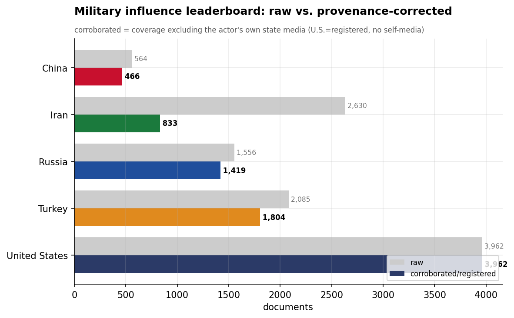
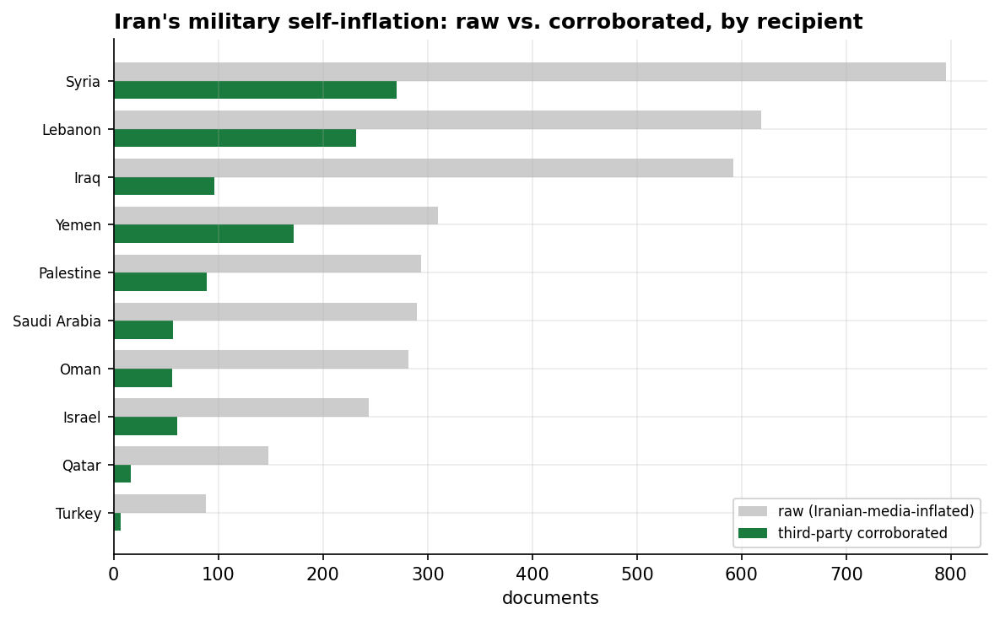
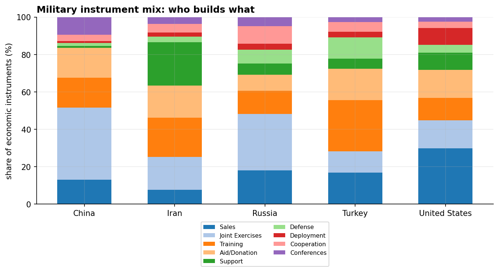
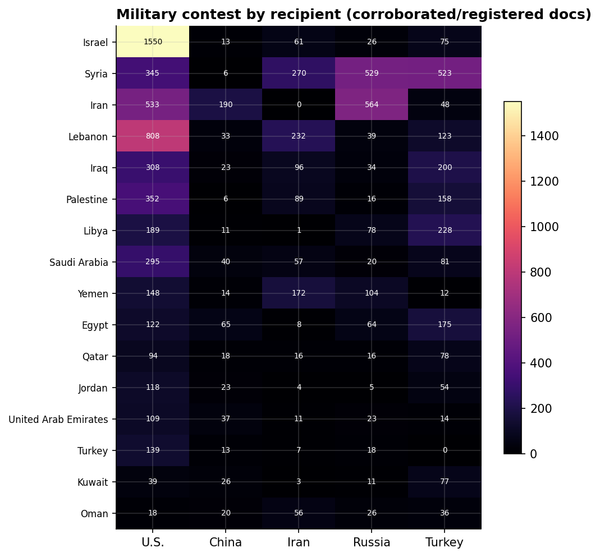
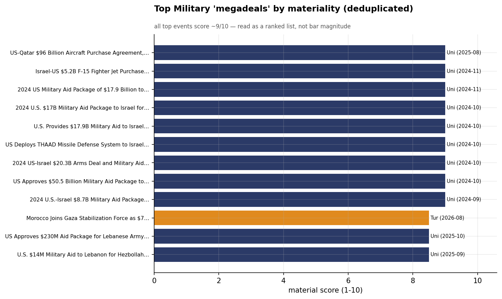

# The Military Influence Contest in MENA
### A Cross-Actor Category Assessment (China · Iran · Russia · Turkey · United States) — for Policy Analysis

*Observation window: 2024-08-01 to 2026-07-31 (open-source media corpus; refreshed 2026-08-25). Category filter:
**Military** only — arms sales, defense diplomacy, joint exercises, training, basing, and
security partnerships. Method/caveats per `docs/INSIGHT_REPORT_PROMPT.md`. Intensity =
**third-party-corroborated** documents (U.S. = registered coverage; no state media in corpus).
Confidence: **(H)/(M)/(L)**.*

> **Companion to the Economic report.** Together the two categories reveal a clean division of
> labor: in MENA, **the United States supplies security and China supplies capital.** China was the
> economic hegemon and near-absent militarily; the United States is the military hegemon and a
> transactional economic player. The Gulf hedges between them.

---

## 1. Key Findings (BLUF)

- **The United States is the military-influence hegemon of MENA** — 3,917 registered documents,
  more than double the next actor (Turkey 1,669, Russia 1,402, Iran 816, China 454). Where China
  dominates the economic file, the U.S. dominates the security file. This is the single most
  important cross-category finding. **(H)**
- **U.S. military influence runs on arms, aid, and missile defense** — the **US-Qatar $96B** and
  **Qatar $90B Boeing** aircraft agreements, the **$17.9B 2024 military aid package to Israel**, the
  **$5.2B F-15** sale, and **THAAD/Patriot** missile-defense deployments to Israel and Kuwait. **(H)**
- **Iran's military influence is its proxy network, not arms exports.** Even after provenance
  correction, Iran's footprint concentrates on **Lebanon (Hezbollah)** and **Yemen (Houthis)**,
  executed through the **IRGC-Quds Force** and **Popular Mobilization Forces** in Iraq — asymmetric
  influence the soft-power lens only partly captures. **(H)**
- **Russia's military influence is basing-and-client-defense** — anchored on the **Tartus Naval
  Base** in Syria and arms/defense ties to **Iran and Syria**, the two recipients it leads. **(M)**
- **Turkey is a defense-diplomacy exporter** — leading the military file in **Libya, Iraq, Egypt,
  and Palestine**, advancing **Bayraktar TB2 drones** and Ministry-of-Defense partnerships. **(M)**
- **China is militarily absent** — just 454 documents, confined to symbolic **PLA Navy** port
  calls. China deliberately does not compete for security influence, the mirror of its economic
  dominance. **(H)**

---

## 2. The Leaderboard: the U.S. Mirror Image of China

On provenance-corrected volume the military order is **United States (3,917) › Turkey (1,669) ›
Russia (1,402) › Iran (816) › China (454)**. This is almost the exact inverse of the economic
leaderboard, where China led and the U.S. trailed. The two categories together are the headline:
**the U.S. and China occupy opposite poles of the influence spectrum** — security vs. capital —
and the region's states engage both. **(H)**

Iran again shows a self-reporting gap (raw 2,584 → 816 corroborated, ~68%), though smaller than its
economic mirage — its military activity draws more independent coverage because its proxies are
genuinely consequential. **(M)**

---

## 3. Instrument Mix: Arms, Exercises, Training, Basing

The genuinely military instruments — **Sales, Joint Exercises, Training, Support, Defense, and
Deployment** — distribute differently by actor: the U.S. and Turkey lean on **Sales** and
**Training/Exercises** (the exporter/partner model), Russia on **Deployment/Support** (basing and
client defense), and Iran on **Support** to proxies. China's sliver is exercises and port calls. **(M)**

---

## 4. Recipient Competition: Security Clients and Proxy Theaters

| Recipient | Military leader | Corroborated docs | Read |
|-----------|-----------------|------------------:|------|
| Iran | **Russia** | 563 | client defense (nuclear/arms) |
| Syria | **Russia** | 529 | Tartus basing + regime support |
| Lebanon | **Iran** | 232 | Hezbollah |
| Libya | **Turkey** | 224 | defense diplomacy + drones |
| Iraq | **Turkey** | 194 | + Iran's PMF |
| Yemen | **Iran** | 171 | Houthis |
| Egypt | **Turkey** | 161 | defense outreach |
| Palestine | **Turkey** | 158 | Gaza |

*(The U.S., excluded from the four-actor leader table for basis consistency, would lead Israel and
the Gulf states by a wide margin on registered coverage — its dominance is in the partner/ally
theaters.)*

- **Russia owns the Iran-Syria security axis** — the same two states it anchors economically (nuclear
  energy), now reinforced by Tartus basing. **(H)**
- **Iran owns the proxy theaters** — Lebanon and Yemen, the Hezbollah and Houthi fronts. **(H)**
- **Turkey is the broad defense-diplomacy player** — leading more recipients than any rival except
  via drones and MoD partnerships. **(M)**

---

## 5. The Megadeals

The highest-materiality military events are overwhelmingly American and transactional: the
**US-Qatar $96B aircraft agreement**, **Qatar's $90B Boeing** purchase, the **$17.9B U.S. military
aid package to Israel**, the **$5.2B Israel-US F-15** sale, and repeated **THAAD deployments to
Israel** amid the Iran confrontation. Iran's headline military events are demonstrations
(**IRGC "Promise of Truth" missile** exercises) rather than transactions — capability signaling, not
commerce. **(H)**

---

## 6. The Initiatives Driving the Strategies

### United States — arms, aid, and the security umbrella
The U.S. fields the most complete security architecture: **missile defense** (THAAD batteries to
Israel, Patriot to Kuwait), **fighter and aircraft sales** (F-15, F-35, the $96B Qatar deal),
**military aid** ($17.9B to Israel), **partner forces** (the **Syrian Democratic Forces**, the
**Lebanese Army**), and the **U.S. Central Command** as the integrating institution. This is the
defense-industrial and security-guarantee influence the Economic report could not see. **(H)**

### Russia — basing and client defense
Russia's military influence rests on the **Tartus Naval Base** in Syria — its only Mediterranean
naval foothold — plus arms and defense cooperation with **Iran** and **Syria**. It is narrow and
asset-anchored, the security complement to its nuclear-energy economics. **(M)**

### Iran — the Axis of Resistance
Iran projects through **non-state proxies**: **Hezbollah** (Lebanon), the **Houthis** (Yemen), and
the **Popular Mobilization Forces** (Iraq), directed by the **IRGC-Quds Force**, with **Shahed
drones** and ballistic-missile demonstrations as signature capabilities. This asymmetric network is
Iran's real military influence — and it sits largely outside the "soft-power" frame, so even these
counts understate it. **(H)**

### Turkey — defense exports and diplomacy
Turkey advances **Bayraktar TB2 drones** and Ministry-of-Defense partnerships across Libya, Iraq,
Egypt, and the Gulf — a rising defense-industrial exporter using hardware sales and training as
influence instruments. **(M)**

### China — deliberately absent
China's military presence is symbolic **PLA Navy** port calls. Its near-total absence from the
security file is a strategic choice: it lets the U.S. and Russia carry security risk while it
captures the economic returns. **(H)**

---

## 7. Data Gaps & Coverage Priorities

- **The proxy network is under-captured.** Iran's most consequential military influence — Hezbollah,
  the Houthis, the PMF, IRGC-Quds operations — is only partially visible in an open-source
  soft-power corpus. **Pair with proxy/IRGC reporting** for the true picture.
- **Hard-power deployments sit at the edge of the lens.** Russian basing (Tartus), U.S. force
  posture (CENTCOM), and actual combat operations are reported only where they intersect
  influence/diplomacy. This is *security influence*, not order-of-battle.
- **The U.S.–China division of labor is the strategic headline.** Across Economic + Military, the
  same Gulf states buy **American security and Chinese capital simultaneously** — the central
  hedging dynamic for U.S. policymakers to manage.
- **Announced ≠ delivered.** Arms-deal dollar figures ($96B Qatar, $17.9B Israel) are reported
  commitments; track deliveries and end-use.
- **August 2026 (in-window) / September post-window note:** the U.S.–Iran de-escalation arc
  (June ceasefire MOU → July "Nuclear Disarmament Talks" → August Strait-of-Hormuz rounds)
  keeps shifting the military file toward diplomacy. August's structural item is the **Mecca
  Joint Defense Agreement** (52 articles, corroboration 1.00) — Turkey, Saudi Arabia
  and Pakistan formalizing their defense triangle, the first new multilateral defense
  instrument in the corpus since the window opened. Watch U.S. force-posture coverage
  (THAAD/Patriot) for knock-on effects in Q4.

---

*Visuals plot corroborated/registered military coverage; underlying numbers in sibling CSVs under
`assets/`. Reuses `analytics.subcat_clean` (instrument normalization). Cross-actor synthesis:
[`../../README.md`](../../README.md). Second in the per-category series (after **Economic**).*
