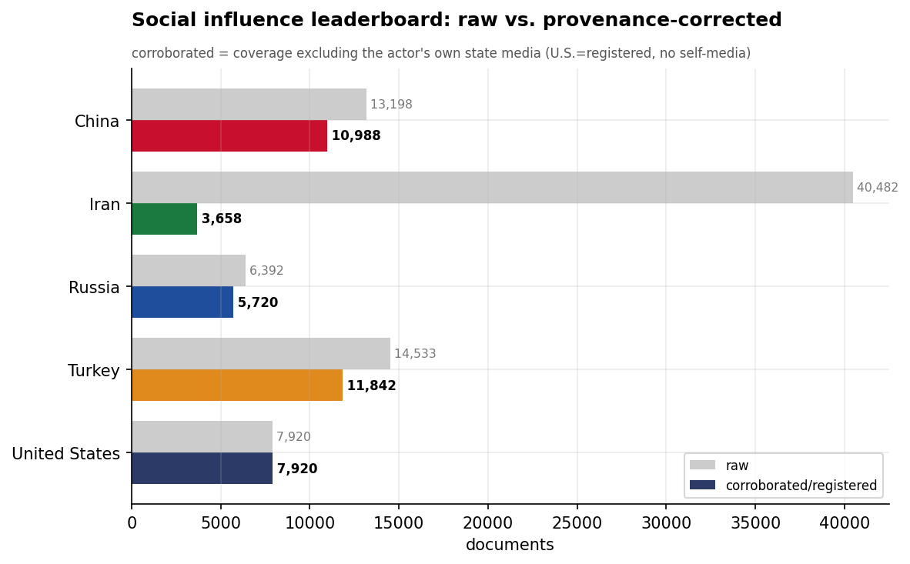
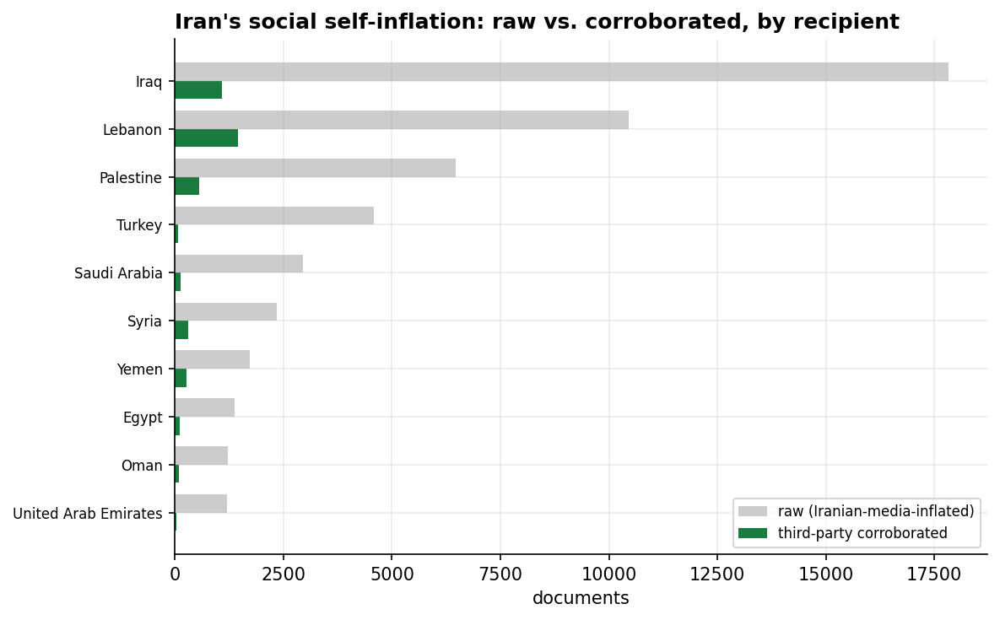
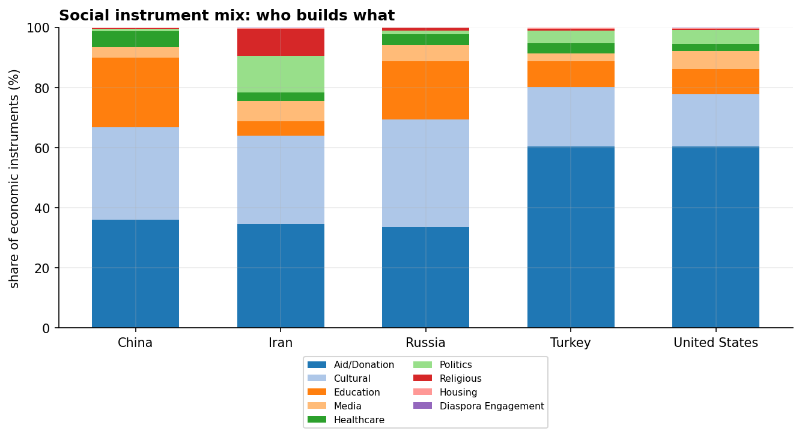
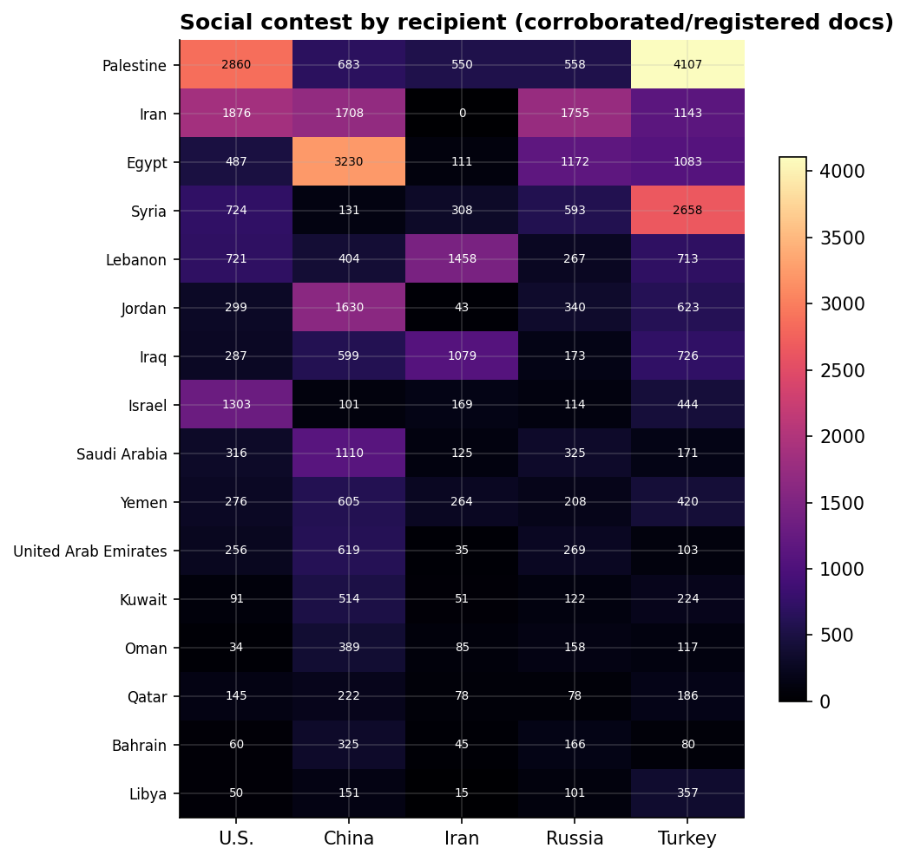
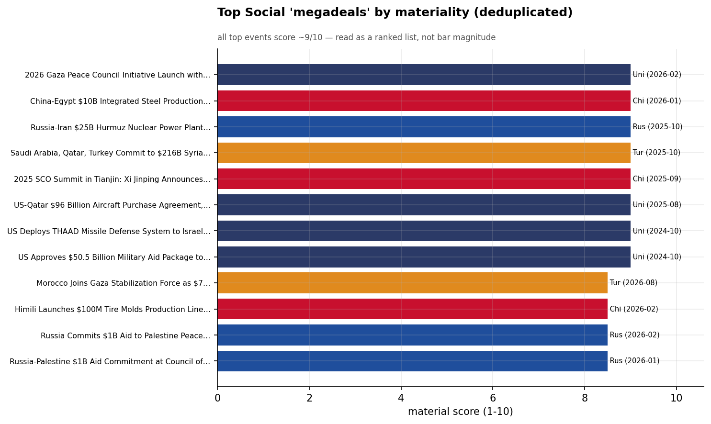

# The Social & Cultural Influence Contest in MENA
### A Cross-Actor Category Assessment (China · Iran · Russia · Turkey · United States) — for Policy Analysis

*Observation window: 2024-08-01 to 2026-07-31 (open-source media corpus; refreshed 2026-08-25). Category filter:
**Social** only — cultural diplomacy, humanitarian aid, education, religion, media, and health.
Method/caveats per `docs/INSIGHT_REPORT_PROMPT.md`. Intensity = **third-party-corroborated**
documents (U.S. = registered coverage). Confidence: **(H)/(M)/(L)**.*

> **Third in the per-category series** (after Economic and Military). The economic and military
> reports found single hegemons (China; the U.S.). Social is the category where **Turkey** leads —
> the only actor fielding a complete cultural-diplomacy apparatus — and where **Iran's
> self-narration reaches its extreme.**

---

## 1. Key Findings (BLUF)

- **Turkey is the social and cultural-influence leader in MENA** — 11,528 corroborated documents,
  ahead of China (10,318), the U.S. (7,822), Russia (5,625), and Iran (3,493). It is the only actor
  operating the **full soft-power toolkit**: an aid agency, cultural institutes, schools, and a
  religious-affairs arm. **(H)**
- **Iran's social influence is the largest mirage in the entire dataset.** Its raw social footprint
  — 38,890 documents, its single biggest category — collapses to **3,493 corroborated, a 91%
  self-reported share.** Even in religion and humanitarian aid, the instruments Iran leans on most,
  its externally-validated reach is small. **(H)**
- **Turkey's apparatus is institutional and named:** **TIKA** (development aid), the **Yunus Emre
  Institutes** (culture/language), the **Maarif Foundation** (schools), and **Diyanet** (religious
  affairs), amplified through the **Organization of Islamic Cooperation** and Gaza-solidarity
  vehicles (the **Freedom Flotilla**). **(H)**
- **Iran's social strategy is confessional** — the **Iranian Red Crescent Society** (1,134 mentions)
  for humanitarian reach and the **Hajj/Pilgrimage Organization** and **Arbaeen** logistics for
  religious solidarity, concentrated on Lebanon and Iraq. **(M)**
- **China leans on cultural-education** (Confucius Institutes, scholarships) tied to its economic
  presence, leading the Gulf and Egypt; **the U.S.'s social footprint is Gaza humanitarian aid**;
  **Russia's is thin** and project-tied. **(M)**
- **The category splits Cultural + Aid + Education** — these three subcategories carry the vast
  majority of social influence; religion and media are secondary in volume (though central to
  Iran's and Turkey's strategies). **(M)**

---

## 2. The Leaderboard: Turkey Leads, Iran's Mirage Peaks

On corroborated volume the social order is **Turkey (11,528) › China (10,318) › United States (7,822)
› Russia (5,625) › Iran (3,493)**. Two findings stand out. First, **Turkey** — not the economic or
military hegemon — leads here, because social/cultural influence is its comparative advantage.
Second, **Iran**: in the all-category and raw views Iran's social activity looks enormous, but it is
**91% self-reported**, the widest provenance gap of any actor in any category. Iran *narrates* a vast
religious-humanitarian presence that the outside world corroborates only thinly. **(H)**

---

## 3. Instrument Mix: Culture, Aid, Education

Social influence runs overwhelmingly on three instruments — **Cultural**, **Aid/Donation**, and
**Education** — with Religious, Media, Healthcare, and Politics as secondary channels. Turkey and
Iran are distinguished by their heavier **Religious** weighting (Diyanet/OIC for Turkey; Hajj/Arbaeen
for Iran), while China's social activity is **education-and-culture** (Confucius Institutes,
scholarships) and the U.S.'s is **aid** (Gaza humanitarian). **(M)**

---

## 4. Recipient Competition

| Recipient | Social leader | Corroborated docs | Read |
|-----------|---------------|------------------:|------|
| Palestine | **Turkey** | 4,030 | Gaza solidarity + humanitarian |
| Egypt | **China** | 3,099 | cultural-education |
| Syria | **Turkey** | 2,603 | reconstruction + aid |
| Iran | **Russia** | 1,737 | project-tied |
| Lebanon | **Iran** | 1,389 | confessional (Shia) |
| Jordan | **China** | 1,262 | cultural-education |
| Saudi Arabia | **China** | 1,102 | cultural-education |
| Iraq | **Iran** | 878 | religious (Arbaeen/Shia) |

- **Turkey owns the Gaza and Syria social files** — humanitarian solidarity with Palestine (its
  single largest social relationship) and reconstruction-linked aid in Syria. **(H)**
- **China owns Gulf-and-Egypt cultural-education** — Confucius Institutes and scholarships
  accompanying its economic footprint. **(M)**
- **Iran owns the Shia confessional theaters** — Lebanon and Iraq, via religion and the Red
  Crescent — the same Resistance-arc geography as its (small) economic and (proxy) military files.
  **(H)**

*August 2026 (now in-window) note: Iran's social file in August is the **Arbaeen pilgrimage
peak** — dominating its ten largest events of the month and overwhelmingly self-reported, as in
prior years (the dataset's standing bias case). The Khamenei funeral-mobilization wave
(June–July, ~303 docs at 41% third-party — genuinely above Iran's social-category norm) has
fully receded; no comparable third-party-validated social event has replaced it, for any
actor.*

---

## 5. Why "Megadeals" Don't Fit Social

The materiality chart is instructive precisely because it *misfires*: the highest-material events
carrying a Social tag are actually the big **economic and diplomatic** deals (Lenovo, El Dabaa, the
$10B steel complex, Gaza reconstruction) that also touch social dimensions. **Social influence rarely
produces a standalone dollar-denominated megadeal** — it accrues through sustained programs
(scholarships, aid convoys, cultural centers, pilgrimages), not signing ceremonies. The right unit of
analysis for this category is the **institution**, not the deal — which is the next section. **(M)**

---

## 6. The Initiatives Driving the Strategies

### Turkey — the full soft-power apparatus
Turkey is the only actor operating a complete, purpose-built cultural-diplomacy machine: **TIKA**
(its development-aid agency), the **Yunus Emre Institutes** (language and culture), the **Maarif
Foundation** (a global network of Turkish schools), and **Diyanet** (religious affairs, mosques, and
imam training) — coordinated through the **Organization of Islamic Cooperation** and projected via
high-visibility Gaza-solidarity vehicles like the **Freedom Flotilla**. This institutional depth is
why Turkey leads the category. **(H)**

### Iran — the confessional machine (heavily self-narrated)
Iran's social strategy is religious-humanitarian: the **Iranian Red Crescent Society** for aid reach
and the **Hajj/Pilgrimage Organization** and **Arbaeen** logistics for Shia solidarity into Lebanon
and Iraq. The apparatus is real but its reach is **overwhelmingly self-reported** — Iran's 91%
provenance gap is concentrated exactly here. **(M)**

### China — culture in the wake of capital
China's social presence is **education-and-culture** — **Confucius Institutes**, scholarships, and
cultural exchange — deployed through the **SCO** and **FOCAC** alongside its economic projects rather
than as a standalone program. It accompanies the capital; it does not lead. **(M)**

### United States — humanitarian, issue-driven
The U.S.'s social footprint is **Gaza humanitarian aid** (UNRWA-linked relief and reconstruction
funding) — issue-driven crisis response, not a standing cultural-diplomacy program. **(M)**

### Russia — thin and project-tied
Russia's social activity is minor and tethered to its energy/economic projects (community
engagement around El Dabaa, etc.); it has no MENA cultural-diplomacy apparatus of consequence. **(L)**

---

## 7. Data Gaps & Coverage Priorities

- **Iran's social mirage is the headline caveat.** Any assessment using raw volume will overstate
  Iran's religious-humanitarian reach by an order of magnitude. The 91% gap is a clean monitoring
  metric for the distance between Iranian projection and external traction.
- **Turkey's apparatus deserves dedicated tracking.** TIKA, Yunus Emre, Maarif, and Diyanet are the
  region's most developed soft-power institutions and the clearest expression of Turkey's bid for
  Sunni-world cultural leadership — under-analyzed relative to its military/economic moves.
- **Cultural influence is diffuse and slow.** Unlike arms or infrastructure, social influence builds
  over years through institutions; point-in-time media counts undercount its cumulative effect.
- **Series synthesis:** across all four categories, the lanes are now clear — **China = economic
  patron, U.S. = security guarantor, Turkey = cultural/humanitarian leader, Russia = energy+basing
  client-patron, Iran = confessional projector (heavily self-narrated)**. The **Diplomacy** category
  remains — the largest and noisiest, and the original signal this series filtered out.

---

*Visuals plot corroborated/registered social coverage; underlying numbers in sibling CSVs under
`assets/`. Reuses `analytics.subcat_clean`. Cross-actor synthesis: [`../../README.md`](../../README.md).
Third in the per-category series (after Economic, Military).*
