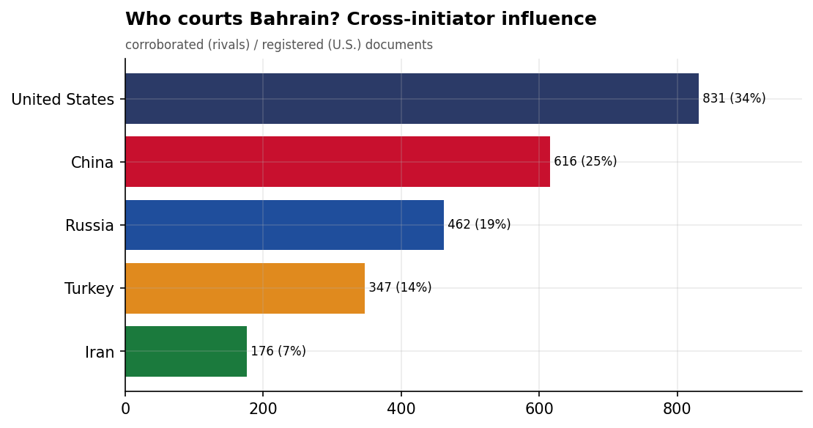
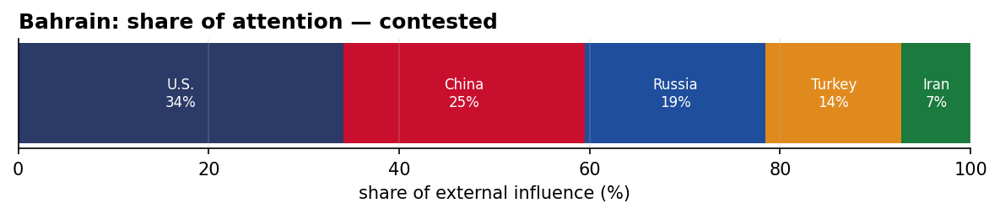
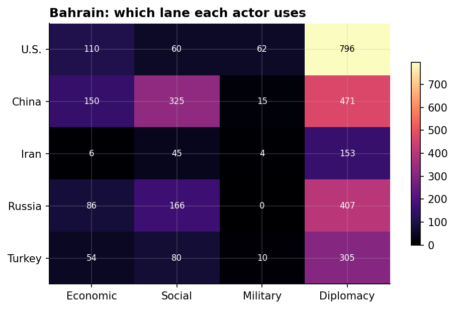
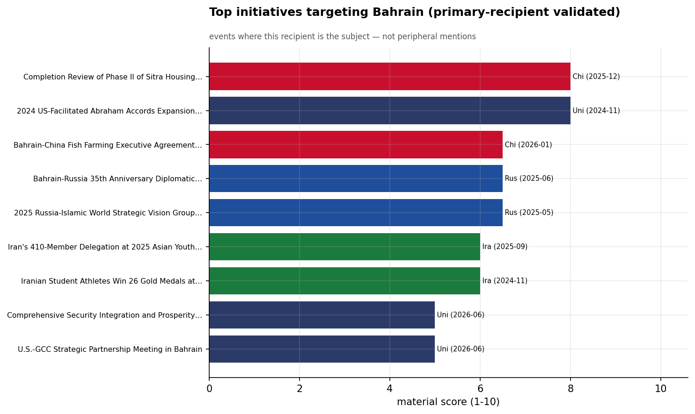
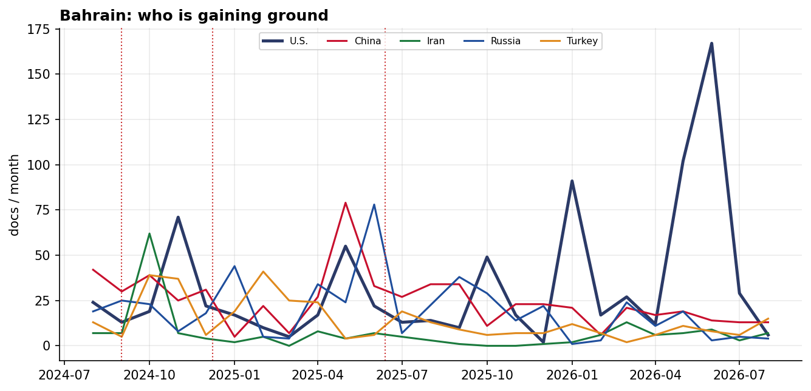

# Who Courts Bahrain? A Cross-Initiator Influence Assessment
### China · Iran · Russia · Turkey · United States — for Policy Analysis

*Open-source media corpus, 2024-08-01 to 2026-08-31. Method/caveats per
`../../INSIGHT_REPORT_PROMPT.md`. Intensity = third-party-corroborated documents (U.S. = registered
coverage; the U.S. has no state media in the corpus). Confidence: **(H)/(M)/(L)**.*

> **Hedging profile: contested.** Lead actor: **U.S.** (34% of external attention).

---

## 1. Key Findings (BLUF)

- **Bahrain is genuinely contested:** U.S. leads with only 34%, with China close behind (25%). **(H)**
- **Division of labor by instrument:** Economic→**China**, Social→**China**, Military→**U.S.**, Diplomacy→**U.S.**. **(H)**
- The classic division of labor is on display: **China supplies the economics and the U.S. the security** — the Gulf-hedge pattern at the country level. **(M)**
- **Signature initiative:** Completion Review of Phase II of Sitra Housing City Project in Bahrain (China). **(M)**
- **17.4% of U.S. coverage here is Iranian-media-framed** — a meaningful adversarial-narrative presence around the U.S. role. **(M)**

---

## 2. The Suitors

| Actor | Influence (docs) | Share |
|-------|-----------------:|------:|
| U.S. | 831 | 34% |
| China | 616 | 25% |
| Russia | 462 | 19% |
| Turkey | 347 | 14% |
| Iran | 176 | 7% |

Bahrain's external-influence field is **contested**. The classic division of labor is on display: **China supplies the economics and the U.S. the security** — the Gulf-hedge pattern at the country level.

---

## 3. Instrument Matrix — Which Lane Each Actor Uses

Read by instrument, the competition for Bahrain sorts cleanly: **Economic → China**,
**Social → China**, **Military → U.S.**, **Diplomacy →
U.S.**. Each actor competes in the lane that fits its regional model rather
than going head-to-head across all four. **(H)**

---

## 4. Initiatives Targeting Bahrain

*Validated for alignment: only events where Bahrain is the **primary** recipient are shown — named in
the title, holding ≥40% of the event's recipient mentions, or the sole top recipient.
111 peripheral events (where Bahrain was only mentioned in
passing on another country's initiative — e.g., regional spillover) were excluded.*

- **Completion Review of Phase II of Sitra Housing City Project in Bahrain** — China, material 8.00 (2025-12)
- **2024 US-Facilitated Abraham Accords Expansion with Bahrain and Sudan** — U.S., material 8.00 (2024-11)
- **Bahrain-China Fish Farming Executive Agreement Signing, January 2026** — China, material 6.50 (2026-01)
- **Bahrain-Russia 35th Anniversary Diplomatic Relations Agreements Signing at SPIEF 2025** — Russia, material 6.50 (2025-06)
- **2025 Russia-Islamic World Strategic Vision Group Meeting in Kazan** — Russia, material 6.50 (2025-05)
- **Iran's 410-Member Delegation at 2025 Asian Youth Games in Bahrain** — Iran, material 6.00 (2025-09)
- **Iranian Student Athletes Win 26 Gold Medals at Bahrain Global Sports Competition 2024** — Iran, material 6.00 (2024-11)
- **Comprehensive Security Integration and Prosperity Agreement (C-SIPA)** — U.S., material 5.00 (2026-06)

---

## 5. Contested Dynamics, Trajectory & Gaps

- **Trajectory:** see the monthly series for who is gaining or losing ground in Bahrain; activity tracks
  the region's inflection points (Israel-Hezbollah escalation Sept 2024, Assad's fall Dec 2024, the
  June 2025 Israel-Iran war). **(M)**
- **Adversarial framing:** 17.4% of the U.S.'s coverage in Bahrain is carried by Iranian media — its image here is partly written by its adversary. **(M)**
- **Caveat:** this measures *reported* influence; the soft-power lens under-captures hard power, and
  dollar figures are announced, not verified. 

---

*Visuals plot corroborated/registered influence; underlying numbers in sibling CSVs under `assets/`.
Index: [`../README.md`](../README.md). Method: `docs/INSIGHT_REPORT_PROMPT.md`.*
