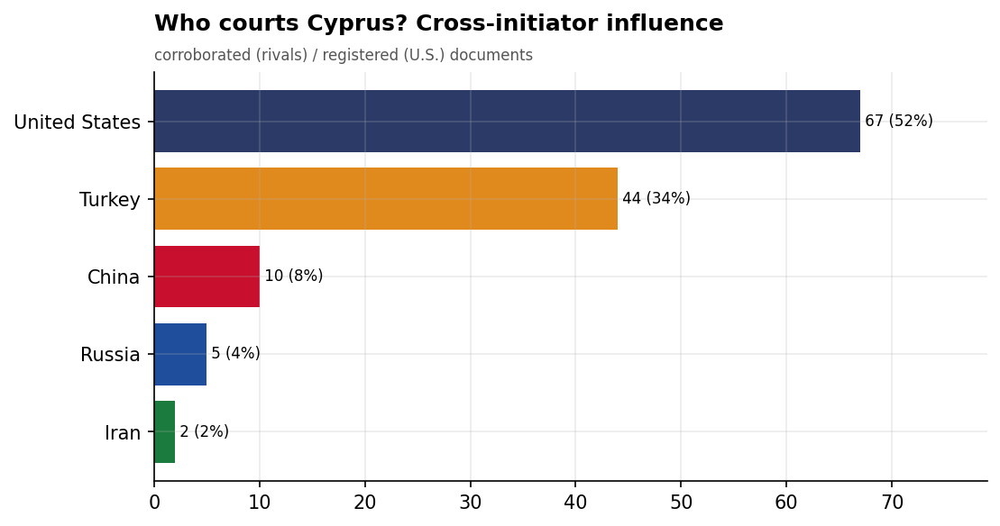
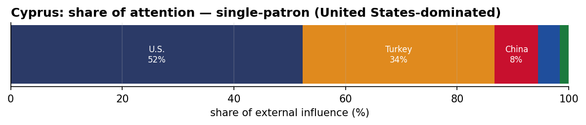
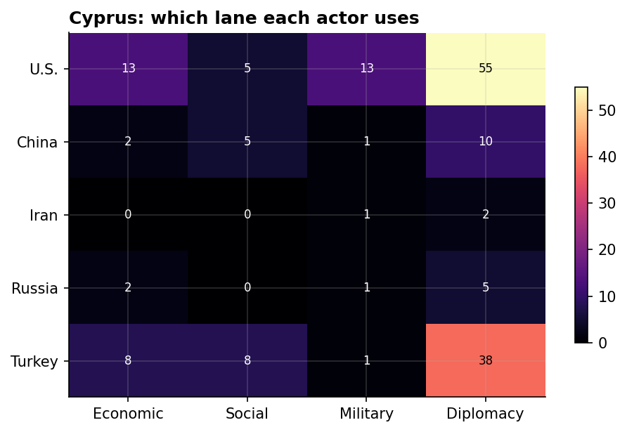
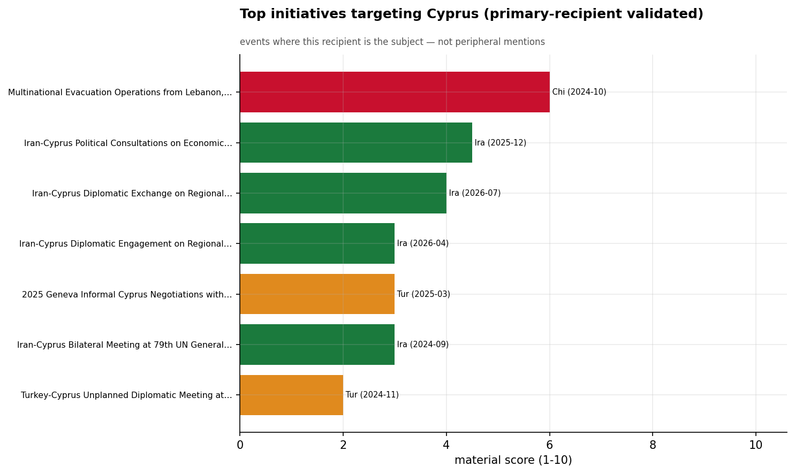
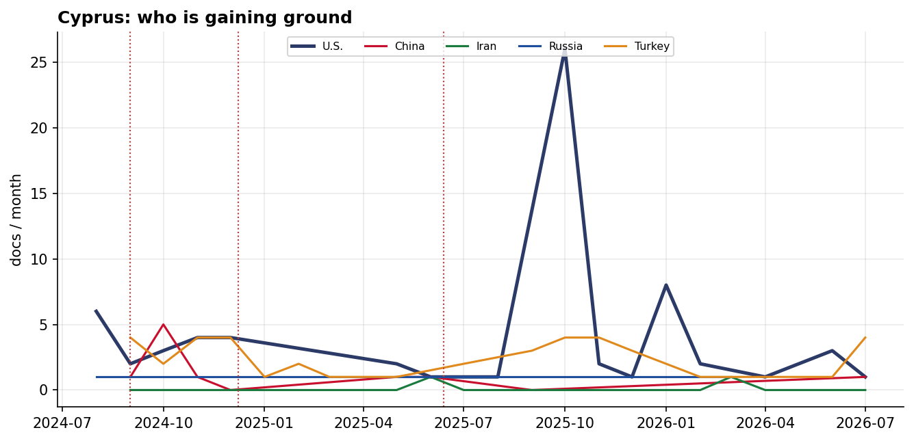

# Who Courts Cyprus? A Cross-Initiator Influence Assessment
### China · Iran · Russia · Turkey · United States — for Policy Analysis

*Open-source media corpus, 2024-08-01 to 2026-07-31. Method/caveats per
`../../INSIGHT_REPORT_PROMPT.md`. Intensity = third-party-corroborated documents (U.S. = registered
coverage; the U.S. has no state media in the corpus). Confidence: **(H)/(M)/(L)**.*

> **Hedging profile: single-patron (United States-dominated).** Lead actor: **U.S.** (52% of external attention).

---

## 1. Key Findings (BLUF)

- **Cyprus is a single-patron file — U.S.-dominated (52%)**, with no rival close. **(H)**
- **Division of labor by instrument:** Economic→**U.S.**, Social→**Turkey**, Military→**U.S.**, Diplomacy→**U.S.**. **(H)**
- **Signature initiative:** Multinational Evacuation Operations from Lebanon, October 2024 (China). **(M)**

---

## 2. The Suitors

| Actor | Influence (docs) | Share |
|-------|-----------------:|------:|
| U.S. | 67 | 52% |
| Turkey | 44 | 34% |
| China | 10 | 8% |
| Russia | 5 | 4% |
| Iran | 2 | 2% |

Cyprus's external-influence field is **single-patron (United States-dominated)**. 

---

## 3. Instrument Matrix — Which Lane Each Actor Uses

Read by instrument, the competition for Cyprus sorts cleanly: **Economic → U.S.**,
**Social → Turkey**, **Military → U.S.**, **Diplomacy →
U.S.**. Each actor competes in the lane that fits its regional model rather
than going head-to-head across all four. **(H)**

---

## 4. Initiatives Targeting Cyprus

*Validated for alignment: only events where Cyprus is the **primary** recipient are shown — named in
the title, holding ≥40% of the event's recipient mentions, or the sole top recipient.
35 peripheral events (where Cyprus was only mentioned in
passing on another country's initiative — e.g., regional spillover) were excluded.*

- **Multinational Evacuation Operations from Lebanon, October 2024** — China, material 6.00 (2024-10)
- **Iran-Cyprus Political Consultations on Economic and Cultural Ties, December 2025** — Iran, material 4.50 (2025-12)
- **Iran-Cyprus Diplomatic Exchange on Regional Security** — Iran, material 4.00 (2026-07)
- **Iran-Cyprus Diplomatic Engagement on Regional Conflict Resolution** — Iran, material 3.00 (2026-04)
- **2025 Geneva Informal Cyprus Negotiations with Turkey, UK, and UN** — Turkey, material 3.00 (2025-03)
- **Iran-Cyprus Bilateral Meeting at 79th UN General Assembly, September 2024** — Iran, material 3.00 (2024-09)
- **Turkey-Cyprus Unplanned Diplomatic Meeting at Hungary Summit, Nov 2024** — Turkey, material 2.00 (2024-11)

---

## 5. Contested Dynamics, Trajectory & Gaps

- **Trajectory:** see the monthly series for who is gaining or losing ground in Cyprus; activity tracks
  the region's inflection points (Israel-Hezbollah escalation Sept 2024, Assad's fall Dec 2024, the
  June 2025 Israel-Iran war). **(M)**

- **Caveat:** this measures *reported* influence; the soft-power lens under-captures hard power, and
  dollar figures are announced, not verified. 

---

*Visuals plot corroborated/registered influence; underlying numbers in sibling CSVs under `assets/`.
Index: [`../README.md`](../README.md). Method: `docs/INSIGHT_REPORT_PROMPT.md`.*
