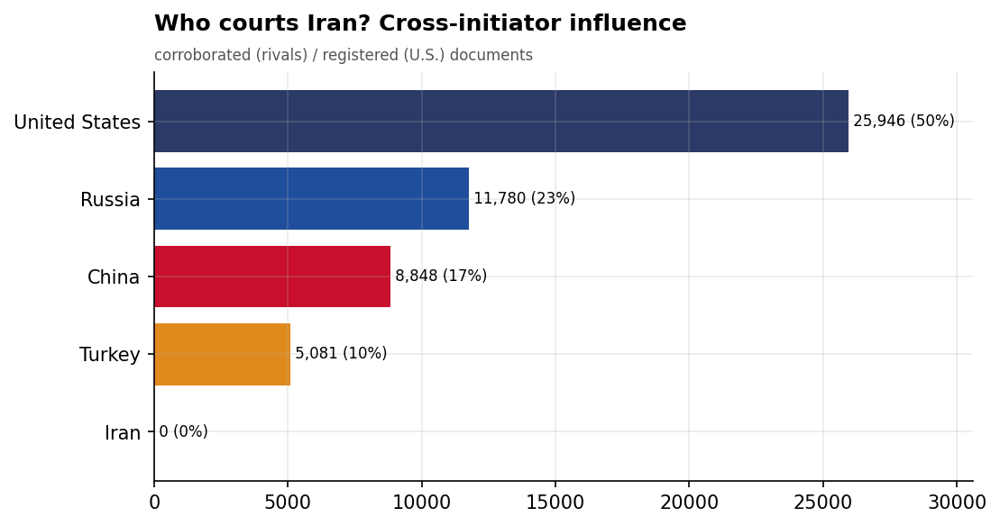
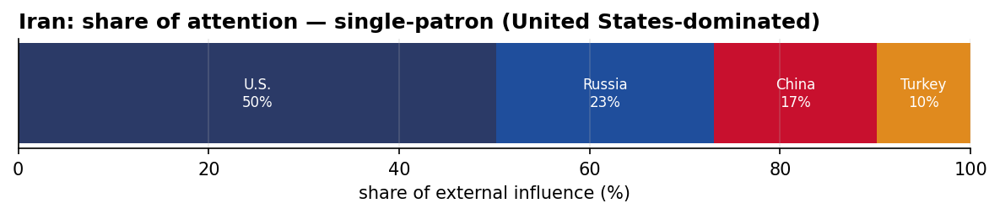
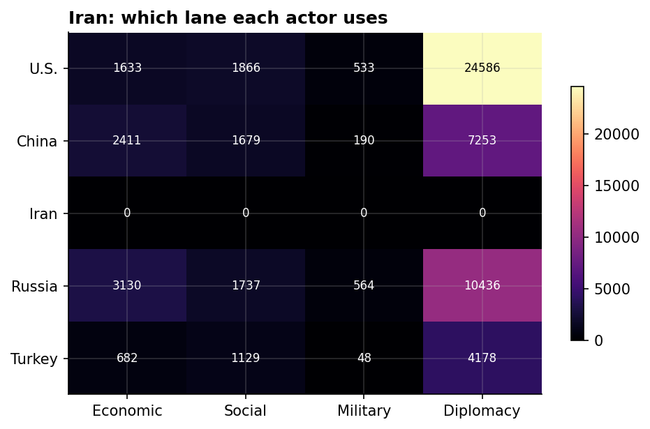
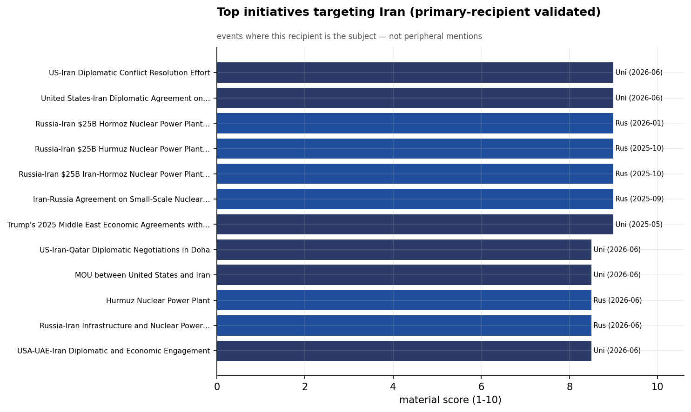
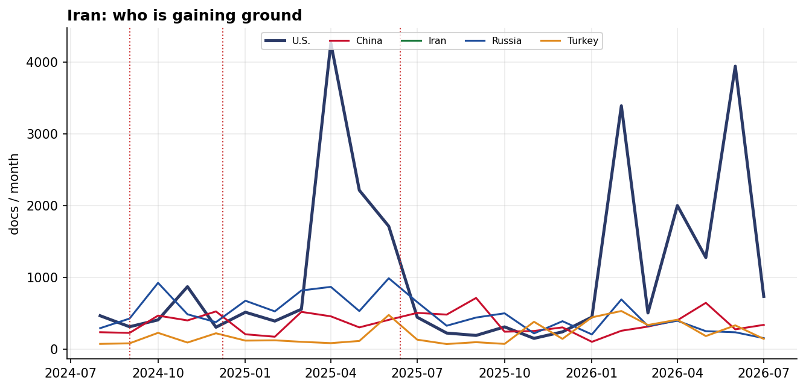

# Who Courts Iran? A Cross-Initiator Influence Assessment
### China · Iran · Russia · Turkey · United States — for Policy Analysis

*Open-source media corpus, 2024-08-01 to 2026-07-31. Method/caveats per
`../../INSIGHT_REPORT_PROMPT.md`. Intensity = third-party-corroborated documents (U.S. = registered
coverage; the U.S. has no state media in the corpus). Confidence: **(H)/(M)/(L)**.*

> **Hedging profile: single-patron (United States-dominated).** Lead actor: **U.S.** (50% of external attention).

---

## 1. Key Findings (BLUF)

- **Iran is dominated by U.S. involvement (50% of external attention)** — but this reflects Iran's centrality to a crisis/alliance file, not development courtship. **(H)**
- **Division of labor by instrument:** Economic→**Russia**, Social→**U.S.**, Military→**Russia**, Diplomacy→**U.S.**. **(H)**
- The U.S. lead here is **crisis/alliance involvement, not economic courtship** — it reflects how central Washington is to this file, adversarially or as guarantor. **(M)**
- **Signature initiative:** US-Iran Diplomatic Conflict Resolution Effort (U.S.). **(M)**

---

## 2. The Suitors

| Actor | Influence (docs) | Share |
|-------|-----------------:|------:|
| U.S. | 25,946 | 50% |
| Russia | 11,780 | 23% |
| China | 8,848 | 17% |
| Turkey | 5,081 | 10% |

Iran's external-influence field is **single-patron (United States-dominated)**. The U.S. lead here is **crisis/alliance involvement, not economic courtship** — it reflects how central Washington is to this file, adversarially or as guarantor.

---

## 3. Instrument Matrix — Which Lane Each Actor Uses

Read by instrument, the competition for Iran sorts cleanly: **Economic → Russia**,
**Social → U.S.**, **Military → Russia**, **Diplomacy →
U.S.**. Each actor competes in the lane that fits its regional model rather
than going head-to-head across all four. **(H)**

---

## 4. Initiatives Targeting Iran

*Validated for alignment: only events where Iran is the **primary** recipient are shown — named in
the title, holding ≥40% of the event's recipient mentions, or the sole top recipient.
26 peripheral events (where Iran was only mentioned in
passing on another country's initiative — e.g., regional spillover) were excluded.*

- **US-Iran Diplomatic Conflict Resolution Effort** — U.S., material 9.00 (2026-06)
- **United States-Iran Diplomatic Agreement on Economic and Nuclear Cooperation** — U.S., material 9.00 (2026-06)
- **Russia-Iran $25B Hormoz Nuclear Power Plant Development Agreement, January 2026** — Russia, material 9.00 (2026-01)
- **Russia-Iran $25B Hurmuz Nuclear Power Plant Contract Signing, October 2025** — Russia, material 9.00 (2025-10)
- **Russia-Iran $25B Iran-Hormoz Nuclear Power Plant Reactor Agreement** — Russia, material 9.00 (2025-10)
- **Iran-Russia Agreement on Small-Scale Nuclear Power Plants at Atom Expo 2025** — Russia, material 9.00 (2025-09)
- **Trump's 2025 Middle East Economic Agreements with Saudi Arabia and Qatar** — U.S., material 9.00 (2025-05)
- **US-Iran-Qatar Diplomatic Negotiations in Doha** — U.S., material 8.50 (2026-06)

---

## 5. Contested Dynamics, Trajectory & Gaps

- **Trajectory:** see the monthly series for who is gaining or losing ground in Iran; activity tracks
  the region's inflection points (Israel-Hezbollah escalation Sept 2024, Assad's fall Dec 2024, the
  June 2025 Israel-Iran war). **(M)**

- **Caveat:** this measures *reported* influence; the soft-power lens under-captures hard power, and
  dollar figures are announced, not verified. For Iran, a high U.S. share reflects crisis/alliance involvement rather than economic courtship.

---

*Visuals plot corroborated/registered influence; underlying numbers in sibling CSVs under `assets/`.
Index: [`../README.md`](../README.md). Method: `docs/INSIGHT_REPORT_PROMPT.md`.*
