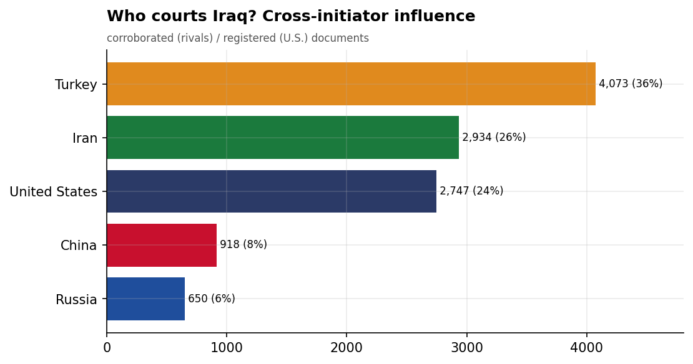
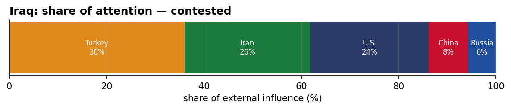
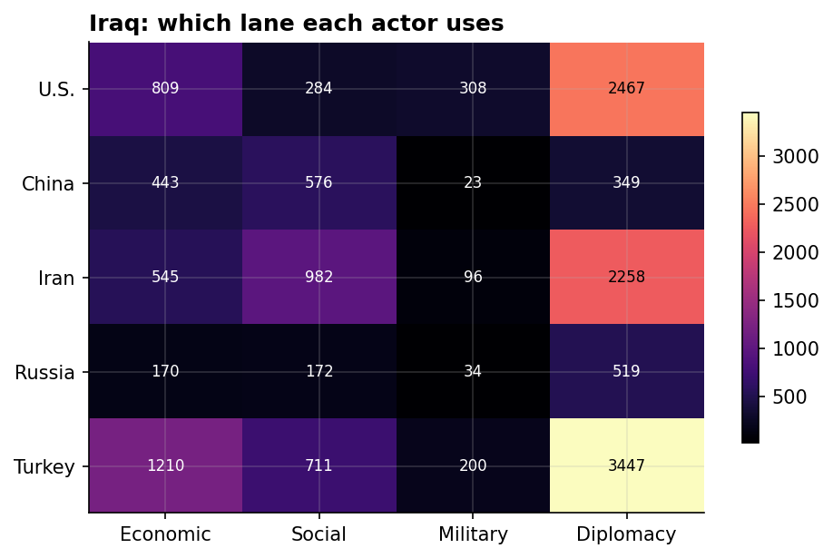
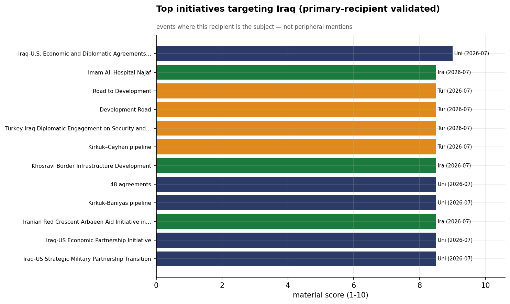
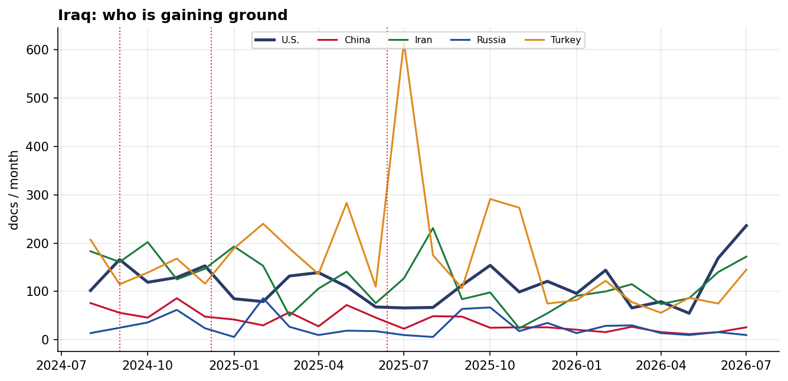

# Who Courts Iraq? A Cross-Initiator Influence Assessment
### China · Iran · Russia · Turkey · United States — for Policy Analysis

*Open-source media corpus, 2024-08-01 to 2026-07-31. Method/caveats per
`../../INSIGHT_REPORT_PROMPT.md`. Intensity = third-party-corroborated documents (U.S. = registered
coverage; the U.S. has no state media in the corpus). Confidence: **(H)/(M)/(L)**.*

> **Hedging profile: contested.** Lead actor: **Turkey** (36% of external attention).

---

## 1. Key Findings (BLUF)

- **Iraq is genuinely contested:** Turkey leads with only 36%, with Iran close behind (25%). **(H)**
- **Division of labor by instrument:** Economic→**Turkey**, Social→**Iran**, Military→**U.S.**, Diplomacy→**Turkey**. **(H)**
- **Turkey is the across-the-board lead** — economics, social, and diplomacy — the reconstruction-patron model. **(M)**
- **Signature initiative:** Iraq-U.S. Economic and Diplomatic Agreements Signing (U.S.). **(M)**

---

## 2. The Suitors

| Actor | Influence (docs) | Share |
|-------|-----------------:|------:|
| Turkey | 4,073 | 36% |
| Iran | 2,934 | 26% |
| U.S. | 2,747 | 24% |
| China | 918 | 8% |
| Russia | 650 | 6% |

Iraq's external-influence field is **contested**. **Turkey is the across-the-board lead** — economics, social, and diplomacy — the reconstruction-patron model.

---

## 3. Instrument Matrix — Which Lane Each Actor Uses

Read by instrument, the competition for Iraq sorts cleanly: **Economic → Turkey**,
**Social → Iran**, **Military → U.S.**, **Diplomacy →
Turkey**. Each actor competes in the lane that fits its regional model rather
than going head-to-head across all four. **(H)**

---

## 4. Initiatives Targeting Iraq

*Validated for alignment: only events where Iraq is the **primary** recipient are shown — named in
the title, holding ≥40% of the event's recipient mentions, or the sole top recipient.
18 peripheral events (where Iraq was only mentioned in
passing on another country's initiative — e.g., regional spillover) were excluded.*

- **Iraq-U.S. Economic and Diplomatic Agreements Signing** — U.S., material 9.00 (2026-07)
- **Imam Ali Hospital Najaf** — Iran, material 8.50 (2026-07)
- **Road to Development** — Turkey, material 8.50 (2026-07)
- **Development Road** — Turkey, material 8.50 (2026-07)
- **Turkey-Iraq Diplomatic Engagement on Security and Energy Cooperation** — Turkey, material 8.50 (2026-07)
- **Kirkuk–Ceyhan pipeline** — Turkey, material 8.50 (2026-07)
- **Khosravi Border Infrastructure Development** — Iran, material 8.50 (2026-07)
- **48 agreements** — U.S., material 8.50 (2026-07)

---

## 5. Contested Dynamics, Trajectory & Gaps

- **Trajectory:** see the monthly series for who is gaining or losing ground in Iraq; activity tracks
  the region's inflection points (Israel-Hezbollah escalation Sept 2024, Assad's fall Dec 2024, the
  June 2025 Israel-Iran war). **(M)**
- **Adversarial framing:** 10.9% of the U.S.'s coverage in Iraq is carried by Iranian media — its image here is partly written by its adversary. **(M)**
- **Caveat:** this measures *reported* influence; the soft-power lens under-captures hard power, and
  dollar figures are announced, not verified. 

---

*Visuals plot corroborated/registered influence; underlying numbers in sibling CSVs under `assets/`.
Index: [`../README.md`](../README.md). Method: `docs/INSIGHT_REPORT_PROMPT.md`.*
