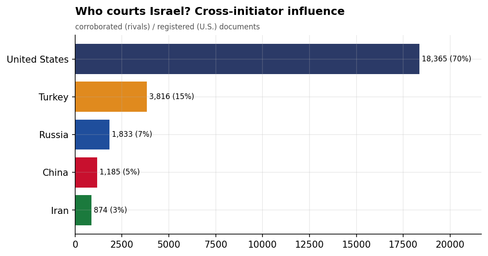
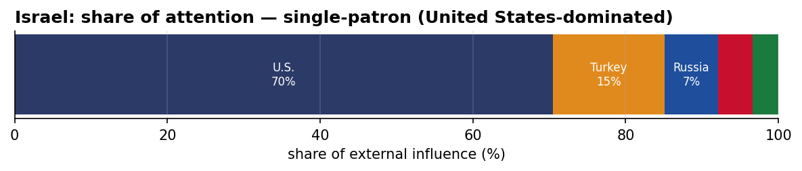
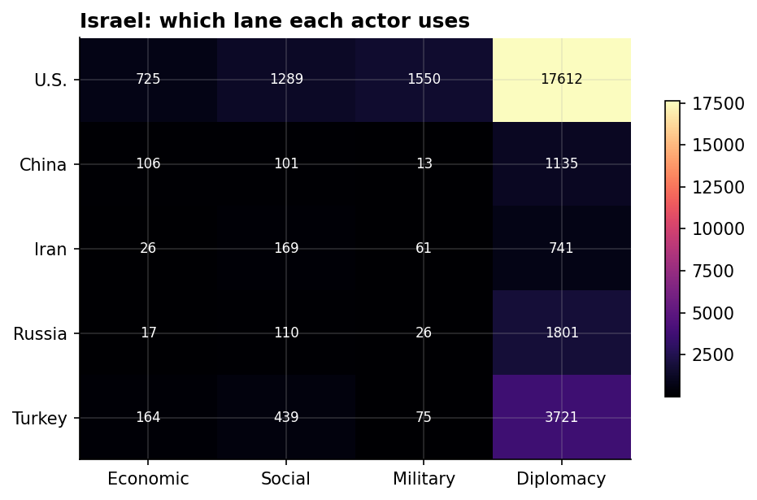
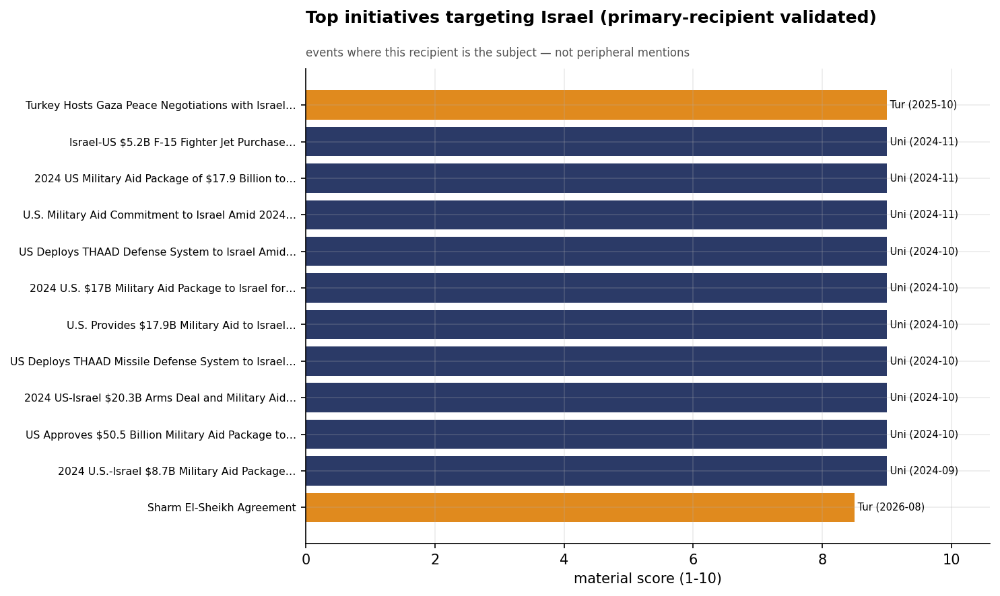
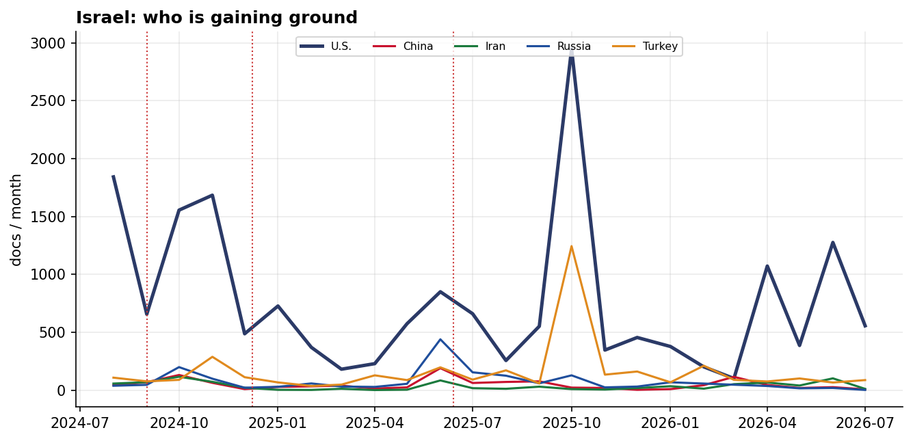

# Who Courts Israel? A Cross-Initiator Influence Assessment
### China · Iran · Russia · Turkey · United States — for Policy Analysis

*Open-source media corpus, 2024-08-01 to 2026-07-31. Method/caveats per
`../../INSIGHT_REPORT_PROMPT.md`. Intensity = third-party-corroborated documents (U.S. = registered
coverage; the U.S. has no state media in the corpus). Confidence: **(H)/(M)/(L)**.*

> **Hedging profile: single-patron (United States-dominated).** Lead actor: **U.S.** (70% of external attention).

---

## 1. Key Findings (BLUF)

- **Israel is dominated by U.S. involvement (70% of external attention)** — but this reflects Israel's centrality to a crisis/alliance file, not development courtship. **(H)**
- **Division of labor by instrument:** Economic→**U.S.**, Social→**U.S.**, Military→**U.S.**, Diplomacy→**U.S.**. **(H)**
- The U.S. lead here is **crisis/alliance involvement, not economic courtship** — it reflects how central Washington is to this file, adversarially or as guarantor. **(M)**
- **Signature initiative:** Turkey Hosts Gaza Peace Negotiations with Israel and Palestine, October 2025 (Turkey). **(M)**

---

## 2. The Suitors

| Actor | Influence (docs) | Share |
|-------|-----------------:|------:|
| U.S. | 18,365 | 70% |
| Turkey | 3,816 | 15% |
| Russia | 1,833 | 7% |
| China | 1,185 | 5% |
| Iran | 874 | 3% |

Israel's external-influence field is **single-patron (United States-dominated)**. The U.S. lead here is **crisis/alliance involvement, not economic courtship** — it reflects how central Washington is to this file, adversarially or as guarantor.

---

## 3. Instrument Matrix — Which Lane Each Actor Uses

Read by instrument, the competition for Israel sorts cleanly: **Economic → U.S.**,
**Social → U.S.**, **Military → U.S.**, **Diplomacy →
U.S.**. Each actor competes in the lane that fits its regional model rather
than going head-to-head across all four. **(H)**

---

## 4. Initiatives Targeting Israel

*Validated for alignment: only events where Israel is the **primary** recipient are shown — named in
the title, holding ≥40% of the event's recipient mentions, or the sole top recipient.
53 peripheral events (where Israel was only mentioned in
passing on another country's initiative — e.g., regional spillover) were excluded.*

- **Turkey Hosts Gaza Peace Negotiations with Israel and Palestine, October 2025** — Turkey, material 9.00 (2025-10)
- **Israel-US $5.2B F-15 Fighter Jet Purchase Agreement, November 2024** — U.S., material 9.00 (2024-11)
- **2024 US Military Aid Package of $17.9 Billion to Israel** — U.S., material 9.00 (2024-11)
- **U.S. Military Aid Commitment to Israel Amid 2024 Elections** — U.S., material 9.00 (2024-11)
- **US Deploys THAAD Defense System to Israel Amid Iran Conflict, October 2024** — U.S., material 9.00 (2024-10)
- **2024 U.S. $17B Military Aid Package to Israel for Gaza Operations** — U.S., material 9.00 (2024-10)
- **U.S. Provides $17.9B Military Aid to Israel During Gaza Conflict, October 2024** — U.S., material 9.00 (2024-10)
- **US Deploys THAAD Missile Defense System to Israel under $14B Military Aid Package** — U.S., material 9.00 (2024-10)

---

## 5. Contested Dynamics, Trajectory & Gaps

- **Trajectory:** see the monthly series for who is gaining or losing ground in Israel; activity tracks
  the region's inflection points (Israel-Hezbollah escalation Sept 2024, Assad's fall Dec 2024, the
  June 2025 Israel-Iran war). **(M)**
- **Adversarial framing:** 12.5% of the U.S.'s coverage in Israel is carried by Iranian media — its image here is partly written by its adversary. **(M)**
- **Caveat:** this measures *reported* influence; the soft-power lens under-captures hard power, and
  dollar figures are announced, not verified. For Israel, a high U.S. share reflects crisis/alliance involvement rather than economic courtship.

---

*Visuals plot corroborated/registered influence; underlying numbers in sibling CSVs under `assets/`.
Index: [`../README.md`](../README.md). Method: `docs/INSIGHT_REPORT_PROMPT.md`.*
