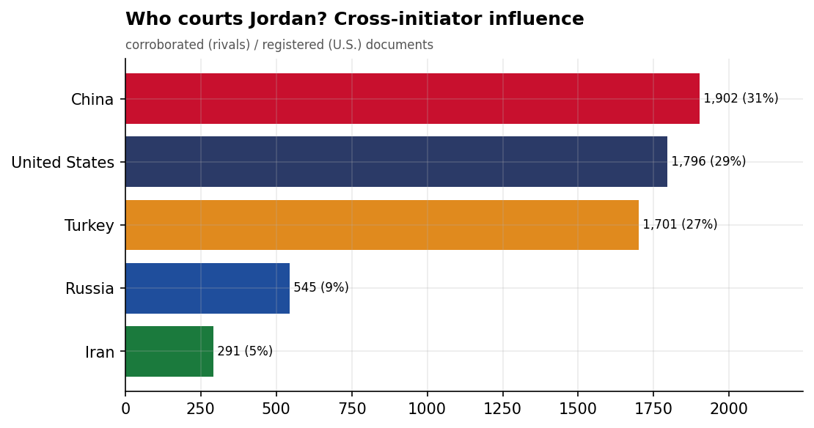
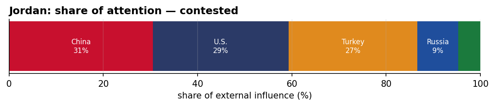
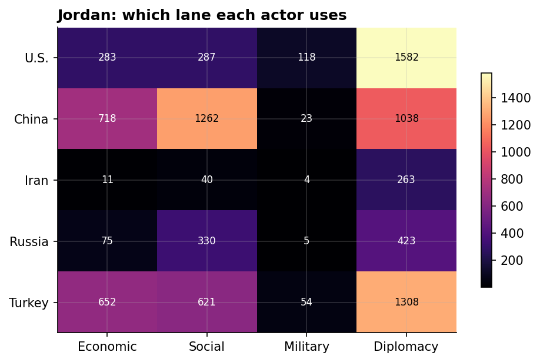
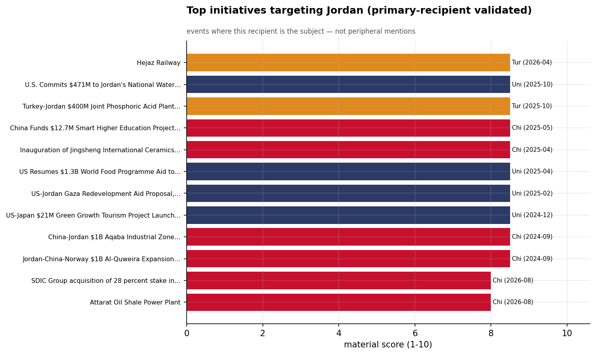
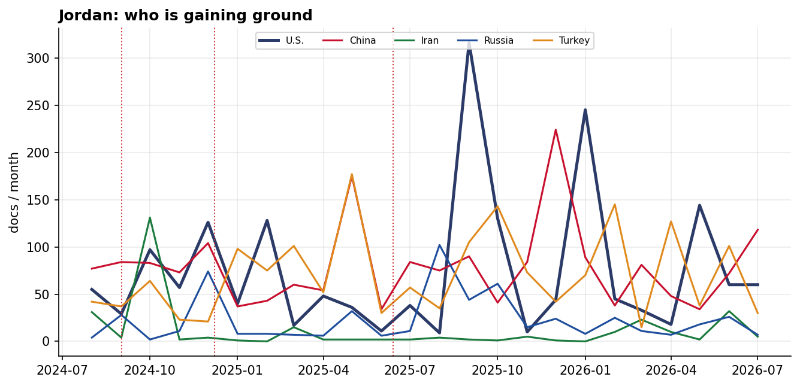

# Who Courts Jordan? A Cross-Initiator Influence Assessment
### China · Iran · Russia · Turkey · United States — for Policy Analysis

*Open-source media corpus, 2024-08-01 to 2026-07-31. Method/caveats per
`../../INSIGHT_REPORT_PROMPT.md`. Intensity = third-party-corroborated documents (U.S. = registered
coverage; the U.S. has no state media in the corpus). Confidence: **(H)/(M)/(L)**.*

> **Hedging profile: contested.** Lead actor: **China** (30% of external attention).

---

## 1. Key Findings (BLUF)

- **Jordan is genuinely contested:** China leads with only 30%, with U.S. close behind (28%). **(H)**
- **Division of labor by instrument:** Economic→**China**, Social→**China**, Military→**U.S.**, Diplomacy→**U.S.**. **(H)**
- The classic division of labor is on display: **China supplies the economics and the U.S. the security** — the Gulf-hedge pattern at the country level. **(M)**
- **Signature initiative:** Hejaz Railway (Turkey). **(M)**

---

## 2. The Suitors

| Actor | Influence (docs) | Share |
|-------|-----------------:|------:|
| China | 1,902 | 31% |
| U.S. | 1,796 | 29% |
| Turkey | 1,701 | 27% |
| Russia | 545 | 9% |
| Iran | 291 | 5% |

Jordan's external-influence field is **contested**. The classic division of labor is on display: **China supplies the economics and the U.S. the security** — the Gulf-hedge pattern at the country level.

---

## 3. Instrument Matrix — Which Lane Each Actor Uses

Read by instrument, the competition for Jordan sorts cleanly: **Economic → China**,
**Social → China**, **Military → U.S.**, **Diplomacy →
U.S.**. Each actor competes in the lane that fits its regional model rather
than going head-to-head across all four. **(H)**

---

## 4. Initiatives Targeting Jordan

*Validated for alignment: only events where Jordan is the **primary** recipient are shown — named in
the title, holding ≥40% of the event's recipient mentions, or the sole top recipient.
61 peripheral events (where Jordan was only mentioned in
passing on another country's initiative — e.g., regional spillover) were excluded.*

- **Hejaz Railway** — Turkey, material 8.50 (2026-04)
- **U.S. Commits $471M to Jordan's National Water Carrier and Aqaba Digital Center Projects** — U.S., material 8.50 (2025-10)
- **Turkey-Jordan $400M Joint Phosphoric Acid Plant Agreement in Aqaba** — Turkey, material 8.50 (2025-10)
- **China Funds $12.7M Smart Higher Education Project in Jordan, May 2025** — China, material 8.50 (2025-05)
- **Inauguration of Jingsheng International Ceramics Factory in Al Qatraneh, Jordan** — China, material 8.50 (2025-04)
- **US Resumes $1.3B World Food Programme Aid to Lebanon, Syria, Jordan, Iraq, Somalia, Ecuador** — U.S., material 8.50 (2025-04)
- **US-Jordan Gaza Redevelopment Aid Proposal, February 2025** — U.S., material 8.50 (2025-02)
- **US-Japan $21M Green Growth Tourism Project Launch in Petra, Jordan** — U.S., material 8.50 (2024-12)

---

## 5. Contested Dynamics, Trajectory & Gaps

- **Trajectory:** see the monthly series for who is gaining or losing ground in Jordan; activity tracks
  the region's inflection points (Israel-Hezbollah escalation Sept 2024, Assad's fall Dec 2024, the
  June 2025 Israel-Iran war). **(M)**
- **Adversarial framing:** 11.7% of the U.S.'s coverage in Jordan is carried by Iranian media — its image here is partly written by its adversary. **(M)**
- **Caveat:** this measures *reported* influence; the soft-power lens under-captures hard power, and
  dollar figures are announced, not verified. 

---

*Visuals plot corroborated/registered influence; underlying numbers in sibling CSVs under `assets/`.
Index: [`../README.md`](../README.md). Method: `docs/INSIGHT_REPORT_PROMPT.md`.*
