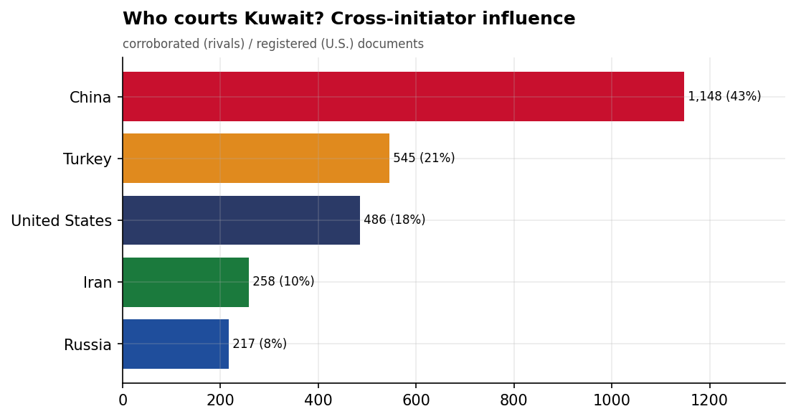
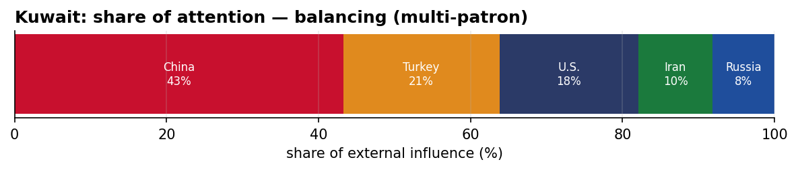
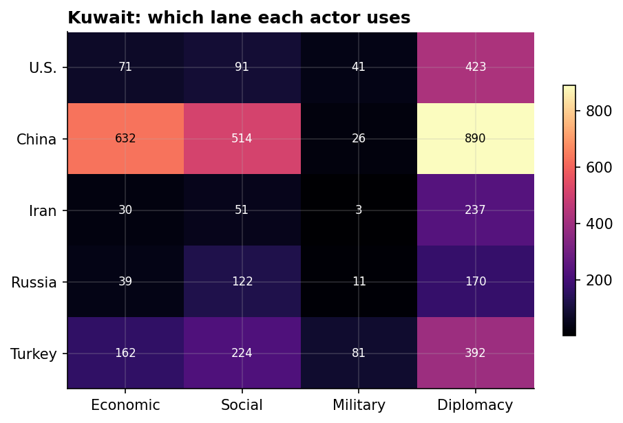
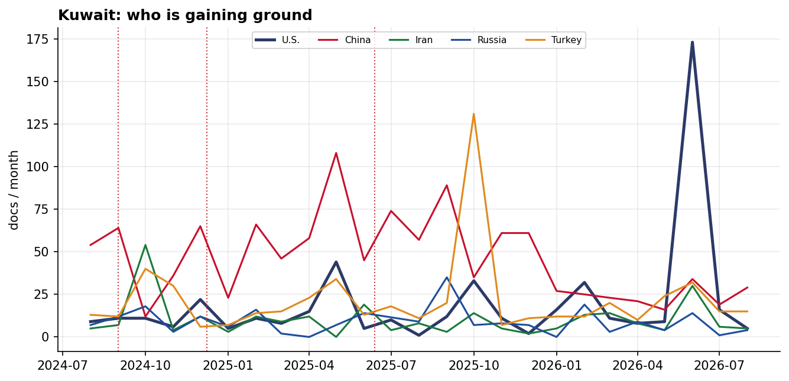

# Who Courts Kuwait? A Cross-Initiator Influence Assessment
### China · Iran · Russia · Turkey · United States — for Policy Analysis

*Open-source media corpus, 2024-08-01 to 2026-08-31. Method/caveats per
`../../INSIGHT_REPORT_PROMPT.md`. Intensity = third-party-corroborated documents (U.S. = registered
coverage; the U.S. has no state media in the corpus). Confidence: **(H)/(M)/(L)**.*

> **Hedging profile: balancing (multi-patron).** Lead actor: **China** (43% of external attention).

---

## 1. Key Findings (BLUF)

- **Kuwait balances multiple patrons** — China leads (43%) but engages Turkey, U.S. substantially too. **(M)**
- **Division of labor by instrument:** Economic→**China**, Social→**China**, Military→**Turkey**, Diplomacy→**China**. **(H)**
- **Signature initiative:** Kuwait-China Contract Signing for Mubarak Al-Kabeer Port Project, February 2025 (China). **(M)**

---

## 2. The Suitors

| Actor | Influence (docs) | Share |
|-------|-----------------:|------:|
| China | 1,148 | 43% |
| Turkey | 545 | 21% |
| U.S. | 486 | 18% |
| Iran | 258 | 10% |
| Russia | 217 | 8% |

Kuwait's external-influence field is **balancing (multi-patron)**. 

---

## 3. Instrument Matrix — Which Lane Each Actor Uses

Read by instrument, the competition for Kuwait sorts cleanly: **Economic → China**,
**Social → China**, **Military → Turkey**, **Diplomacy →
China**. Each actor competes in the lane that fits its regional model rather
than going head-to-head across all four. **(H)**

---

## 4. Initiatives Targeting Kuwait

*Validated for alignment: only events where Kuwait is the **primary** recipient are shown — named in
the title, holding ≥40% of the event's recipient mentions, or the sole top recipient.
58 peripheral events (where Kuwait was only mentioned in
passing on another country's initiative — e.g., regional spillover) were excluded.*

- **Kuwait-China Contract Signing for Mubarak Al-Kabeer Port Project, February 2025** — China, material 9.00 (2025-02)
- **2026 US-Kuwait Patriot Missile Defense Agreement** — U.S., material 8.50 (2026-02)
- **Kuwait-China Mubarak Al-Kabeer Port EPC Contract Signing, December 2025** — China, material 8.50 (2025-12)
- **China-Kuwait Signs Engineering Contract for Mubarak Al-Kabeer Port Completion** — China, material 8.50 (2025-12)
- **Kuwait Signs Executive Contract for Mubarak Al-Kabeer Port with China, December 2025** — China, material 8.50 (2025-12)
- **Kuwait-China Contract Signing for Kabd Wastewater Treatment Plant, October 2025** — China, material 8.50 (2025-09)
- **China-Kuwait Signing of Seven Agreements Including Mubarak Al-Kabeer Port, June 2025** — China, material 8.50 (2025-06)
- **Kuwait-China Mubarak Al-Kabeer Port Project Development Agreement, May 2025** — China, material 8.50 (2025-05)

---

## 5. Contested Dynamics, Trajectory & Gaps

- **Trajectory:** see the monthly series for who is gaining or losing ground in Kuwait; activity tracks
  the region's inflection points (Israel-Hezbollah escalation Sept 2024, Assad's fall Dec 2024, the
  June 2025 Israel-Iran war). **(M)**
- **Adversarial framing:** 12.3% of the U.S.'s coverage in Kuwait is carried by Iranian media — its image here is partly written by its adversary. **(M)**
- **Caveat:** this measures *reported* influence; the soft-power lens under-captures hard power, and
  dollar figures are announced, not verified. 

---

*Visuals plot corroborated/registered influence; underlying numbers in sibling CSVs under `assets/`.
Index: [`../README.md`](../README.md). Method: `docs/INSIGHT_REPORT_PROMPT.md`.*
