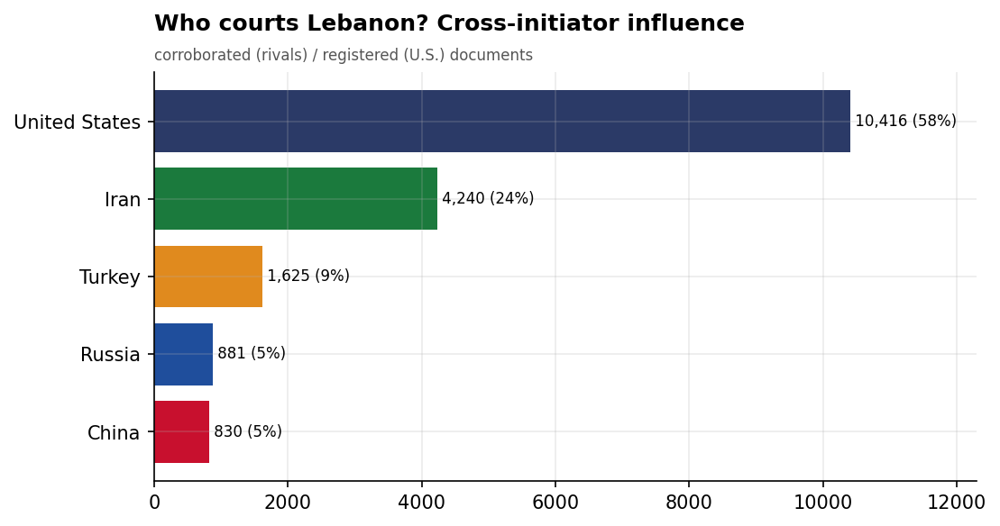
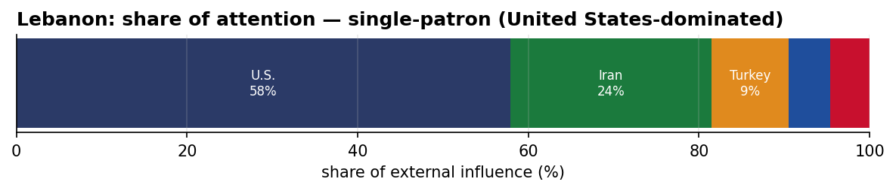
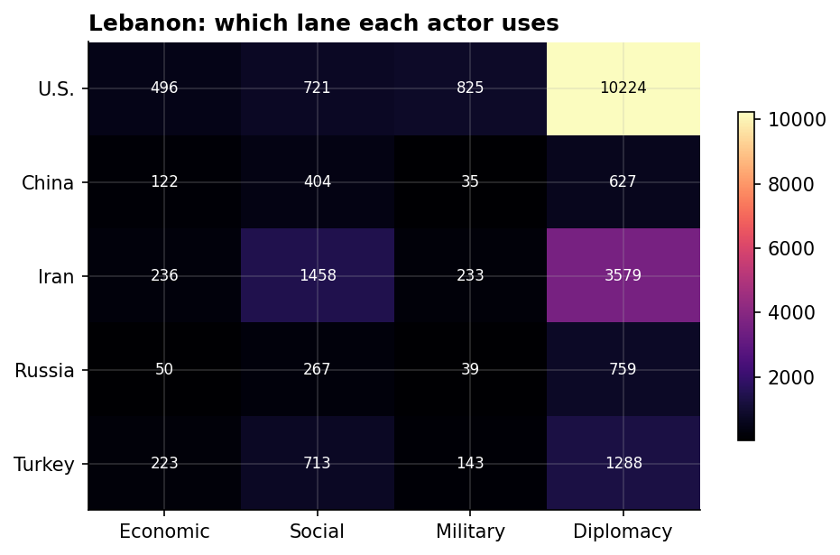
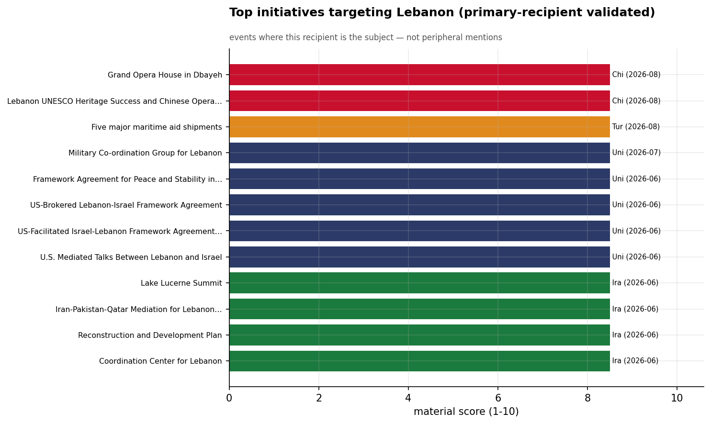
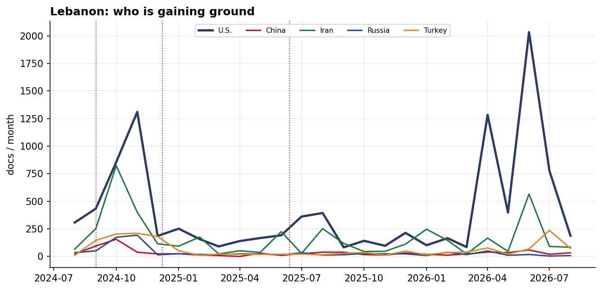

# Who Courts Lebanon? A Cross-Initiator Influence Assessment
### China · Iran · Russia · Turkey · United States — for Policy Analysis

*Open-source media corpus, 2024-08-01 to 2026-08-31. Method/caveats per
`../../INSIGHT_REPORT_PROMPT.md`. Intensity = third-party-corroborated documents (U.S. = registered
coverage; the U.S. has no state media in the corpus). Confidence: **(H)/(M)/(L)**.*

> **Hedging profile: single-patron (United States-dominated).** Lead actor: **U.S.** (57% of external attention).

---

## 1. Key Findings (BLUF)

- **Lebanon is dominated by U.S. involvement (57% of external attention)** — but this reflects Lebanon's centrality to a crisis/alliance file, not development courtship. **(H)**
- **Division of labor by instrument:** Economic→**U.S.**, Social→**Iran**, Military→**U.S.**, Diplomacy→**U.S.**. **(H)**
- The U.S. lead here is **crisis/alliance involvement, not economic courtship** — it reflects how central Washington is to this file, adversarially or as guarantor. **(M)**
- **Signature initiative:** Grand Opera House in Dbayeh (China). **(M)**

---

## 2. The Suitors

| Actor | Influence (docs) | Share |
|-------|-----------------:|------:|
| U.S. | 10,416 | 58% |
| Iran | 4,240 | 24% |
| Turkey | 1,625 | 9% |
| Russia | 881 | 5% |
| China | 830 | 5% |

Lebanon's external-influence field is **single-patron (United States-dominated)**. The U.S. lead here is **crisis/alliance involvement, not economic courtship** — it reflects how central Washington is to this file, adversarially or as guarantor.

---

## 3. Instrument Matrix — Which Lane Each Actor Uses

Read by instrument, the competition for Lebanon sorts cleanly: **Economic → U.S.**,
**Social → Iran**, **Military → U.S.**, **Diplomacy →
U.S.**. Each actor competes in the lane that fits its regional model rather
than going head-to-head across all four. **(H)**

---

## 4. Initiatives Targeting Lebanon

*Validated for alignment: only events where Lebanon is the **primary** recipient are shown — named in
the title, holding ≥40% of the event's recipient mentions, or the sole top recipient.
50 peripheral events (where Lebanon was only mentioned in
passing on another country's initiative — e.g., regional spillover) were excluded.*

- **Grand Opera House in Dbayeh** — China, material 8.50 (2026-08)
- **Lebanon UNESCO Heritage Success and Chinese Opera House Investment** — China, material 8.50 (2026-08)
- **Five major maritime aid shipments** — Turkey, material 8.50 (2026-08)
- **Military Co-ordination Group for Lebanon** — U.S., material 8.50 (2026-07)
- **Framework Agreement for Peace and Stability in Lebanon** — U.S., material 8.50 (2026-06)
- **US-Brokered Lebanon-Israel Framework Agreement** — U.S., material 8.50 (2026-06)
- **US-Facilitated Israel-Lebanon Framework Agreement Negotiations** — U.S., material 8.50 (2026-06)
- **U.S. Mediated Talks Between Lebanon and Israel** — U.S., material 8.50 (2026-06)

---

## 5. Contested Dynamics, Trajectory & Gaps

- **Trajectory:** see the monthly series for who is gaining or losing ground in Lebanon; activity tracks
  the region's inflection points (Israel-Hezbollah escalation Sept 2024, Assad's fall Dec 2024, the
  June 2025 Israel-Iran war). **(M)**

- **Caveat:** this measures *reported* influence; the soft-power lens under-captures hard power, and
  dollar figures are announced, not verified. For Lebanon, a high U.S. share reflects crisis/alliance involvement rather than economic courtship.

---

*Visuals plot corroborated/registered influence; underlying numbers in sibling CSVs under `assets/`.
Index: [`../README.md`](../README.md). Method: `docs/INSIGHT_REPORT_PROMPT.md`.*

## Post-window context (September 2026)

*The corpus extends to 2026-09-09; September is nine days of data — context, not
analysis-grade. August 2026 is now inside the analysis window.*

- **The US-mediated Lebanon–Israel track re-warmed in Rome in early September** — a
  US-brokered detainee release and a push to resume the Rome dialogue are the file's live
  items after the framework's August cooling; the track is moving in stop-start rounds
  rather than dying.
- Iran's Lebanon file stayed quiet in August (25 corroborated docs, from the 639-doc June
  crest); Turkey's UNIFIL-cooperation and South-Lebanon-reconstruction initiatives remain
  the live non-U.S. items.
