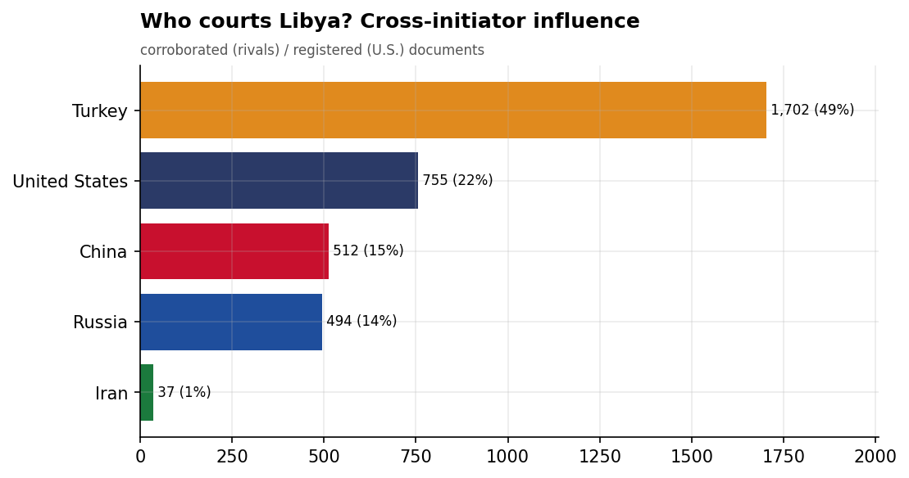
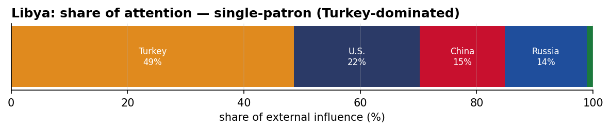
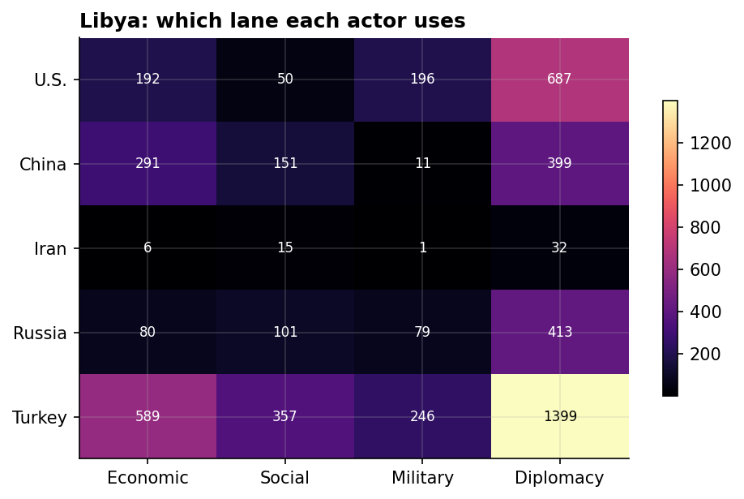
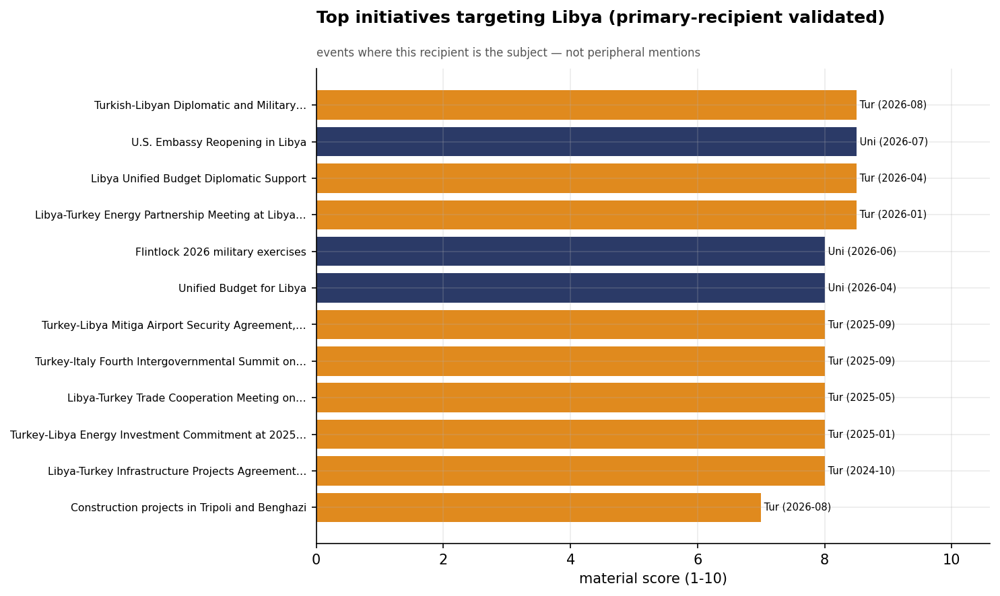
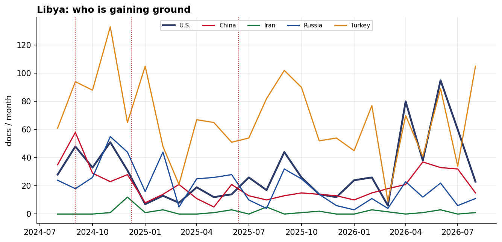

# Who Courts Libya? A Cross-Initiator Influence Assessment
### China · Iran · Russia · Turkey · United States — for Policy Analysis

*Open-source media corpus, 2024-08-01 to 2026-08-31. Method/caveats per
`../../INSIGHT_REPORT_PROMPT.md`. Intensity = third-party-corroborated documents (U.S. = registered
coverage; the U.S. has no state media in the corpus). Confidence: **(H)/(M)/(L)**.*

> **Hedging profile: single-patron (Turkey-dominated).** Lead actor: **Turkey** (48% of external attention).

---

## 1. Key Findings (BLUF)

- **Libya is a single-patron file — Turkey-dominated (48%)**, with no rival close. **(H)**
- **Division of labor by instrument:** Economic→**Turkey**, Social→**Turkey**, Military→**Turkey**, Diplomacy→**Turkey**. **(H)**
- **Turkey is the across-the-board lead** — economics, social, and diplomacy — the reconstruction-patron model. **(M)**
- **Signature initiative:** Turkish-Libyan Diplomatic and Military Cooperation Meetings (Turkey). **(M)**

---

## 2. The Suitors

| Actor | Influence (docs) | Share |
|-------|-----------------:|------:|
| Turkey | 1,702 | 49% |
| U.S. | 755 | 22% |
| China | 512 | 15% |
| Russia | 494 | 14% |
| Iran | 37 | 1% |

Libya's external-influence field is **single-patron (Turkey-dominated)**. **Turkey is the across-the-board lead** — economics, social, and diplomacy — the reconstruction-patron model.

---

## 3. Instrument Matrix — Which Lane Each Actor Uses

Read by instrument, the competition for Libya sorts cleanly: **Economic → Turkey**,
**Social → Turkey**, **Military → Turkey**, **Diplomacy →
Turkey**. Each actor competes in the lane that fits its regional model rather
than going head-to-head across all four. **(H)**

---

## 4. Initiatives Targeting Libya

*Validated for alignment: only events where Libya is the **primary** recipient are shown — named in
the title, holding ≥40% of the event's recipient mentions, or the sole top recipient.
42 peripheral events (where Libya was only mentioned in
passing on another country's initiative — e.g., regional spillover) were excluded.*

- **Turkish-Libyan Diplomatic and Military Cooperation Meetings** — Turkey, material 8.50 (2026-08)
- **U.S. Embassy Reopening in Libya** — U.S., material 8.50 (2026-07)
- **Libya Unified Budget Diplomatic Support** — Turkey, material 8.50 (2026-04)
- **Libya-Turkey Energy Partnership Meeting at Libya Energy and Economy Summit 2026** — Turkey, material 8.50 (2026-01)
- **Flintlock 2026 military exercises** — U.S., material 8.00 (2026-06)
- **Unified Budget for Libya** — U.S., material 8.00 (2026-04)
- **Turkey-Libya Mitiga Airport Security Agreement, September 2025** — Turkey, material 8.00 (2025-09)
- **Turkey-Italy Fourth Intergovernmental Summit on Libya Stability, September 2025** — Turkey, material 8.00 (2025-09)

---

## 5. Contested Dynamics, Trajectory & Gaps

- **Trajectory:** see the monthly series for who is gaining or losing ground in Libya; activity tracks
  the region's inflection points (Israel-Hezbollah escalation Sept 2024, Assad's fall Dec 2024, the
  June 2025 Israel-Iran war). **(M)**

- **Caveat:** this measures *reported* influence; the soft-power lens under-captures hard power, and
  dollar figures are announced, not verified. 

---

*Visuals plot corroborated/registered influence; underlying numbers in sibling CSVs under `assets/`.
Index: [`../README.md`](../README.md). Method: `docs/INSIGHT_REPORT_PROMPT.md`.*
