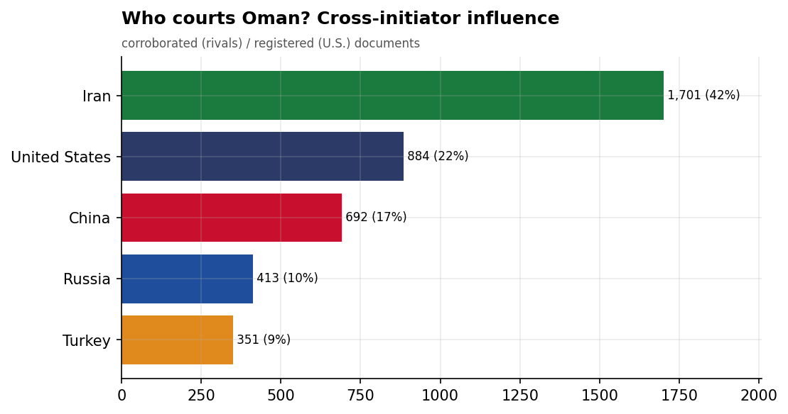
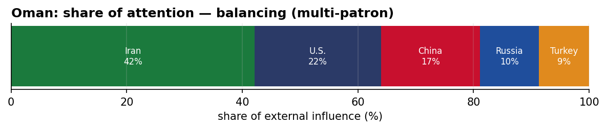
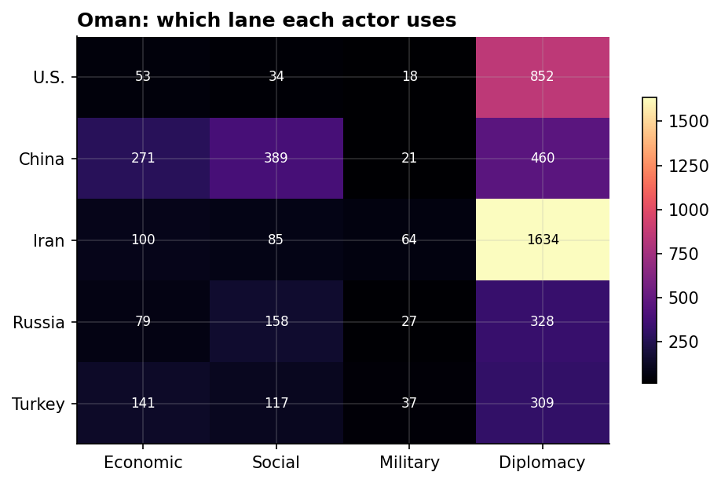
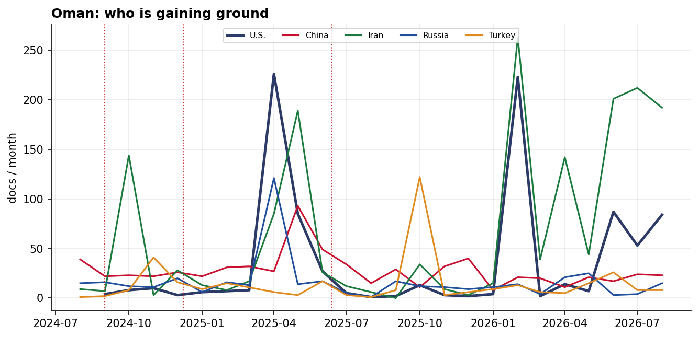

# Who Courts Oman? A Cross-Initiator Influence Assessment
### China · Iran · Russia · Turkey · United States — for Policy Analysis

*Open-source media corpus, 2024-08-01 to 2026-08-31. Method/caveats per
`../../INSIGHT_REPORT_PROMPT.md`. Intensity = third-party-corroborated documents (U.S. = registered
coverage; the U.S. has no state media in the corpus). Confidence: **(H)/(M)/(L)**.*

> **Hedging profile: balancing (multi-patron).** Lead actor: **Iran** (42% of external attention).

---

## 1. Key Findings (BLUF)

- **Oman balances multiple patrons** — Iran leads (42%) but engages U.S., China substantially too. **(M)**
- **Division of labor by instrument:** Economic→**China**, Social→**China**, Military→**Iran**, Diplomacy→**Iran**. **(H)**
- **Signature initiative:** Oman-China $200M Energy Transition Fund Launch for Vision 2040 (China). **(M)**
- **38.6% of U.S. coverage here is Iranian-media-framed** — a meaningful adversarial-narrative presence around the U.S. role. **(M)**

---

## 2. The Suitors

| Actor | Influence (docs) | Share |
|-------|-----------------:|------:|
| Iran | 1,701 | 42% |
| U.S. | 884 | 22% |
| China | 692 | 17% |
| Russia | 413 | 10% |
| Turkey | 351 | 9% |

Oman's external-influence field is **balancing (multi-patron)**. 

---

## 3. Instrument Matrix — Which Lane Each Actor Uses

Read by instrument, the competition for Oman sorts cleanly: **Economic → China**,
**Social → China**, **Military → Iran**, **Diplomacy →
Iran**. Each actor competes in the lane that fits its regional model rather
than going head-to-head across all four. **(H)**

---

## 4. Initiatives Targeting Oman

*Validated for alignment: only events where Oman is the **primary** recipient are shown — named in
the title, holding ≥40% of the event's recipient mentions, or the sole top recipient.
79 peripheral events (where Oman was only mentioned in
passing on another country's initiative — e.g., regional spillover) were excluded.*

- **Oman-China $200M Energy Transition Fund Launch for Vision 2040** — China, material 8.50 (2025-07)
- **Iran-Oman $20M Annual Trade Agreement and Joint Financial Institution Launch, June 2025** — Iran, material 8.50 (2025-05)
- **Iran-Oman 18 Economic Agreements Signing in Muscat, May 2025** — Iran, material 8.50 (2025-05)
- **Taiwan-China Electric Vehicle and Semiconductor Investment Talks in Oman** — China, material 8.50 (2025-02)
- **Inauguration of Manah 2 Solar Power Plant in Oman with Sembcorp and Jinko Power** — China, material 8.50 (2025-01)
- **Singapore-China $300M Polymer Plant Foundation at Sohar Port, Oman** — China, material 8.50 (2024-12)
- **Temporary maritime passage in the Strait of Hormuz** — Iran, material 8.00 (2026-06)
- **Oman-China Green Steel Industry Partnership Agreement for Integrated Industrial City** — China, material 8.00 (2025-12)

---

## 5. Contested Dynamics, Trajectory & Gaps

- **Trajectory:** see the monthly series for who is gaining or losing ground in Oman; activity tracks
  the region's inflection points (Israel-Hezbollah escalation Sept 2024, Assad's fall Dec 2024, the
  June 2025 Israel-Iran war). **(M)**
- **Adversarial framing:** 38.6% of the U.S.'s coverage in Oman is carried by Iranian media — its image here is partly written by its adversary. **(M)**
- **Caveat:** this measures *reported* influence; the soft-power lens under-captures hard power, and
  dollar figures are announced, not verified. 

---

*Visuals plot corroborated/registered influence; underlying numbers in sibling CSVs under `assets/`.
Index: [`../README.md`](../README.md). Method: `docs/INSIGHT_REPORT_PROMPT.md`.*

## Post-window context (September 2026)

*The corpus extends to 2026-09-09; September is nine days of data — context, not
analysis-grade. August 2026 is now inside the analysis window.*

- **The Muscat channel is holding, not fading**: Iran→Oman ran 201 → 212 → 192 corroborated
  docs Jun→Aug (an Iran–Oman Hormuz navigation round Aug 2; a proposed Hormuz shipping
  route was August's most-corroborated new Iranian initiative at 0.82). **Oman is now
  Iran's #3 corroborated recipient (1,701 in-window)** — behind only Lebanon and Iraq,
  ahead of Syria — and FM Badr al-Busaidi remains the region's most contested intermediary.
