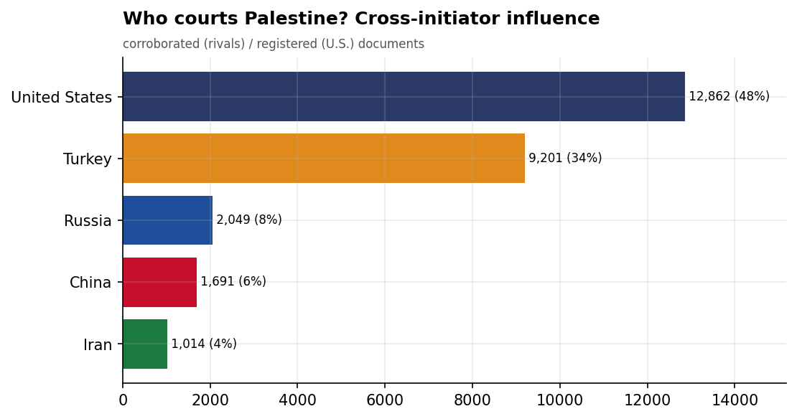
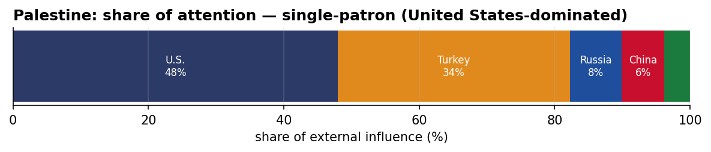
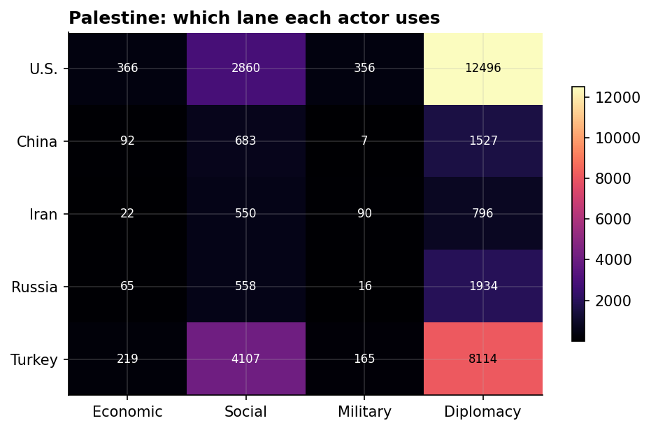
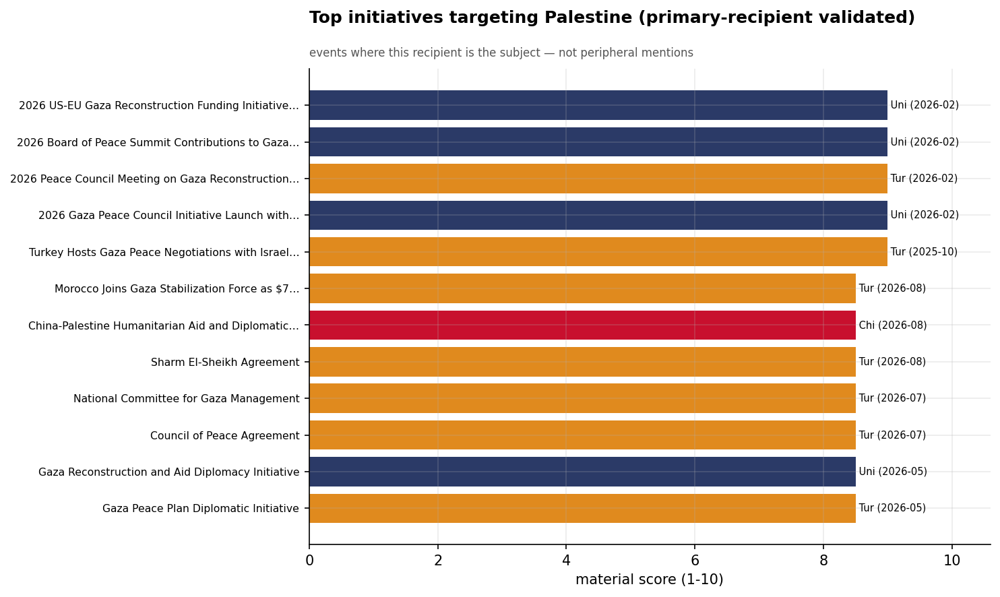
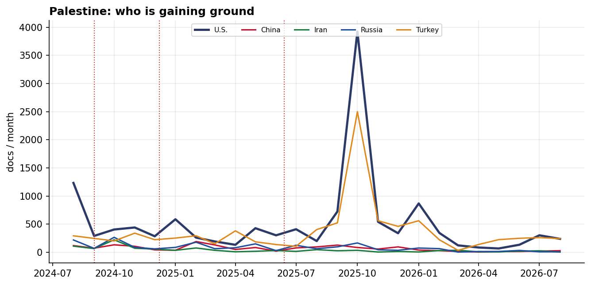

# Who Courts Palestine? A Cross-Initiator Influence Assessment
### China · Iran · Russia · Turkey · United States — for Policy Analysis

*Open-source media corpus, 2024-08-01 to 2026-08-31. Method/caveats per
`../../INSIGHT_REPORT_PROMPT.md`. Intensity = third-party-corroborated documents (U.S. = registered
coverage; the U.S. has no state media in the corpus). Confidence: **(H)/(M)/(L)**.*

> **Hedging profile: single-patron (United States-dominated).** Lead actor: **U.S.** (48% of external attention).

---

## 1. Key Findings (BLUF)

- **Palestine is dominated by U.S. involvement (48% of external attention)** — but this reflects Palestine's centrality to a crisis/alliance file, not development courtship. **(H)**
- **Division of labor by instrument:** Economic→**U.S.**, Social→**Turkey**, Military→**U.S.**, Diplomacy→**U.S.**. **(H)**
- The U.S. lead here is **crisis/alliance involvement, not economic courtship** — it reflects how central Washington is to this file, adversarially or as guarantor. **(M)**
- **Signature initiative:** 2026 US-EU Gaza Reconstruction Funding Initiative in Brussels (U.S.). **(M)**

---

## 2. The Suitors

| Actor | Influence (docs) | Share |
|-------|-----------------:|------:|
| U.S. | 12,862 | 48% |
| Turkey | 9,201 | 34% |
| Russia | 2,049 | 8% |
| China | 1,691 | 6% |
| Iran | 1,014 | 4% |

Palestine's external-influence field is **single-patron (United States-dominated)**. The U.S. lead here is **crisis/alliance involvement, not economic courtship** — it reflects how central Washington is to this file, adversarially or as guarantor.

---

## 3. Instrument Matrix — Which Lane Each Actor Uses

Read by instrument, the competition for Palestine sorts cleanly: **Economic → U.S.**,
**Social → Turkey**, **Military → U.S.**, **Diplomacy →
U.S.**. Each actor competes in the lane that fits its regional model rather
than going head-to-head across all four. **(H)**

---

## 4. Initiatives Targeting Palestine

*Validated for alignment: only events where Palestine is the **primary** recipient are shown — named in
the title, holding ≥40% of the event's recipient mentions, or the sole top recipient.
30 peripheral events (where Palestine was only mentioned in
passing on another country's initiative — e.g., regional spillover) were excluded.*

- **2026 US-EU Gaza Reconstruction Funding Initiative in Brussels** — U.S., material 9.00 (2026-02)
- **2026 Board of Peace Summit Contributions to Gaza Reconstruction** — U.S., material 9.00 (2026-02)
- **2026 Peace Council Meeting on Gaza Reconstruction in Washington** — Turkey, material 9.00 (2026-02)
- **2026 Gaza Peace Council Initiative Launch with $10B US Commitment** — U.S., material 9.00 (2026-02)
- **Turkey Hosts Gaza Peace Negotiations with Israel and Palestine, October 2025** — Turkey, material 9.00 (2025-10)
- **Morocco Joins Gaza Stabilization Force as $7 Billion Reconstruction Pledges Back Ceasefire Roadmap** — Turkey, material 8.50 (2026-08)
- **China-Palestine Humanitarian Aid and Diplomatic Engagement** — China, material 8.50 (2026-08)
- **Sharm El-Sheikh Agreement** — Turkey, material 8.50 (2026-08)

---

## 5. Contested Dynamics, Trajectory & Gaps

- **Trajectory:** see the monthly series for who is gaining or losing ground in Palestine; activity tracks
  the region's inflection points (Israel-Hezbollah escalation Sept 2024, Assad's fall Dec 2024, the
  June 2025 Israel-Iran war). **(M)**
- **Adversarial framing:** 12.4% of the U.S.'s coverage in Palestine is carried by Iranian media — its image here is partly written by its adversary. **(M)**
- **Caveat:** this measures *reported* influence; the soft-power lens under-captures hard power, and
  dollar figures are announced, not verified. For Palestine, a high U.S. share reflects crisis/alliance involvement rather than economic courtship.

---

*Visuals plot corroborated/registered influence; underlying numbers in sibling CSVs under `assets/`.
Index: [`../README.md`](../README.md). Method: `docs/INSIGHT_REPORT_PROMPT.md`.*
