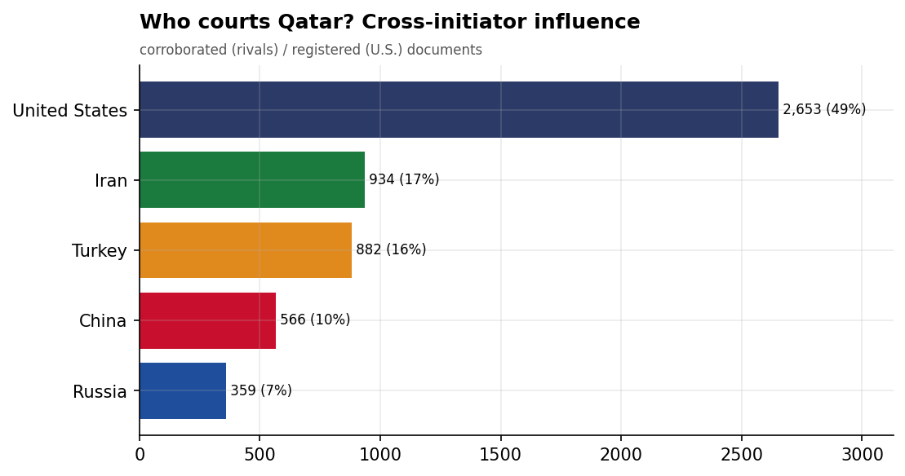
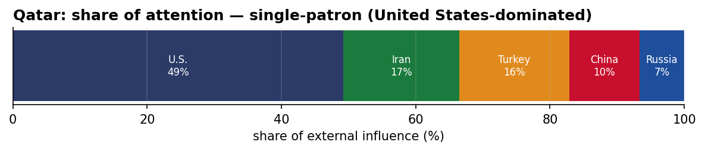
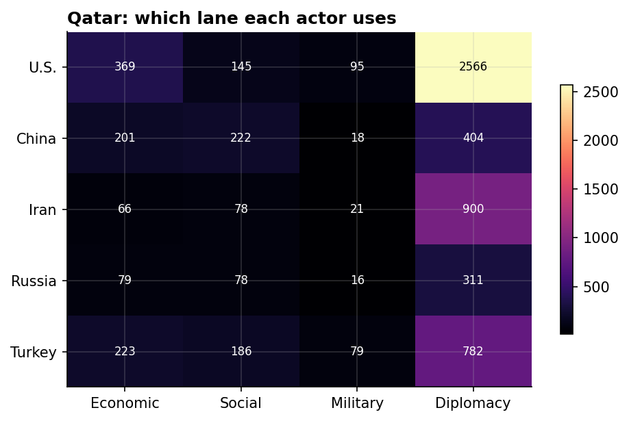
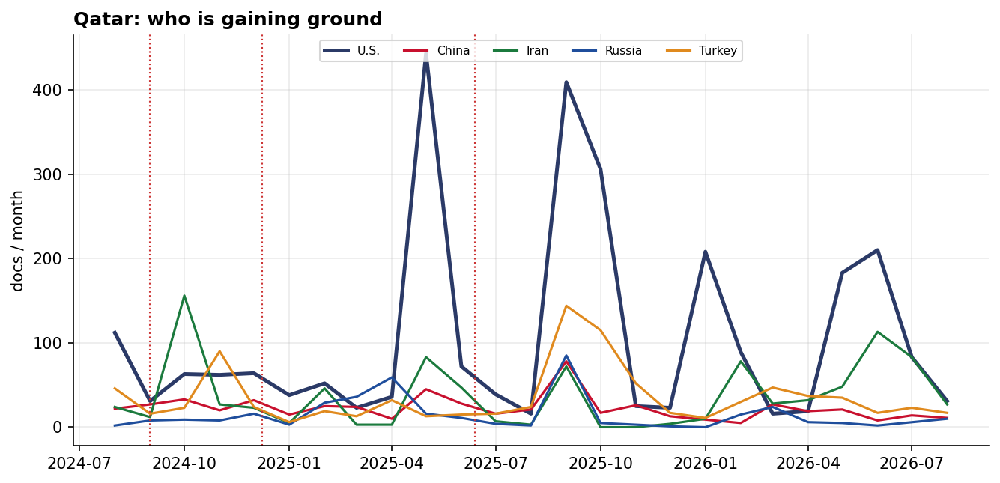

# Who Courts Qatar? A Cross-Initiator Influence Assessment
### China · Iran · Russia · Turkey · United States — for Policy Analysis

*Open-source media corpus, 2024-08-01 to 2026-08-31. Method/caveats per
`../../INSIGHT_REPORT_PROMPT.md`. Intensity = third-party-corroborated documents (U.S. = registered
coverage; the U.S. has no state media in the corpus). Confidence: **(H)/(M)/(L)**.*

> **Hedging profile: single-patron (United States-dominated).** Lead actor: **U.S.** (49% of external attention).

---

## 1. Key Findings (BLUF)

- **Qatar is a single-patron file — U.S.-dominated (49%)**, with no rival close. **(H)**
- **Division of labor by instrument:** Economic→**U.S.**, Social→**China**, Military→**U.S.**, Diplomacy→**U.S.**. **(H)**
- **Signature initiative:** US-Qatar $96 Billion Aircraft Purchase Agreement, August 2025 (U.S.). **(M)**
- **19.0% of U.S. coverage here is Iranian-media-framed** — a meaningful adversarial-narrative presence around the U.S. role. **(M)**

---

## 2. The Suitors

| Actor | Influence (docs) | Share |
|-------|-----------------:|------:|
| U.S. | 2,653 | 49% |
| Iran | 934 | 17% |
| Turkey | 882 | 16% |
| China | 566 | 10% |
| Russia | 359 | 7% |

Qatar's external-influence field is **single-patron (United States-dominated)**. 

---

## 3. Instrument Matrix — Which Lane Each Actor Uses

Read by instrument, the competition for Qatar sorts cleanly: **Economic → U.S.**,
**Social → China**, **Military → U.S.**, **Diplomacy →
U.S.**. Each actor competes in the lane that fits its regional model rather
than going head-to-head across all four. **(H)**

---

## 4. Initiatives Targeting Qatar

*Validated for alignment: only events where Qatar is the **primary** recipient are shown — named in
the title, holding ≥40% of the event's recipient mentions, or the sole top recipient.
89 peripheral events (where Qatar was only mentioned in
passing on another country's initiative — e.g., regional spillover) were excluded.*

- **US-Qatar $96 Billion Aircraft Purchase Agreement, August 2025** — U.S., material 9.00 (2025-08)
- **Trump's 2025 Middle East Economic Agreements with Saudi Arabia and Qatar** — U.S., material 9.00 (2025-05)
- **Trump's 2025 Gulf Investment Agreements with Saudi Arabia, Qatar, UAE** — U.S., material 9.00 (2025-05)
- **US-Iran-Qatar Diplomatic Negotiations in Doha** — U.S., material 8.50 (2026-06)
- **Iran-Pakistan-Qatar Mediation for Lebanon Conflict Resolution** — Iran, material 8.50 (2026-06)
- **2025 Gaza Ceasefire Agreement Signing in Cairo with US, Qatar, Turkey** — Turkey, material 8.50 (2025-10)
- **Trump's 2025 Doha Visit for US-Qatar Hostage Release Negotiations** — U.S., material 8.50 (2025-05)
- **Russia-Qatar Energy and Investment Cooperation Agreement, April 2025** — Russia, material 8.50 (2025-04)

---

## 5. Contested Dynamics, Trajectory & Gaps

- **Trajectory:** see the monthly series for who is gaining or losing ground in Qatar; activity tracks
  the region's inflection points (Israel-Hezbollah escalation Sept 2024, Assad's fall Dec 2024, the
  June 2025 Israel-Iran war). **(M)**
- **Adversarial framing:** 19.0% of the U.S.'s coverage in Qatar is carried by Iranian media — its image here is partly written by its adversary. **(M)**
- **Caveat:** this measures *reported* influence; the soft-power lens under-captures hard power, and
  dollar figures are announced, not verified. 

---

*Visuals plot corroborated/registered influence; underlying numbers in sibling CSVs under `assets/`.
Index: [`../README.md`](../README.md). Method: `docs/INSIGHT_REPORT_PROMPT.md`.*

## Post-window context (September 2026)

*The corpus extends to 2026-09-09; September is nine days of data — context, not
analysis-grade. August 2026 is now inside the analysis window.*

- **Iran's lead over Turkey on Qatar held through the full August window** — 934 vs 882
  corroborated docs among the four assessed actors on the re-measured September layer. Both
  files were quiet in August itself (Iran 37, Turkey 22) as the US–Iran channel stayed on
  the Strait of Hormuz and Muscat: the Doha-venue flip of June is durable, not a one-month
  artifact. The U.S. remains Qatar's overall leader on the registered basis.
