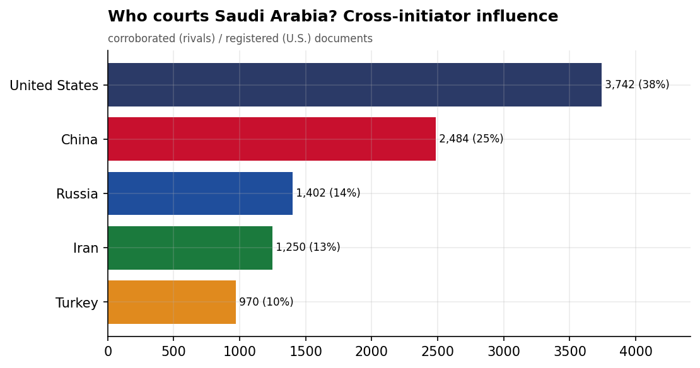
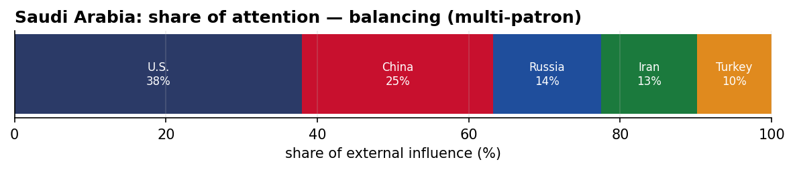
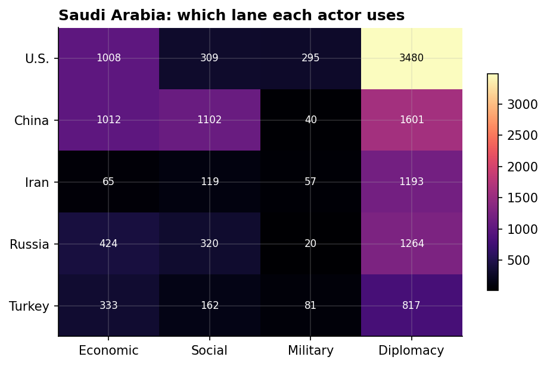
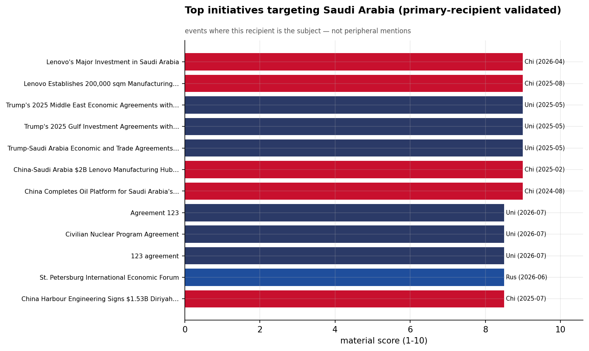
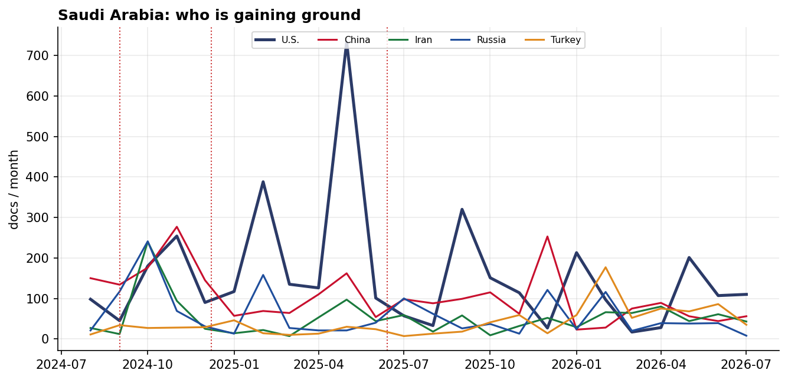

# Who Courts Saudi Arabia? A Cross-Initiator Influence Assessment
### China · Iran · Russia · Turkey · United States — for Policy Analysis

*Open-source media corpus, 2024-08-01 to 2026-07-31. Method/caveats per
`../../INSIGHT_REPORT_PROMPT.md`. Intensity = third-party-corroborated documents (U.S. = registered
coverage; the U.S. has no state media in the corpus). Confidence: **(H)/(M)/(L)**.*

> **Hedging profile: balancing (multi-patron).** Lead actor: **U.S.** (38% of external attention).

---

## 1. Key Findings (BLUF)

- **Saudi Arabia balances multiple patrons** — U.S. leads (38%) but engages China, Russia substantially too. **(M)**
- **Division of labor by instrument:** Economic→**China**, Social→**China**, Military→**U.S.**, Diplomacy→**U.S.**. **(H)**
- The classic division of labor is on display: **China supplies the economics and the U.S. the security** — the Gulf-hedge pattern at the country level. **(M)**
- **Signature initiative:** Lenovo's Major Investment in Saudi Arabia (China). **(M)**
- **19.3% of U.S. coverage here is Iranian-media-framed** — a meaningful adversarial-narrative presence around the U.S. role. **(M)**

---

## 2. The Suitors

| Actor | Influence (docs) | Share |
|-------|-----------------:|------:|
| U.S. | 3,742 | 38% |
| China | 2,484 | 25% |
| Russia | 1,402 | 14% |
| Iran | 1,250 | 13% |
| Turkey | 970 | 10% |

Saudi Arabia's external-influence field is **balancing (multi-patron)**. The classic division of labor is on display: **China supplies the economics and the U.S. the security** — the Gulf-hedge pattern at the country level.

---

## 3. Instrument Matrix — Which Lane Each Actor Uses

Read by instrument, the competition for Saudi Arabia sorts cleanly: **Economic → China**,
**Social → China**, **Military → U.S.**, **Diplomacy →
U.S.**. Each actor competes in the lane that fits its regional model rather
than going head-to-head across all four. **(H)**

---

## 4. Initiatives Targeting Saudi Arabia

*Validated for alignment: only events where Saudi Arabia is the **primary** recipient are shown — named in
the title, holding ≥40% of the event's recipient mentions, or the sole top recipient.
66 peripheral events (where Saudi Arabia was only mentioned in
passing on another country's initiative — e.g., regional spillover) were excluded.*

- **Lenovo's Major Investment in Saudi Arabia** — China, material 9.00 (2026-04)
- **Lenovo Establishes 200,000 sqm Manufacturing Facility in Riyadh for Vision 2030** — China, material 9.00 (2025-08)
- **Trump's 2025 Middle East Economic Agreements with Saudi Arabia and Qatar** — U.S., material 9.00 (2025-05)
- **Trump's 2025 Gulf Investment Agreements with Saudi Arabia, Qatar, UAE** — U.S., material 9.00 (2025-05)
- **Trump-Saudi Arabia Economic and Trade Agreements Signing, May 2025** — U.S., material 9.00 (2025-05)
- **China-Saudi Arabia $2B Lenovo Manufacturing Hub Groundbreaking in Riyadh** — China, material 9.00 (2025-02)
- **China Completes Oil Platform for Saudi Arabia's Marjan Field Increment Program** — China, material 9.00 (2024-08)
- **Agreement 123** — U.S., material 8.50 (2026-07)

---

## 5. Contested Dynamics, Trajectory & Gaps

- **Trajectory:** see the monthly series for who is gaining or losing ground in Saudi Arabia; activity tracks
  the region's inflection points (Israel-Hezbollah escalation Sept 2024, Assad's fall Dec 2024, the
  June 2025 Israel-Iran war). **(M)**
- **Adversarial framing:** 19.3% of the U.S.'s coverage in Saudi Arabia is carried by Iranian media — its image here is partly written by its adversary. **(M)**
- **Caveat:** this measures *reported* influence; the soft-power lens under-captures hard power, and
  dollar figures are announced, not verified. 

---

*Visuals plot corroborated/registered influence; underlying numbers in sibling CSVs under `assets/`.
Index: [`../README.md`](../README.md). Method: `docs/INSIGHT_REPORT_PROMPT.md`.*
