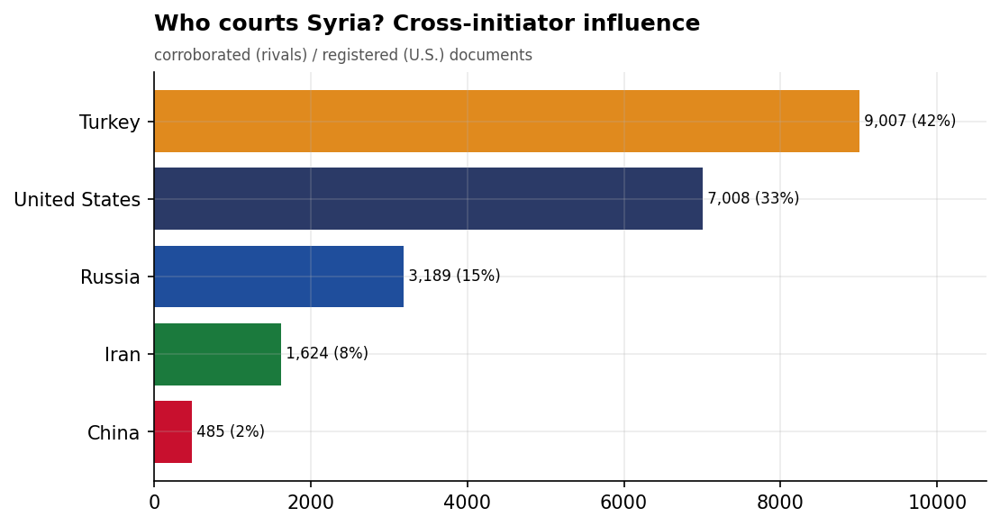
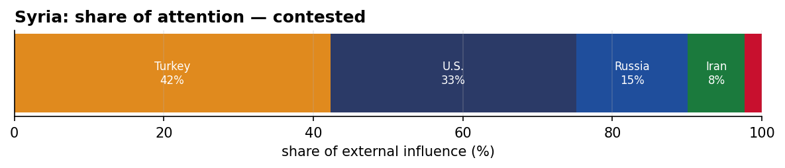
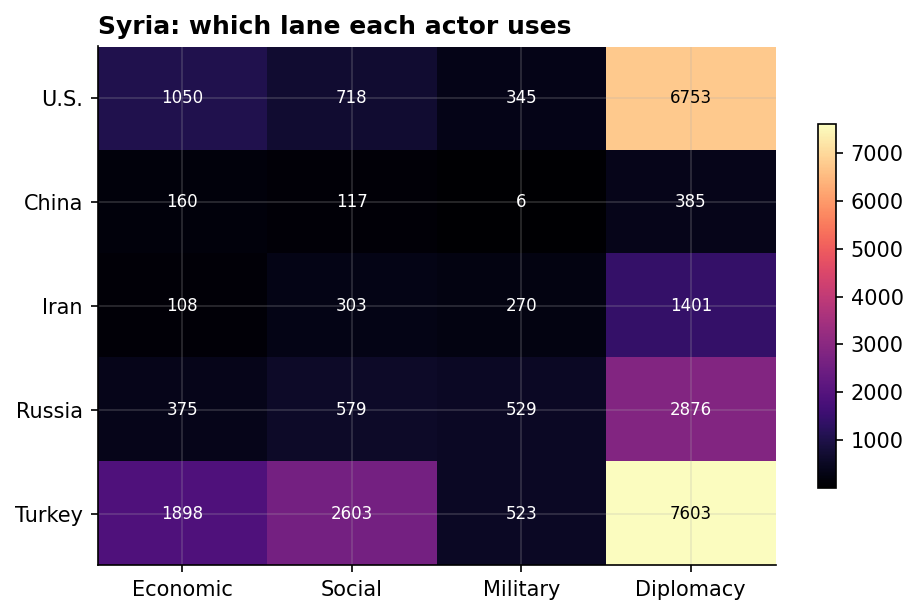
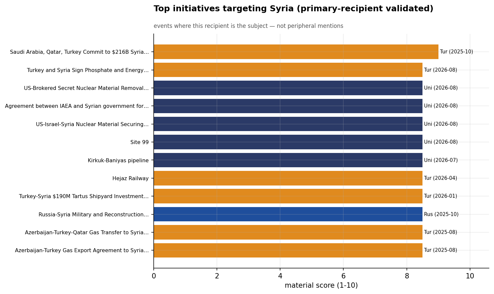
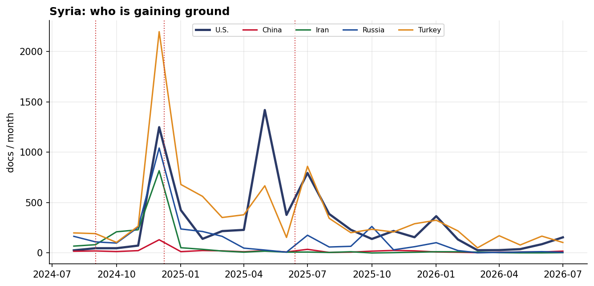

# Who Courts Syria? A Cross-Initiator Influence Assessment
### China · Iran · Russia · Turkey · United States — for Policy Analysis

*Open-source media corpus, 2024-08-01 to 2026-07-31. Method/caveats per
`../../INSIGHT_REPORT_PROMPT.md`. Intensity = third-party-corroborated documents (U.S. = registered
coverage; the U.S. has no state media in the corpus). Confidence: **(H)/(M)/(L)**.*

> **Hedging profile: contested.** Lead actor: **Turkey** (42% of external attention).

---

## 1. Key Findings (BLUF)

- **Syria is genuinely contested:** Turkey leads with only 42%, with U.S. close behind (32%). **(H)**
- **Division of labor by instrument:** Economic→**Turkey**, Social→**Turkey**, Military→**Russia**, Diplomacy→**Turkey**. **(H)**
- **Turkey is the across-the-board lead** — economics, social, and diplomacy — the reconstruction-patron model. **(M)**
- **Signature initiative:** Saudi Arabia, Qatar, Turkey Commit to $216B Syria Reconstruction Agreements (Turkey). **(M)**

---

## 2. The Suitors

| Actor | Influence (docs) | Share |
|-------|-----------------:|------:|
| Turkey | 9,007 | 42% |
| U.S. | 7,008 | 33% |
| Russia | 3,189 | 15% |
| Iran | 1,624 | 8% |
| China | 485 | 2% |

Syria's external-influence field is **contested**. **Turkey is the across-the-board lead** — economics, social, and diplomacy — the reconstruction-patron model.

---

## 3. Instrument Matrix — Which Lane Each Actor Uses

Read by instrument, the competition for Syria sorts cleanly: **Economic → Turkey**,
**Social → Turkey**, **Military → Russia**, **Diplomacy →
Turkey**. Each actor competes in the lane that fits its regional model rather
than going head-to-head across all four. **(H)**

---

## 4. Initiatives Targeting Syria

*Validated for alignment: only events where Syria is the **primary** recipient are shown — named in
the title, holding ≥40% of the event's recipient mentions, or the sole top recipient.
42 peripheral events (where Syria was only mentioned in
passing on another country's initiative — e.g., regional spillover) were excluded.*

- **Saudi Arabia, Qatar, Turkey Commit to $216B Syria Reconstruction Agreements** — Turkey, material 9.00 (2025-10)
- **Turkey and Syria Sign Phosphate and Energy Cooperation MoU in Damascus** — Turkey, material 8.50 (2026-08)
- **US-Brokered Secret Nuclear Material Removal Agreement** — U.S., material 8.50 (2026-08)
- **Agreement between IAEA and Syrian government for nuclear material removal** — U.S., material 8.50 (2026-08)
- **US-Israel-Syria Nuclear Material Securing Agreement** — U.S., material 8.50 (2026-08)
- **Site 99** — U.S., material 8.50 (2026-08)
- **Kirkuk-Baniyas pipeline** — U.S., material 8.50 (2026-07)
- **Hejaz Railway** — Turkey, material 8.50 (2026-04)

---

## 5. Contested Dynamics, Trajectory & Gaps

- **Trajectory:** see the monthly series for who is gaining or losing ground in Syria; activity tracks
  the region's inflection points (Israel-Hezbollah escalation Sept 2024, Assad's fall Dec 2024, the
  June 2025 Israel-Iran war). **(M)**
- **Adversarial framing:** 10.2% of the U.S.'s coverage in Syria is carried by Iranian media — its image here is partly written by its adversary. **(M)**
- **Caveat:** this measures *reported* influence; the soft-power lens under-captures hard power, and
  dollar figures are announced, not verified. For Syria, a high U.S. share reflects crisis/alliance involvement rather than economic courtship.

---

*Visuals plot corroborated/registered influence; underlying numbers in sibling CSVs under `assets/`.
Index: [`../README.md`](../README.md). Method: `docs/INSIGHT_REPORT_PROMPT.md`.*
