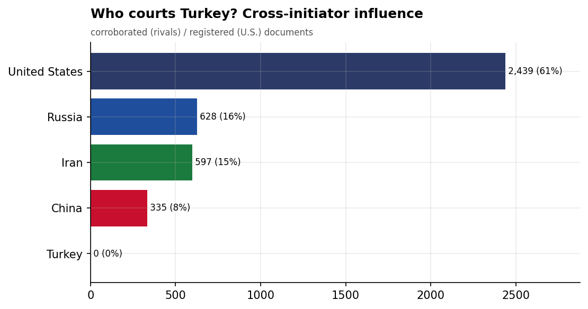
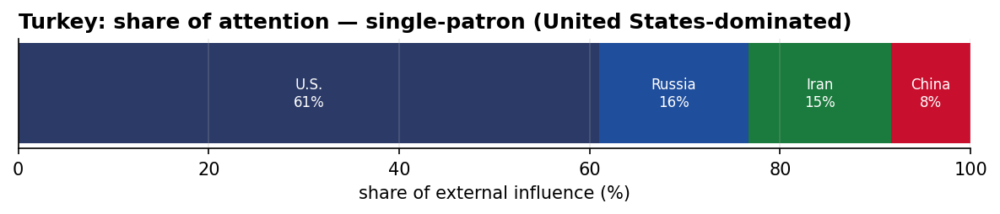
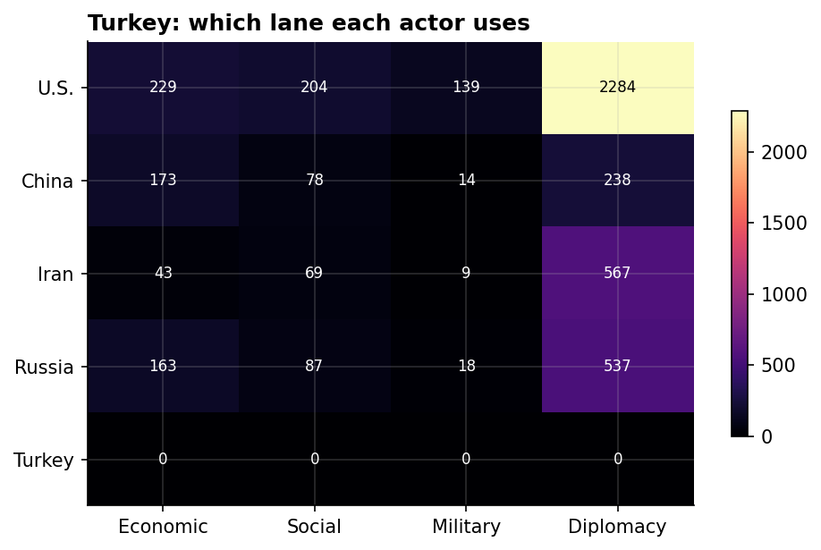
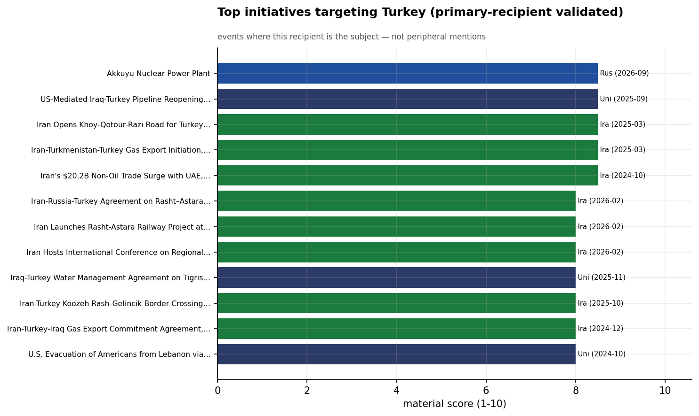
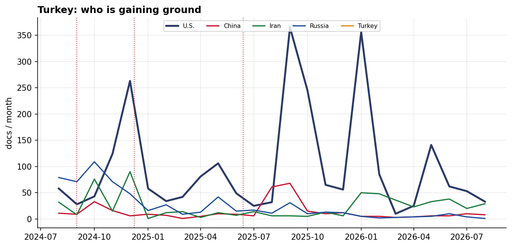

# Who Courts Turkey? A Cross-Initiator Influence Assessment
### China · Iran · Russia · Turkey · United States — for Policy Analysis

*Open-source media corpus, 2024-08-01 to 2026-08-31. Method/caveats per
`../../INSIGHT_REPORT_PROMPT.md`. Intensity = third-party-corroborated documents (U.S. = registered
coverage; the U.S. has no state media in the corpus). Confidence: **(H)/(M)/(L)**.*

> **Hedging profile: single-patron (United States-dominated).** Lead actor: **U.S.** (61% of external attention).

---

## 1. Key Findings (BLUF)

- **Turkey is a single-patron file — U.S.-dominated (61%)**, with no rival close. **(H)**
- **Division of labor by instrument:** Economic→**U.S.**, Social→**U.S.**, Military→**U.S.**, Diplomacy→**U.S.**. **(H)**
- **Signature initiative:** Akkuyu Nuclear Power Plant (Russia). **(M)**
- **15.9% of U.S. coverage here is Iranian-media-framed** — a meaningful adversarial-narrative presence around the U.S. role. **(M)**

---

## 2. The Suitors

| Actor | Influence (docs) | Share |
|-------|-----------------:|------:|
| U.S. | 2,439 | 61% |
| Russia | 628 | 16% |
| Iran | 597 | 15% |
| China | 335 | 8% |

Turkey's external-influence field is **single-patron (United States-dominated)**. 

---

## 3. Instrument Matrix — Which Lane Each Actor Uses

Read by instrument, the competition for Turkey sorts cleanly: **Economic → U.S.**,
**Social → U.S.**, **Military → U.S.**, **Diplomacy →
U.S.**. Each actor competes in the lane that fits its regional model rather
than going head-to-head across all four. **(H)**

---

## 4. Initiatives Targeting Turkey

*Validated for alignment: only events where Turkey is the **primary** recipient are shown — named in
the title, holding ≥40% of the event's recipient mentions, or the sole top recipient.
97 peripheral events (where Turkey was only mentioned in
passing on another country's initiative — e.g., regional spillover) were excluded.*

- **Akkuyu Nuclear Power Plant** — Russia, material 8.50 (2026-09)
- **US-Mediated Iraq-Turkey Pipeline Reopening Agreement, September 2025** — U.S., material 8.50 (2025-09)
- **Iran Opens Khoy-Qotour-Razi Road for Turkey Transit Corridor, March 2025** — Iran, material 8.50 (2025-03)
- **Iran-Turkmenistan-Turkey Gas Export Initiation, March 2025** — Iran, material 8.50 (2025-03)
- **Iran's $20.2B Non-Oil Trade Surge with UAE, Turkey, and Iraq, 2024** — Iran, material 8.50 (2024-10)
- **Iran-Russia-Turkey Agreement on Rasht–Astara Railway Development, February 2026** — Iran, material 8.00 (2026-02)
- **Iran Launches Rasht-Astara Railway Project at International Investment Conference 2026** — Iran, material 8.00 (2026-02)
- **Iran Hosts International Conference on Regional Infrastructure Investment, February 2026** — Iran, material 8.00 (2026-02)

---

## 5. Contested Dynamics, Trajectory & Gaps

- **Trajectory:** see the monthly series for who is gaining or losing ground in Turkey; activity tracks
  the region's inflection points (Israel-Hezbollah escalation Sept 2024, Assad's fall Dec 2024, the
  June 2025 Israel-Iran war). **(M)**
- **Adversarial framing:** 15.9% of the U.S.'s coverage in Turkey is carried by Iranian media — its image here is partly written by its adversary. **(M)**
- **Caveat:** this measures *reported* influence; the soft-power lens under-captures hard power, and
  dollar figures are announced, not verified. 

---

*Visuals plot corroborated/registered influence; underlying numbers in sibling CSVs under `assets/`.
Index: [`../README.md`](../README.md). Method: `docs/INSIGHT_REPORT_PROMPT.md`.*
