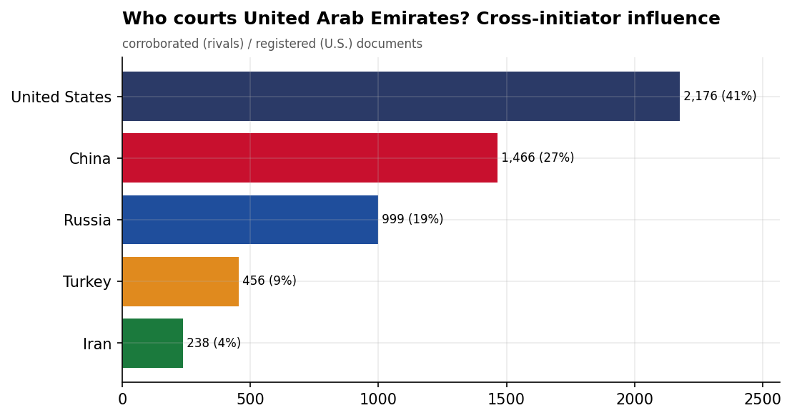
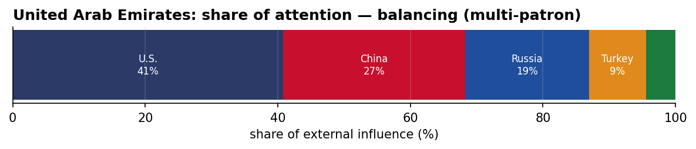
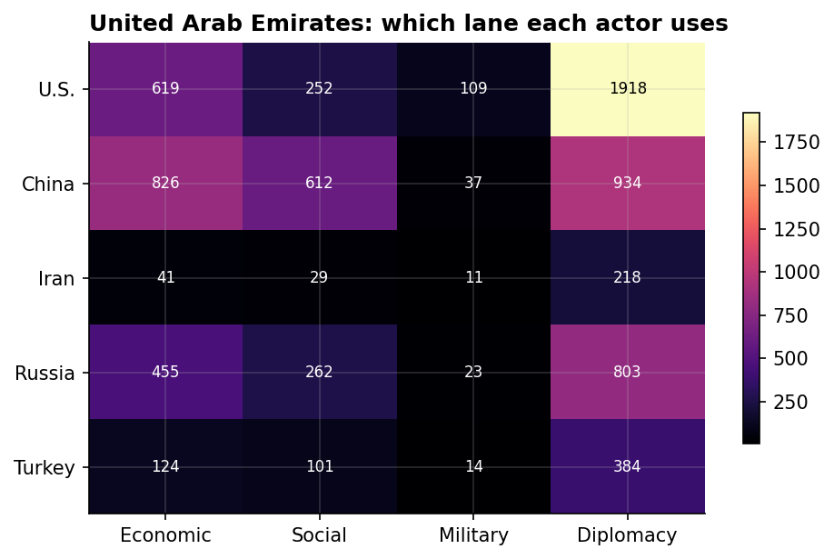
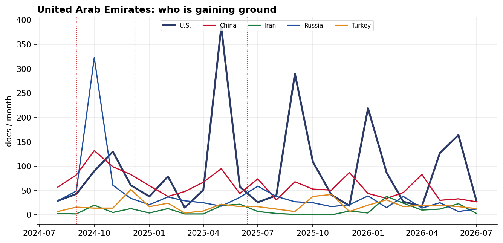

# Who Courts United Arab Emirates? A Cross-Initiator Influence Assessment
### China · Iran · Russia · Turkey · United States — for Policy Analysis

*Open-source media corpus, 2024-08-01 to 2026-07-31. Method/caveats per
`../../INSIGHT_REPORT_PROMPT.md`. Intensity = third-party-corroborated documents (U.S. = registered
coverage; the U.S. has no state media in the corpus). Confidence: **(H)/(M)/(L)**.*

> **Hedging profile: balancing (multi-patron).** Lead actor: **U.S.** (40% of external attention).

---

## 1. Key Findings (BLUF)

- **United Arab Emirates balances multiple patrons** — U.S. leads (40%) but engages China, Russia substantially too. **(M)**
- **Division of labor by instrument:** Economic→**China**, Social→**China**, Military→**U.S.**, Diplomacy→**U.S.**. **(H)**
- The classic division of labor is on display: **China supplies the economics and the U.S. the security** — the Gulf-hedge pattern at the country level. **(M)**
- **Signature initiative:** Trump's 2025 Gulf Investment Agreements with Saudi Arabia, Qatar, UAE (U.S.). **(M)**
- **20.5% of U.S. coverage here is Iranian-media-framed** — a meaningful adversarial-narrative presence around the U.S. role. **(M)**

---

## 2. The Suitors

| Actor | Influence (docs) | Share |
|-------|-----------------:|------:|
| U.S. | 2,176 | 41% |
| China | 1,466 | 27% |
| Russia | 999 | 19% |
| Turkey | 456 | 9% |
| Iran | 238 | 4% |

United Arab Emirates's external-influence field is **balancing (multi-patron)**. The classic division of labor is on display: **China supplies the economics and the U.S. the security** — the Gulf-hedge pattern at the country level.

---

## 3. Instrument Matrix — Which Lane Each Actor Uses

Read by instrument, the competition for United Arab Emirates sorts cleanly: **Economic → China**,
**Social → China**, **Military → U.S.**, **Diplomacy →
U.S.**. Each actor competes in the lane that fits its regional model rather
than going head-to-head across all four. **(H)**

---

## 4. Initiatives Targeting United Arab Emirates

*Validated for alignment: only events where United Arab Emirates is the **primary** recipient are shown — named in
the title, holding ≥40% of the event's recipient mentions, or the sole top recipient.
87 peripheral events (where United Arab Emirates was only mentioned in
passing on another country's initiative — e.g., regional spillover) were excluded.*

- **Trump's 2025 Gulf Investment Agreements with Saudi Arabia, Qatar, UAE** — U.S., material 9.00 (2025-05)
- **Trump's 2025 Middle East Economic Diplomacy Tour with Saudi Arabia and UAE** — U.S., material 9.00 (2025-05)
- **US-UAE AI Semiconductor Purchase Agreement, May 2025** — U.S., material 9.00 (2025-05)
- **US-Iran peace deal** — U.S., material 8.50 (2026-06)
- **China-UAE Engineering Center Project in Dubai** — China, material 8.50 (2026-05)
- **Integrated Clean Energy and Manufacturing Platform** — China, material 8.50 (2026-04)
- **Microsoft $8B AI Infrastructure Investment in UAE, November 2025** — U.S., material 8.50 (2025-11)
- **Trump's 2025 Gaza Conflict Diplomatic Talks in Saudi Arabia and UAE** — U.S., material 8.50 (2025-05)

---

## 5. Contested Dynamics, Trajectory & Gaps

- **Trajectory:** see the monthly series for who is gaining or losing ground in United Arab Emirates; activity tracks
  the region's inflection points (Israel-Hezbollah escalation Sept 2024, Assad's fall Dec 2024, the
  June 2025 Israel-Iran war). **(M)**
- **Adversarial framing:** 20.5% of the U.S.'s coverage in United Arab Emirates is carried by Iranian media — its image here is partly written by its adversary. **(M)**
- **Caveat:** this measures *reported* influence; the soft-power lens under-captures hard power, and
  dollar figures are announced, not verified. 

---

*Visuals plot corroborated/registered influence; underlying numbers in sibling CSVs under `assets/`.
Index: [`../README.md`](../README.md). Method: `docs/INSIGHT_REPORT_PROMPT.md`.*
