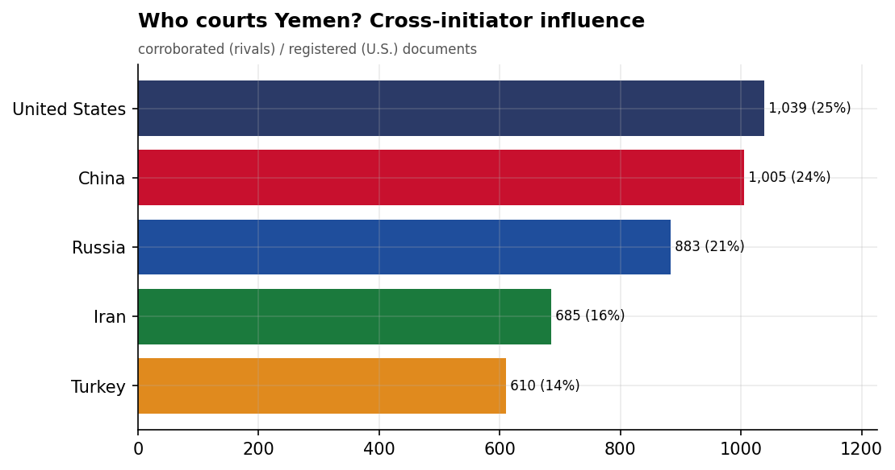
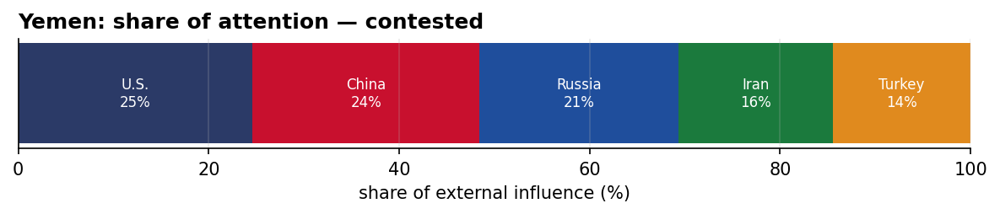
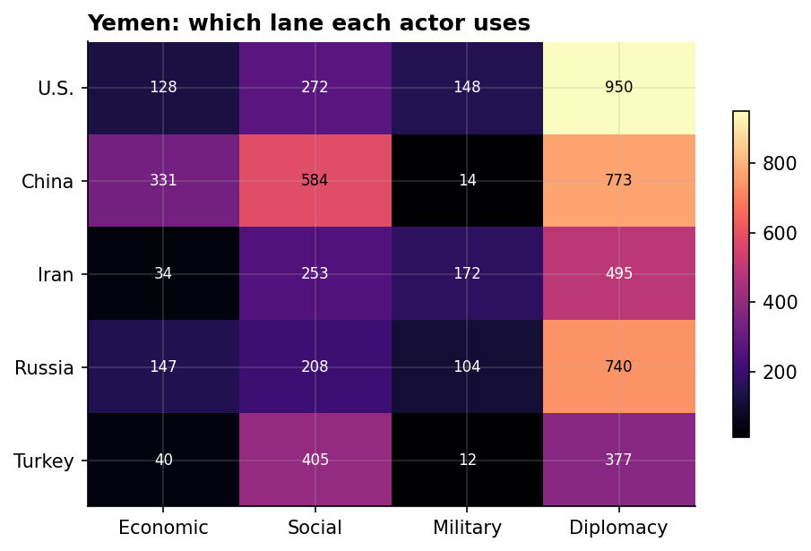
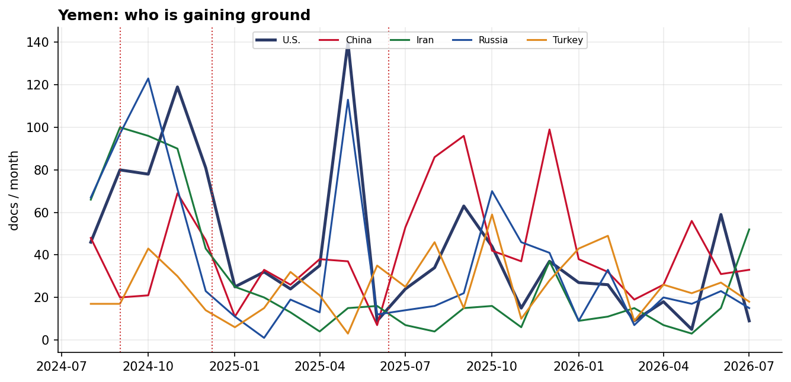

# Who Courts Yemen? A Cross-Initiator Influence Assessment
### China · Iran · Russia · Turkey · United States — for Policy Analysis

*Open-source media corpus, 2024-08-01 to 2026-07-31. Method/caveats per
`../../INSIGHT_REPORT_PROMPT.md`. Intensity = third-party-corroborated documents (U.S. = registered
coverage; the U.S. has no state media in the corpus). Confidence: **(H)/(M)/(L)**.*

> **Hedging profile: contested.** Lead actor: **U.S.** (24% of external attention).

---

## 1. Key Findings (BLUF)

- **Yemen is genuinely contested:** U.S. leads with only 24%, with China close behind (23%). **(H)**
- **Division of labor by instrument:** Economic→**China**, Social→**China**, Military→**Iran**, Diplomacy→**U.S.**. **(H)**
- **Signature initiative:** Inauguration of Anatolian Residential Complex for Displaced in Marib, Yemen (Turkey). **(M)**

---

## 2. The Suitors

| Actor | Influence (docs) | Share |
|-------|-----------------:|------:|
| U.S. | 1,039 | 25% |
| China | 1,005 | 24% |
| Russia | 883 | 21% |
| Iran | 685 | 16% |
| Turkey | 610 | 14% |

Yemen's external-influence field is **contested**. 

---

## 3. Instrument Matrix — Which Lane Each Actor Uses

Read by instrument, the competition for Yemen sorts cleanly: **Economic → China**,
**Social → China**, **Military → Iran**, **Diplomacy →
U.S.**. Each actor competes in the lane that fits its regional model rather
than going head-to-head across all four. **(H)**

---

## 4. Initiatives Targeting Yemen

*Validated for alignment: only events where Yemen is the **primary** recipient are shown — named in
the title, holding ≥40% of the event's recipient mentions, or the sole top recipient.
70 peripheral events (where Yemen was only mentioned in
passing on another country's initiative — e.g., regional spillover) were excluded.*

- **Inauguration of Anatolian Residential Complex for Displaced in Marib, Yemen** — Turkey, material 8.50 (2025-02)
- **Iran's Quds Force Provides Military Training to Houthi Militias in Yemen, November 2024** — Iran, material 8.50 (2024-11)
- **Russia Supplies Satellite Targeting Data to Houthi Rebels in Yemen, October 2024** — Russia, material 8.50 (2024-10)
- **Iran-Hezbollah-Iraq Military Training Program for Yemeni Houthis, 2024** — Iran, material 8.50 (2024-09)
- **Russia Facilitates Arms Supply to Houthis in Yemen, November 2024** — Russia, material 8.00 (2024-11)
- **U.S. Airstrikes Against Houthi Forces in Yemen, November 2024** — U.S., material 8.00 (2024-11)
- **Iran's Military and Financial Support to Houthis in Yemen, November 2024** — Iran, material 8.00 (2024-11)
- **Iran's Strategic Support for Houthi Rebels in Yemen, October 2024** — Iran, material 8.00 (2024-10)

---

## 5. Contested Dynamics, Trajectory & Gaps

- **Trajectory:** see the monthly series for who is gaining or losing ground in Yemen; activity tracks
  the region's inflection points (Israel-Hezbollah escalation Sept 2024, Assad's fall Dec 2024, the
  June 2025 Israel-Iran war). **(M)**

- **Caveat:** this measures *reported* influence; the soft-power lens under-captures hard power, and
  dollar figures are announced, not verified. 

---

*Visuals plot corroborated/registered influence; underlying numbers in sibling CSVs under `assets/`.
Index: [`../README.md`](../README.md). Method: `docs/INSIGHT_REPORT_PROMPT.md`.*

## Post-window context (August 2026)

*The corpus extends to 2026-08-24; August 1–24 is a partial month with a possible ingestion
tail-off — context, not analysis-grade. July 2026 is now inside the analysis window.*

- **Iran's re-entry into Yemen registered inside the window — and then stalled.** Corroborated
  docs rose 3 (May) → 19 (June) → 65 (July), the first sustained movement since the November
  2024 collapse (the dataset's sharpest break, z=11.4), but fell back to 5 in August 1–24.
  Whether July was a Hormuz-crisis spillover or the start of a durable return is the item to
  watch; no other actor has moved on the file.
