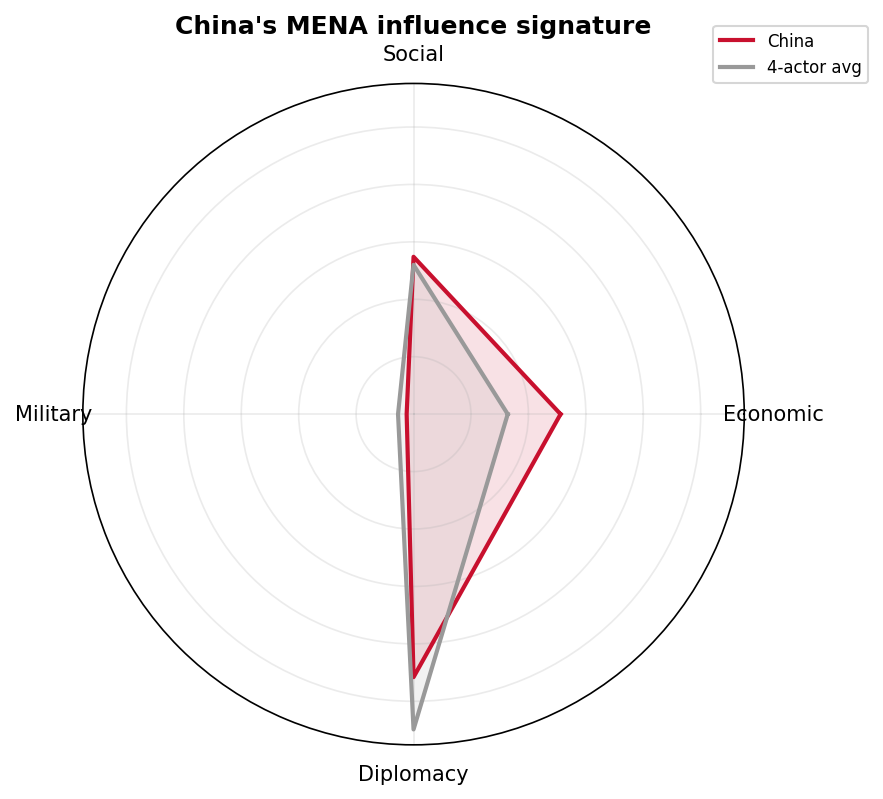
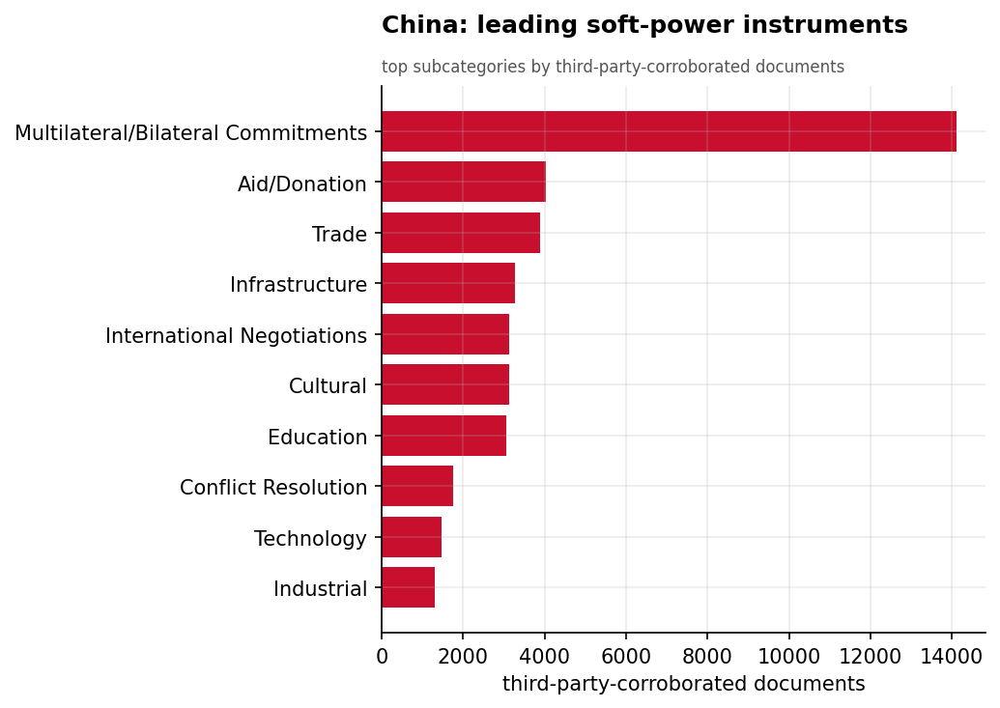
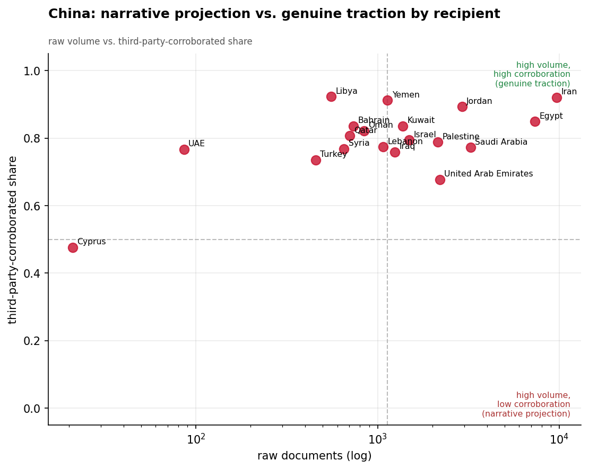
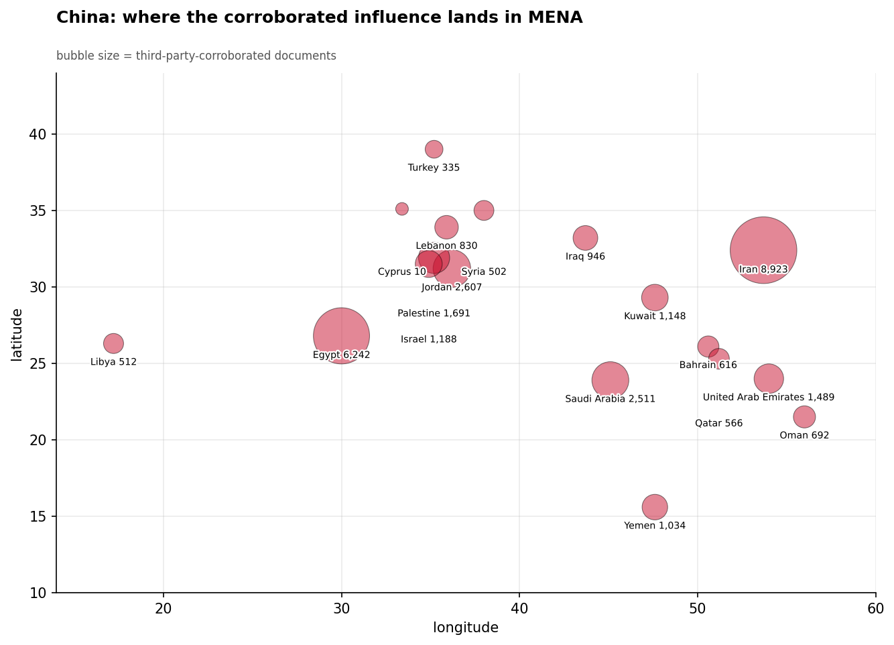
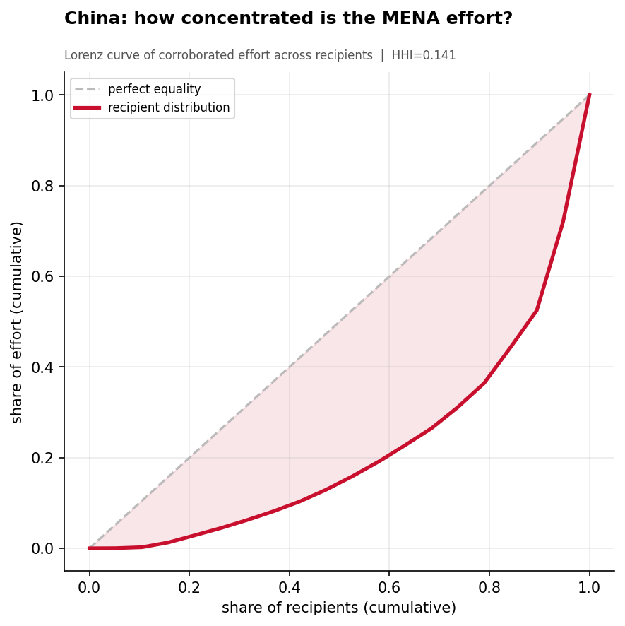
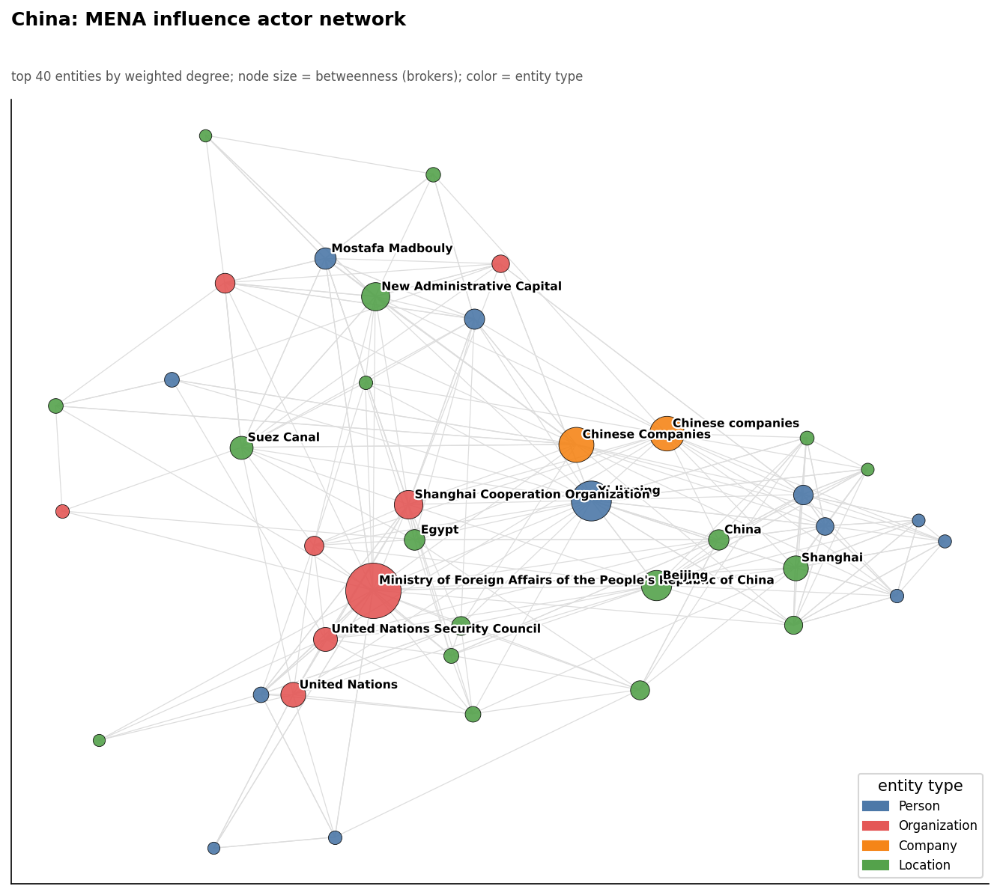
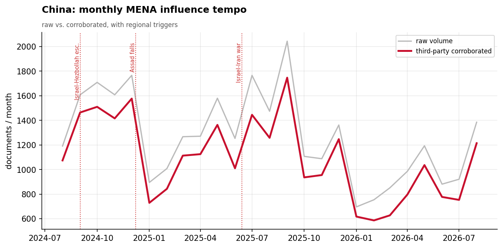

# China's Soft-Power Influence in the Middle East & North Africa
### A Strategic Influence Assessment for Policy Analysis

*Observation window: 2024-08-01 to 2026-07-31 (open-source media corpus; refreshed 2026-08-25). Prepared from the
Soft Power Analytics database; method, scope, and caveats per `docs/INSIGHT_REPORT_PROMPT.md`.
Intensity is measured in **third-party-corroborated** documents (coverage not originating from
the initiator's own state media) unless noted. Confidence tags: **(H)** high, **(M)** moderate,
**(L)** low.*

---

## 1. Key Findings (BLUF)

- **China runs a diplomacy- and economics-led influence model in MENA with a near-zero
  military footprint** — 45.9% Diplomacy, 27.4% Social, 25.5% Economic, **1.2% Military** of
  corroborated effort. This is the inverse of Russia's and Iran's security-heavy postures and
  is China's most distinctive regional trait. **(H)**
- **China's influence is unusually credible.** Only ~14% of its MENA coverage comes from
  Chinese state media (self-report share 0.14); 86% is carried by recipient-country and
  third-party outlets — a *genuine-traction* signature, not narrative projection. **(H)**
- **Egypt and the Gulf are China's strongholds; the Levant is not.** China leads all four
  actors in Egypt (6,003 corroborated docs), Saudi Arabia (2,484), Jordan (1,902), and the UAE
  (1,466), but is decisively outcompeted in Syria, Palestine, and Lebanon (by Turkey and Iran)
  and trails Russia inside Iran. **(H)**
- **China's volume is diplomatic, but its highest-impact events are economic megadeals** — the
  $10B China-Egypt integrated steel complex, the SCO Tianjin $12.75B package, $30.5B in Belt
  and Road construction contracts, and Lenovo's $532M Saudi investment all score at the top of
  the materiality scale. Watch the economics, not the communiqués. **(H)**
- **The Shanghai Cooperation Organization is China's primary multilateral vehicle** into the
  region, functioning as the network bridge linking Beijing to Tehran (e.g., President
  Pezeshkian's SCO engagement). **(M)**
- **Tempo is steady, not event-driven.** China's monthly activity holds ~1,000–1,750
  corroborated docs/month with a mild peak around the August–September 2025 SCO Tianjin summit
  and no surges tied to the region's kinetic shocks — consistent with a deliberate posture of
  staying above the conflicts. **(M)**

---

## 2. Strategic Posture

China approaches MENA as an arena for **economic statecraft and multilateral legitimacy**,
not coercion. Its theory of influence is to convert development finance, trade, and
infrastructure into durable diplomatic alignment, while using forums (SCO, UN Security Council,
Belt and Road) to position itself as a stabilizing, non-aligned great power — explicitly
contrasting itself with Western and Russian models. The corroborated record bears this out:
diplomacy and economics together account for **71%** of China's measured effort, and its
single largest instrument is *Multilateral/Bilateral Commitments* (13,075 corroborated docs),
followed by *Aid/Donation*, *Trade*, *Infrastructure*, and *Cultural* engagement.

Crucially, China's influence is **externally validated**: with only two Chinese-geofocus
outlets in the corpus, the overwhelming majority of China-MENA reporting originates with
recipient and regional media. Where Iran's footprint is inflated by its own state press,
China's reflects how the region *itself* perceives Chinese engagement — a stronger signal of
real traction.

---

## 3. Categorical Breakdown

**Diplomacy (45.9%) — the volume leader.** China's diplomatic activity centers on
multilateral commitments and international negotiations, with the **Ministry of Foreign Affairs
of the PRC**, the **UN Security Council**, and the **Shanghai Cooperation Organization** as the
dominant entities. A recurring theme is China positioning on the Gaza conflict (the China MFA
co-occurs most frequently with "Gaza Strip" and the UNSC), using the crisis to project an image
of even-handed global leadership. **(H)**

**Economic (25.7%) — the materiality leader.** Although third by volume, economics produces
China's most consequential events. The highest-materiality items in the entire China record
are commercial: the **$10B China-Egypt integrated steel complex** (Shing Feng Steel, announced
Jan. 27, 2026), the **SCO Tianjin summit's $12.75B investment package** announced by Xi Jinping,
**$30.5B in Belt and Road construction contracts**, and **Lenovo's $532M investment and
200,000 m² Riyadh manufacturing facility** in Saudi Arabia. The pattern: Gulf-and-Egypt
industrial/technology investment converted into strategic partnership. **(H)**

**Social (27.4%).** Driven by *Aid/Donation* (3,989 corroborated docs) and *Cultural*
engagement — humanitarian gestures and cultural diplomacy that reinforce the benign-partner
narrative. **(M)**

**Military (1.1%) — effectively absent.** China conducts almost no military-category soft power
in MENA in this window. This is a defining negative finding: China is not competing for
security influence the way Russia (arms, basing) and Iran (proxies, IRGC ties) are. **(H)**

---

## 4. Recipient Matrix

China engages **all 19** recipients but concentrates effort. Ranked by corroborated intensity:

| Tier | Recipients (corroborated docs) | Read |
|------|-------------------------------|------|
| **Lead** | Iran (8,848), Egypt (6,003) | Together ~48% of China's top-tier effort |
| **Strong** | Saudi Arabia (2,484), Jordan (1,902), Palestine (1,662), UAE (1,466), Israel (1,185) | Gulf + Jordan are competitive strongholds |
| **Moderate** | Kuwait (1,119), Yemen (1,005), Iraq (918), Lebanon (796), Oman (669) | Broad but shallow |
| **Light** | Bahrain, Qatar, Syria, Libya, Turkey, Cyprus | Presence without depth |

- **Egypt is China's flagship bilateral relationship** — the largest non-Iran target and the
  locus of its biggest economic bets (steel complex, BRI construction, TEDA-Suez industrial
  base). Corroboration share 0.85. **(H)**
- **China's Iran engagement is heavily covered (8,506) but contested** — Russia's corroborated
  Iran footprint (11,780) exceeds China's, and the relationship reads as part of the
  China-Russia-Iran alignment rather than China-led. **(M)**
- **The Levant is a relative gap.** In Syria, Palestine, and Lebanon, China is a minor player
  behind Turkey and Iran — Beijing has ceded the region's highest-salience conflict theaters.
  **(H)**

---

## 5. Actor & Network Analysis

China's MENA influence network is organized around **institutional, not personal, nodes** —
consistent with its bureaucratic statecraft. The dominant hubs are the **PRC Ministry of
Foreign Affairs**, the **UN Security Council**, and the **Shanghai Cooperation Organization**,
with the SCO acting as the key broker bridging China into Iran (the network links the SCO to
President **Masoud Pezeshkian**). Economic engagement surfaces as discrete project nodes —
the **Mubarak Al-Kabeer Port** (Kuwait, linked to Sheikh Ahmad Al-Sabah) and **Aqaba
International Industrial City** (Jordan). Working-level diplomacy appears through named
officials such as **Miao Deyu** engaging Saudi deputy FM **Walid Al-Khuraiji**.

The near-total absence of military or security entities in China's network reinforces the
categorical finding: Beijing's regional actors are diplomats, ministries, multilateral bodies,
and corporations — not commanders. **(H)**

---

## 6. Temporal Dynamics

China's tempo is **steady and conflict-insulated**. Corroborated activity oscillates between
~600 and ~1,750 docs/month with no surges aligned to the region's kinetic inflection points
(Israel-Hezbollah escalation Sept 2024, Assad's fall Dec 2024, the June 2025 Israel-Iran war).
The one mild peak — **September 2025 (1,747)** — aligns with the SCO Tianjin summit and Xi's
investment-package announcements, underscoring that China's calendar is driven by *its own
summitry and deal-making*, not by regional crises. The gentle taper through early 2026 is
partly an artifact of the corpus's trailing edge. **(M)**

**August 2026 (now in-window) — China's strongest month of 2026.** Corroborated tempo jumped
to **1,214 docs (+61% on July's 753)**, the best month since September 2025 — and the driver
is exactly the thesis: head-of-state summitry, not crisis. **King Abdullah II's state visit to
Beijing** produced **24 bilateral agreements** (materiality 8.0, corroboration 1.00) plus
Xi–Abdullah talks on the Palestinian file, lifting China→Jordan from 118 to **705 corroborated
docs** in a month — enough to move **Jordan past Saudi Arabia into China's #3 recipient slot
(2,607 vs 2,511 in-window)**. The month's other substantive economic item is the **SDIC Group
acquisition of a 28% stake in Arab Potash Company** (45 docs, 24 outlets, corroboration 1.00) —
capital, not just communiqués. July's items held: the China–Pakistan mediation track stayed in
the portfolio, the China→Iraq pipeline pause kept easing (26 → 28 corroborated docs), while
the **Libya re-entry stalled** (32 → 15). **(M)**

**Post-window context (September 1–9, 2026).** The corpus extends to 2026-09-09; nine days of
data — context, not trend. **Xi Jinping's state visit to Egypt** dominates: the Grand Egyptian
Museum visit (263 articles), a Cairo round upgrading the comprehensive strategic partnership
(125 articles, materiality 7.5), a Belt-and-Road cooperation plan aligned with Egypt Vision
2030, and **"Sustainable Panda Bonds"** — RMB-denominated financing for Egypt. Two consecutive
months of Chinese head-of-state summitry in the Arab core (Jordan in August, Egypt in
September) is the pattern to watch entering Q4. **(M)**

---

## 7. Data Gaps & Coverage Priorities

- **Media ≠ ground truth.** This assessment measures *reported* activity. China's
  externally-validated footprint is a strong proxy for perceived engagement but not a ledger of
  actual disbursements or completions.
- **No usable financial ground truth in-window.** AidData's GCDF 3.0 (verified Chinese
  development finance) ends in 2023 and does not overlap the 2024–2026 media window; no reported
  project in this corpus directly matches a specific AidData record, so financial figures here
  derive from media-reported deal announcements (e.g., the "$10B" steel complex) and should be
  treated as *announced*, not *committed-and-verified*. **Coverage priority:** track
  disbursement and completion against announced China-MENA megadeals.
- **Economic substance vs. diplomatic noise.** Because China's volume is diplomatic but its
  impact is economic, raw activity counts understate where the strategic action is. Prioritize
  collection on the named industrial/technology investments (Egypt steel, Lenovo-Saudi, Gulf
  ports) over communiqué-level diplomacy.
- **The Levant blind spot is real, not a coverage gap** — China's near-absence in
  Syria/Lebanon/Palestine is corroborated across recipient media, indicating a genuine
  strategic choice to avoid the region's hardest conflicts.

---

*Visuals: all figures plot third-party-corroborated metrics with underlying numbers persisted
as sibling CSVs under `assets/`. Derived analytics tables documented in
`docs/reports/_derived/manifest.md`.*
