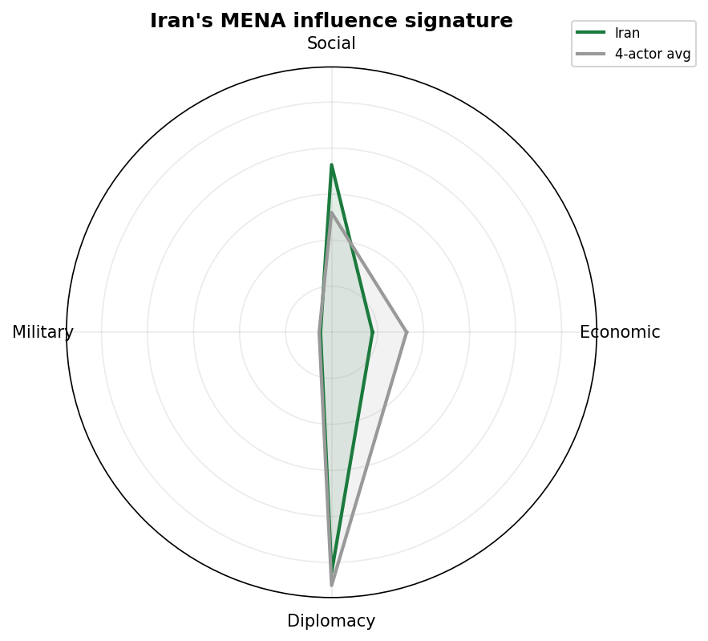
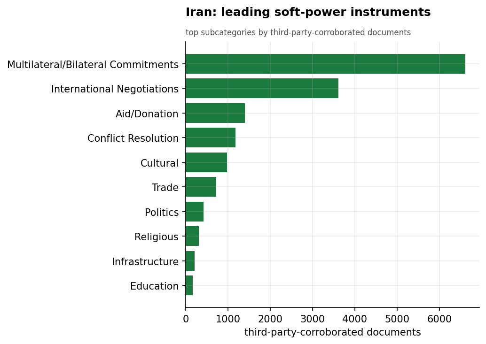
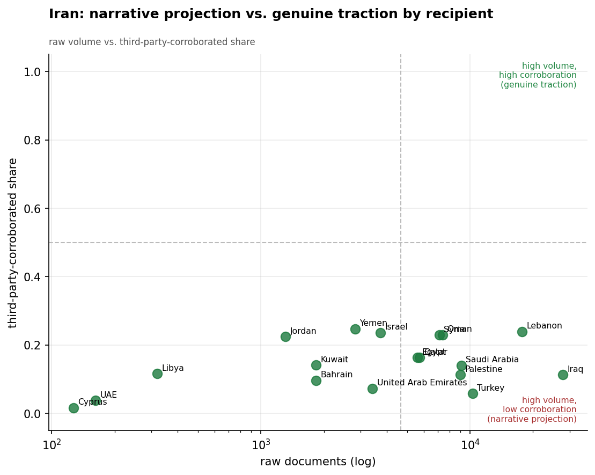
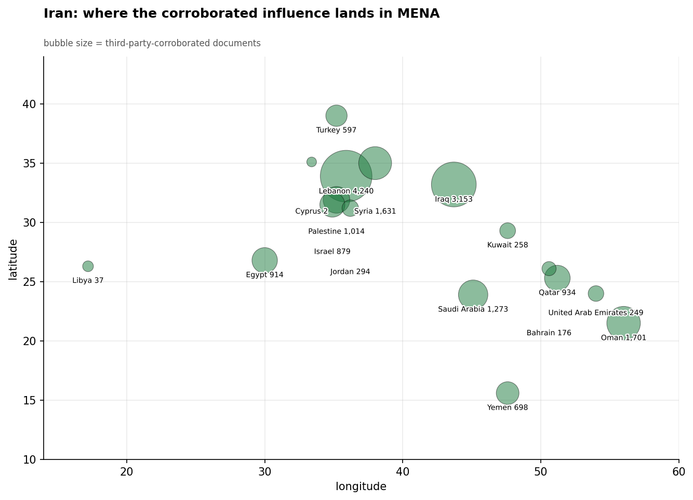
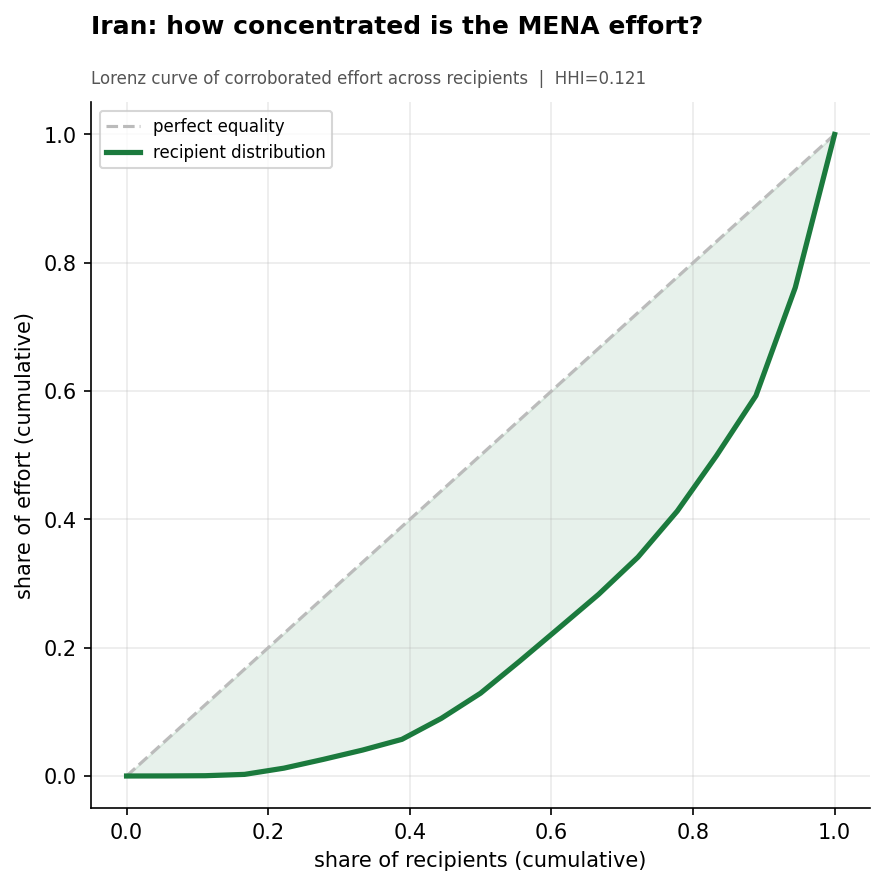
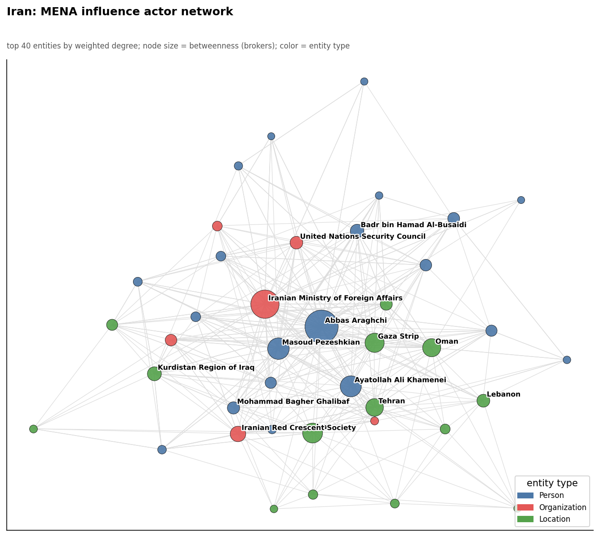
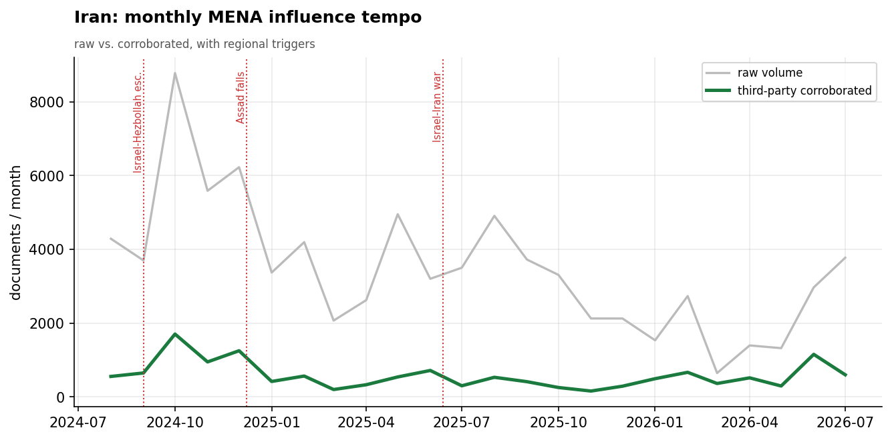

# Iran's Soft-Power Influence in the Middle East & North Africa
### A Strategic Influence Assessment for Policy Analysis

*Observation window: 2024-08-01 to 2026-07-31 (open-source media corpus; refreshed 2026-08-25). Prepared from the
Soft Power Analytics database; method, scope, and caveats per `docs/INSIGHT_REPORT_PROMPT.md`.
Intensity is measured in **third-party-corroborated** documents (coverage not originating from
Iranian state media) unless noted. Confidence tags: **(H)** high, **(M)** moderate, **(L)** low.*

---

## 1. Key Findings (BLUF)

- **Iran's apparent dominance of MENA influence is largely a media artifact.** Iran posts the
  largest *raw* footprint of any actor (83,017 documents) but **83% of it originates from
  Iranian state media** (IRIB, Fars, Mehr, IRNA, Tasnim). On third-party-corroborated volume
  Iran ranks **last of the four** assessed actors — 13,854 docs, versus Turkey's 36,518,
  China's 26,005, and Russia's 25,267. **(H)**
- **Iran's genuine regional traction is concentrated in the Shia "Axis of Resistance"
  geography** — Lebanon (4,156 corroborated docs), Iraq (2,934), and Syria (1,624). Outside
  this arc its independently-reported footprint thins sharply. **(H)**
- **Iran's distinctive instrument is religious-social soft power**, not economics. Its
  highest-materiality non-strategic events are *Arbaeen pilgrimage* infrastructure projects —
  upgraded transport, and the opening of the Jilat and Khosravi border crossings to move Shia
  pilgrims into Iraq — paired with humanitarian work through the **Iranian Red Crescent
  Society**. Economic activity is just 9.1% of its profile. **(H)**
- **The Iran-China 25-Year Strategic Cooperation Agreement is Iran's single highest-impact
  influence event** in-window, underscoring that Iran's most consequential moves are about
  securing *external* great-power alignment (China, Russia) to offset isolation. **(M)**
- **Iran's network is intensely personalized around its diplomats** — Foreign Minister **Abbas
  Araghchi** is by far the dominant node (3,358 documents), with President **Pezeshkian**, the
  **Supreme National Security Council** (Ali Larijani), and Hezbollah's **Hassan Nasrallah**
  forming the core. **(H)**
- **Iran loses the head-to-head contest in most of MENA.** It leads only in Lebanon; it trails
  Russia inside its own partnership space, Turkey across the Levant, and China across the Gulf
  and Egypt. **(M)**
- **The window closes on a strategic inflection.** Ayatollah **Khamenei died in mid-June 2026**,
  with funeral and mourning ceremonies running late June into July (~303 corpus documents, 41%
  third-party corroborated — well above Iran's ~17% baseline, signaling genuine international
  attention). In the same weeks a **US-Iran de-escalation process crystallized** — a June 14
  ceasefire memorandum, Bürgenstock and Doha talks — driving Iran's corroborated volume to
  1,151 docs in June, roughly four times May's 293. Succession signals in the corpus are
  ambiguous; the succession is an open analytic question with major implications for every
  forward-looking judgment here. **(H)** on the events; **(L)** on succession dynamics.

---

## 2. Strategic Posture

Iran's MENA influence strategy is one of **ideological and confessional projection backed by a
state-media megaphone**. Its theory of influence is to sustain the "Axis of Resistance" — a
network of aligned states and non-state actors bound by Shia religious solidarity and
opposition to Israel and the West — and to amplify that alignment through a dense domestic
press ecosystem (82 distinct Iran-geofocus outlets in the corpus).

That megaphone is the central analytic fact about Iran: it makes Iran *look* like the region's
dominant influence actor while its externally-validated footprint is the smallest of the four.
The 83% self-report share is not merely noise to be filtered — it is itself the finding. Iran
practices **narrative projection** at a scale none of the other actors approach, but the world
beyond Iranian media corroborates only a fraction of it.

---

## 3. Categorical Breakdown

**Diplomacy (52.2%).** Dominated by *Multilateral/Bilateral Commitments* (6,615 corroborated
docs), *International Negotiations* (3,613), and *Conflict Resolution* (1,178). Much of this is
Iran positioning on Gaza and managing its nuclear-diplomacy posture; FM Araghchi co-occurs most
with the "Gaza Strip" and the UN Security Council. **(H)**

**Social (35.8%) — Iran's signature differentiator.** No other assessed actor leans this
heavily on social/religious soft power. The instruments are **religious pilgrimage logistics**
(the Arbaeen infrastructure and border-crossing projects into Iraq) and **humanitarian aid**
via the Iranian Red Crescent Society. This is confessional statecraft: moving millions of Shia
pilgrims and delivering aid as a vehicle of regional solidarity. **(H)**

**Economic (9.1%) — a structural weakness.** Under sanctions, Iran cannot compete on the
economic terrain China and Russia occupy. Its notable economic events (Ardabil Expo 2025) are
modest, and its biggest economic move is the *strategic* China agreement rather than a
standalone commercial deal. **(H)**

**Military (2.5%).** The corpus captures little of Iran's hard-power/proxy activity by design
(the lens is influence, not kinetics); the visible military-category items are defense
diplomacy. Note that Hezbollah's Nasrallah appears as a top *entity* even though military
*category* volume is low — Iran's security influence operates through actors more than through
reported "soft" military events. **(M)**

---

## 4. Recipient Matrix

Ranked by third-party-corroborated intensity, Iran's credible reach is strikingly narrow and
confessional:

| Tier | Recipients (corroborated docs) | Read |
|------|-------------------------------|------|
| **Lead** | Lebanon (4,156), Iraq (2,934) | The Hezbollah and Iraqi-Shia cores of the Resistance Axis |
| **Strong** | Syria (1,624), Oman (1,509), Saudi Arabia (1,250) | Syria (legacy ally); Oman/Saudi reflect détente diplomacy |
| **Moderate** | Palestine (1,009), Qatar (907), Egypt (901), Israel (874) | Issue-driven (Gaza), not relationship depth |
| **Thin** | Jordan, Bahrain, Gulf states | Marginal credible presence |

- **Lebanon is Iran's one clear stronghold** — the Hezbollah relationship is the densest
  externally-corroborated Iran tie in MENA. **(H)**
- **Iraq is the Arbaeen corridor** — Iran's credible Iraq footprint is built on religious
  pilgrimage logistics and border infrastructure, a soft-power instrument unique to Iran. **(H)**
- **Note the low corroboration shares (0.11–0.24 across recipients):** even where Iran is
  active, most coverage is Iranian state media. Iran's *self-narrated* reach vastly exceeds its
  *externally-validated* reach in every recipient. **(H)**

---

## 5. Actor & Network Analysis

Iran's influence network is the most **personality-driven** of the four. Foreign Minister
**Abbas Araghchi** is the overwhelming hub — the broker connecting Iran's diplomacy to the UN
Security Council, to counterparts (Egypt's Badr Abdel-Aty), and to the Gaza file. Around him
sit President **Masoud Pezeshkian**, the **Supreme National Security Council** under **Ali
Larijani**, the **Iranian Red Crescent Society** (the humanitarian arm), and — significantly —
Hezbollah's **Hassan Nasrallah**, whose presence as a top entity ties Iran's "soft" influence
network directly to its armed proxy network. The structure is a hub-and-spoke around the
foreign-policy elite, not the distributed institutional web seen with China or the
multi-patron coalitions seen with Turkey. **(H)**

---

## 6. Temporal Dynamics

The gap between Iran's raw and corroborated lines is the widest of any actor — a permanent
visual reminder of the state-media inflation. Corroborated activity is event-sensitive,
rising around Gaza-conflict diplomacy and the annual **Arbaeen pilgrimage season** (late
summer), when border-crossing and pilgrim-transport activity peaks. Iran's tempo tracks the
religious calendar and the Israel-Iran confrontation more than any economic cycle. **(M)**

The second half of June 2026 — beyond the previous report's cutoff — delivered the window's
most consequential turn. **Ayatollah Khamenei died in mid-June 2026** (corpus signals place
the death around June 10–15), and funeral and mourning ceremonies ran from late June into
July: roughly 303 corpus documents, of which **41% are third-party corroborated** — well
above Iran's ~17% baseline, indicating genuine international attention rather than
state-media projection. Documented details include Pakistani Prime Minister Shahbaz Sharif's
announcement that he would attend on behalf of Pakistan, Iranian officials' projection of one
million Iraqi participants in ceremonies, and an Iranian delegation discussing funeral
arrangements in Babylon, Iraq. Succession signals in the corpus are ambiguous; the
succession is an open analytic question with major implications for every judgment about
Iran's forward posture. **(H)** that the death and funeral occurred; **(L)** on succession
dynamics.

In the same weeks a **US-Iran de-escalation process crystallized**: a June 14 ceasefire
Memorandum of Understanding (187 articles, materiality 8.0); US-Iran negotiations at
Bürgenstock, Switzerland (June 17); an Iran-Switzerland quadrilateral diplomatic track
(June 16, 276 articles); a Doha meeting (June 26); and GCC-US joint engagement on regional
security (June 25). Iran's corroborated volume spiked to **1,151 docs in June — roughly 4×
May's 293** — driven by this diplomacy plus a Lebanon surge (Iran→Lebanon posted 566
corroborated docs in June alone). **(H)**

### August 2026 (now in-window) and post-window context (September 1–9)

*The analysis window now closes 2026-08-31; the corpus extends to 2026-09-09, and September
is nine days of data — context, not analysis-grade.*

- **August, in-window: Iraq and Arbaeen, not the Gulf.** Iran's corroborated tempo eased to
  522 docs (from 597 in July and the 1,151 June crisis peak) — a normalization, not a
  collapse. The month's dominant activity is **Arbaeen logistics** (overwhelmingly
  self-reported — the standing bias case) and the **Shalamcheh–Basra railway** (244
  articles, materiality 6.5), the one substantive economic item. Lebanon (25 corroborated
  docs) and Qatar (37) stayed quiet.
- **The Yemen re-entry reversed.** 15 (June) → 52 (July) → 13 (August) corroborated docs:
  July now reads as Hormuz-crisis spillover rather than a durable return, and the
  post-November-2024 Yemen vacancy stands — no actor has moved on the file.
- **The Muscat channel held** — 201 → 212 → 192 corroborated docs Jun→Aug (an Iran–Oman
  Hormuz navigation round Aug 2; a proposed Hormuz shipping route, 54 articles, was
  among August's most-corroborated new Iranian initiatives). **Oman is Iran's
  #3 corroborated recipient (1,701)**, behind only Lebanon and Iraq.
- **Qatar:** Iran's lead over Turkey as Qatar's top corroborated four-actor engager **held
  through the full August window — 934 vs 882** (both files quiet in August itself).
- **September opens quiet**: Arbaeen ramp-down, Hormuz channel steady, no new Iranian
  initiative above ~40 articles in the first nine days.

---

## 7. Data Gaps & Coverage Priorities

- **The state-media inflation is the headline caveat.** Any assessment of Iran that uses raw
  volume will overstate its reach by roughly 6-to-1. Always normalize Iran against third-party
  corroboration; treat Iranian-media-only claims as *intent/projection*, not confirmed traction.
- **Proxy and IRGC activity is under-captured.** The soft-power lens misses most of Iran's
  hard-power influence (Hezbollah, Iraqi militias, the Houthis). Nasrallah's prominence as an
  entity is a hint of a much larger security network outside this dataset. **Collection
  priority:** pair this corpus with proxy-network and IRGC-Quds Force reporting.
- **Religious soft power deserves dedicated tracking.** The Arbaeen pilgrimage and Red Crescent
  channels are Iran's most distinctive and externally-corroborated instruments and are
  under-analyzed relative to nuclear/proxy files.
- **The Khamenei succession is unresolved in the corpus.** Signals are ambiguous, and every
  forward-looking judgment in this report is contingent on how the succession settles.
  **Collection priority:** succession dynamics and elite alignment following Khamenei's
  mid-June 2026 death.
- **External-alignment dependency.** Iran's highest-impact events are agreements with China and
  Russia — its influence increasingly *borrows* great-power weight. Monitor the durability of
  the China 25-year pact and Russia-Iran partnership as leading indicators of Iran's regional
  staying power.

---

*Visuals plot third-party-corroborated metrics (raw shown alongside for the provenance
contrast); underlying numbers persisted as sibling CSVs under `assets/`. Derived analytics
documented in `docs/reports/_derived/manifest.md`.*
