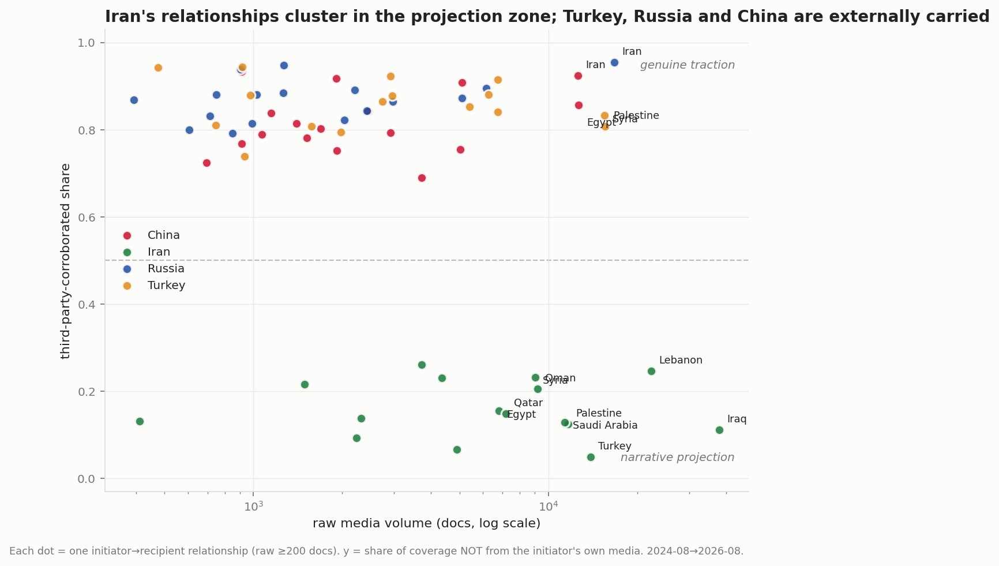
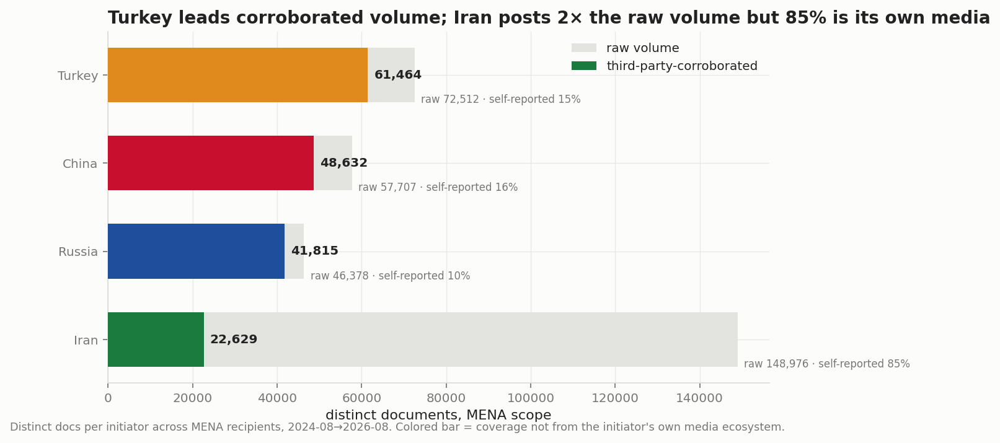
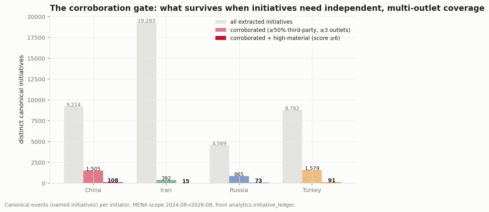
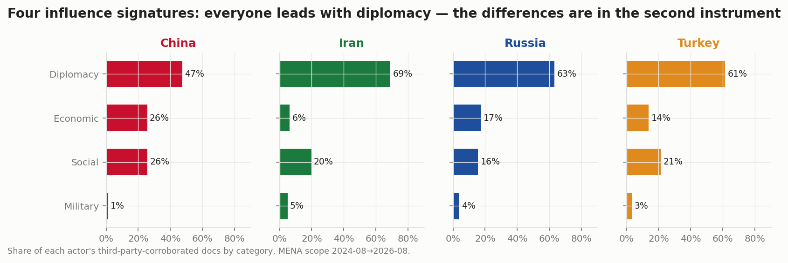
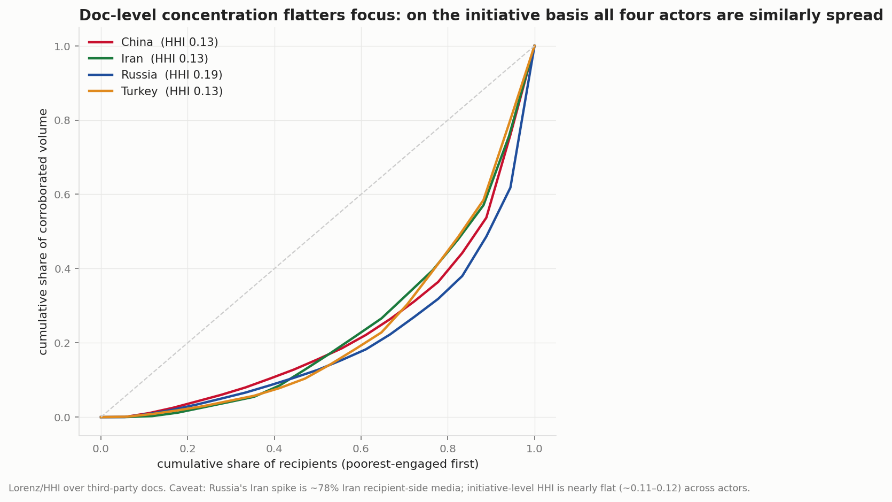
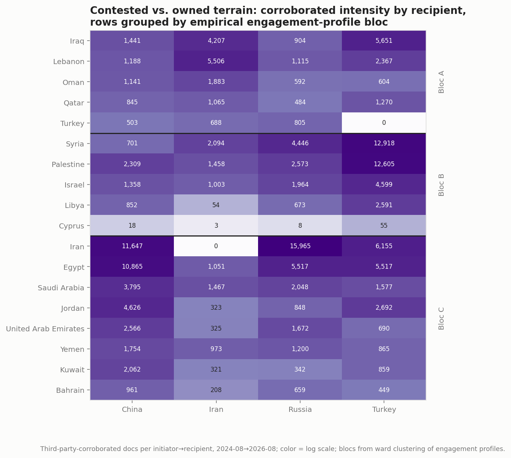
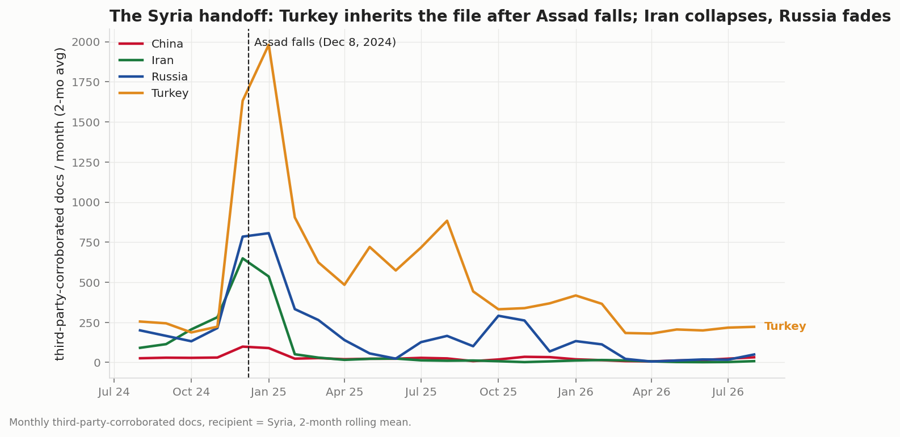
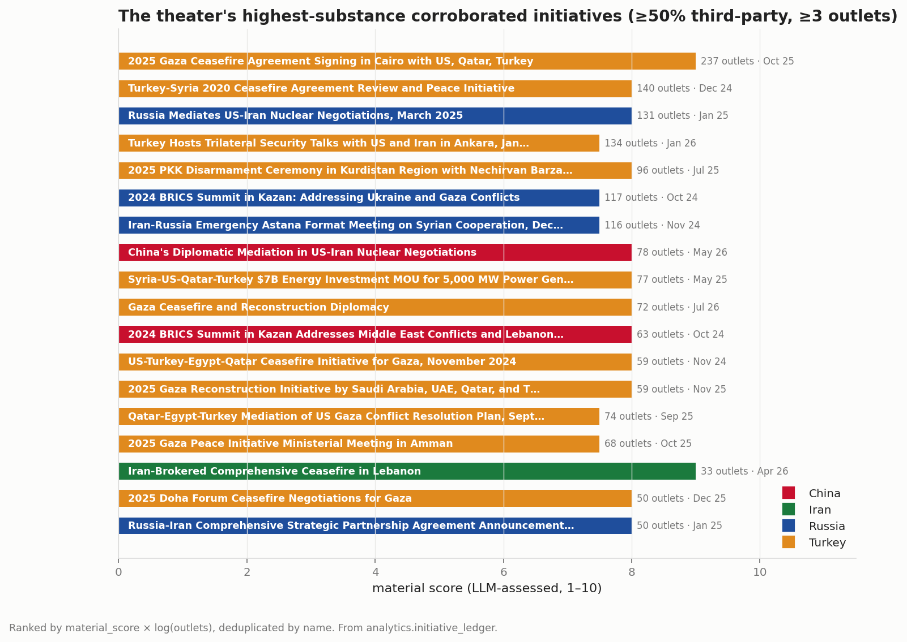
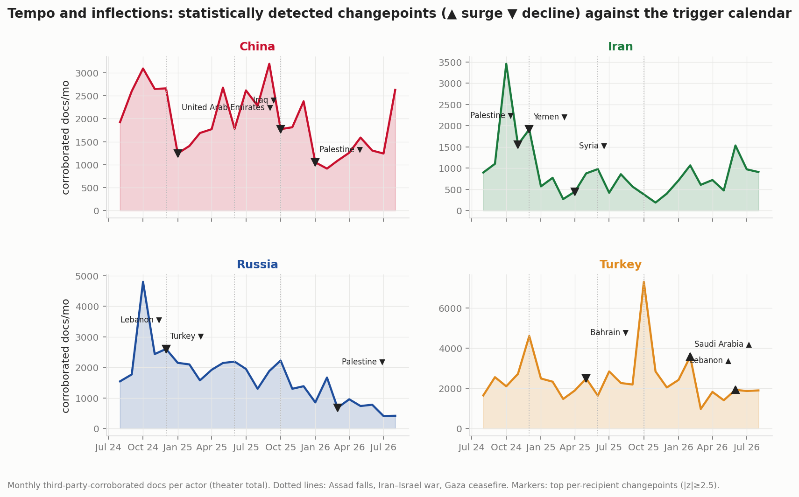
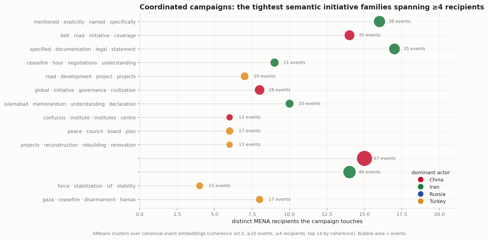

# MENA Theater Assessment — Cross-Actor Soft-Power Competition
### China · Iran · Russia · Turkey | Strategic Influence in the Middle East & North Africa

*Observation window 2024-08-01 → 2026-08-31 (25 full months). Open-source media corpus, 804K
documents (refreshed 2026-09-09; corpus extends to 2026-09-09 — September 1–9 is treated as
**post-window context only**, see §7); method, lineage, and scope per [`../../INSIGHT_REPORT_PROMPT.md`](../../INSIGHT_REPORT_PROMPT.md).
Unit of analysis: the **corroborated initiative** (named canonical event with ≥50% third-party
coverage from ≥3 independent outlets), not the article. Every figure's underlying numbers are
persisted as a sibling CSV in [`assets/`](assets/). Produced by a five-thread agentic
investigation with two-lens adversarial verification of every finding (57 findings: 38
workflow-verified, 19 re-verified inline; 0 refuted, 14 revised with corrections applied).*

> **2026-09-09 edition note:** window advanced one month (August 2026 is now the 25th full
> month; September 1–9 is post-window context). The events/entities layers were extended
> incrementally and re-validated; per-pair figures quoted in §7 are re-measured on this layer
> and can differ modestly from the prior edition's. Substantive changes in this edition:
> China's record 2026 month on Gulf-core summitry (Jordan), the reversal of Iran's Yemen
> re-entry, Russia's second consecutive record-low month, and the Qatar flip confirmed
> in-window.

---

## 1. Key Findings

1. **Raw media volume inverts the truth of this theater.** Iran generates 144,278 scoped
   document-rows — 2× any rival — but 85% is its own state media, and only **1.9% of its 18,144
   extracted initiatives survive the corroboration gate** (≥50% third-party, ≥3 outlets), versus
   15–19% for China, Russia, and Turkey — an ~8–10× survival gap. At the high-material tier Iran
   holds 15 initiatives against China's 93, Turkey's 84, and Russia's 72 — a ~5–6× deficit. Iran
   is a narrative giant and an initiative dwarf. *(High confidence; funnel re-measured 2026-08-25
   on the events layer extended through July 2026 — absolute counts differ from earlier editions,
   the gap does not.)*

2. **Turkey is the theater's largest credible influence actor.** It leads corroborated volume
   (59,562 docs) and gated initiatives (1,406) — though on the high-material tier it sits
   second behind China (84 vs China's 93, Russia's 72) — and it owns the
   corpus's highest-substance events: the Oct 2025 Gaza ceasefire architecture (Cairo signing:
   1,199 articles, 231 distinct outlets), the Jul 2025 PKK disarmament ceremony (95 outlets),
   and the Syria file, where it holds **357 of 527 corroborated initiatives (68%)**. Its playbook
   converts conflict adjacency into mediation equity, then mediation equity into economics
   (the $7B Syria energy MOU; the Feb 2026 Saudi/Egypt normalization wave). *(High confidence)*

3. **China is the economic patron, and its money is concentrated and real — in Egypt.** China
   holds 559 corroborated economic initiatives (2.3× Russia, ~8× Iran) and sweeps every qualifying
   civilian lane in Egypt, Kuwait, UAE, Saudi Arabia, and Bahrain. Its verifiable announced
   money clusters in the Suez Canal Economic Zone / Ain Sokhna corridor: **~$24B across ~27
   deals** after noise removal — a corridor whose Chinese-financed lineage AidData traces to a
   2009 China Eximbank/CDB credit for the TEDA zone. In 2026 China layered a new asset on top:
   an institutionalized US–Iran mediator role marketed to Gulf audiences (6 high-material
   mediation events, 28–78 outlets each, the Beijing–Islamabad track added in July). *(High confidence)*

4. **Russia is the structural loser of the window.** Five of its relationships decayed 64–88%
   from baseline (Syria 272→46 docs/mo, Turkey −88%, Egypt −64%, UAE −69%, Palestine −68%), its
   flagship Iran channel halved after the June 2025 war (cp 2025-08, z=3.45), and its
   high-material initiative pipeline shrank from 21/quarter (Q4-2024 — still the highest
   actor-quarter in the ledger) to 4 (Q2-2026) and 1 in July; July 2026 (293 corroborated docs)
   is its lowest full month on record. What
   remains is narrow and physical: El Dabaa NPP in Egypt — the corpus's most durable project
   (37 events across 17 months) — Bushehr, BRICS convening, and a hedged Syria posture in which
   it is the only actor whose network bridges both the deposed Assad and successor al-Sharaa
   governments. *(High confidence)*

5. **The theater reset in Nov–Dec 2024, and the data timestamps it.** Fourteen of the fifty
   largest changepoints fall in those two months — all declines: the Lebanon ceasefire and
   Assad's fall ended the "Axis of Resistance" coverage regime (Iran→Yemen z=11.4, the sharpest
   break in the dataset — unreplaced by any other actor; Iran itself began re-entering in
   June–July 2026, 19 → 65 corroborated docs/mo; see §7), killed the Astana venue within seven
   weeks, and opened the Syria vacuum that Turkey filled (11.5 → 21.7 corroborated
   initiatives/month). *(High confidence)*

6. **The dominant early-warning complex for H2 2026 is a four-way mediation race around the
   US–Iran/Hormuz crisis.** Iran's corroborated initiative flow surged ~6× in six months (16 in
   Q4-2025 → 42 in Q1-2026 → 97 in Q2-2026, 6 high-material; 41 in July alone) behind a genuine, third-party-attested pivot to
   GCC détente and Lebanon ceasefire brokerage; China institutionalized the US–Iran broker role;
   and Turkey pre-positioned on the Tehran file at cp Nov-2025 (z=3.95, Fidan's Tehran visit →
   the Jan 2026 Ankara US–Iran trilateral, 95 outlets) — **the only true lead indicator found in
   the dataset**. Caveat: Iran's flagship "Iran-Brokered" Lebanon ceasefire event carries
   credit-claiming naming; its top underlying headline is "Iraq-Iran Diplomatic Engagement."
   *(Moderate-to-high confidence)*
   **Update (2026-08 refresh):** the race resolved into an actual process in the window's final
   two weeks — a June 14 US–Iran ceasefire MOU, negotiations at Bürgenstock (Switzerland), a
   Doha round (June 26), and GCC–US engagement (June 25) — venues that ran through Switzerland,
   Doha, and Muscat rather than Ankara or Beijing alone. **Ayatollah Khamenei died in mid-June
   2026** (funeral ceremonies late June–July; ~40% third-party-corroborated coverage), adding
   succession uncertainty to every judgment in this complex. In July — now inside the window —
   the process advanced to "Nuclear Disarmament Talks" and a US-mediated Lebanon–Israel
   framework; August post-window context in §7.

7. **The four networks are wired differently, and the wiring is the strategy.** China is
   institution-wired (organizations carry 47% of top-node weight; brokerage funnels through an
   Egyptian megaproject corridor: Madbouly–SCZONE–CSCEC–New Administrative Capital). Turkey is
   leader-wired (Erdoğan + Gaza + the Öcalan/PKK file; its hidden brokers are its Cairo embassy
   and Egyptian industrial satellite cities). Russia is project-wired (nuclear plants as network
   anchors). Iran is person- and religion-wired: **195 religious entities (8.9% of its
   footprint) — an order of magnitude above Turkey (33) and two above Russia/China** — with the
   Red Crescent as the highest-betweenness organization in any actor's network. The region's
   most contested intermediary is Oman's FM Badr al-Busaidi, present in all four actors'
   networks. *(Moderate-to-high confidence)*

8. **There is no sequencing playbook to exploit for warning.** All four actors' category series
   co-move at lag 0 (correlations collapse by lag 1), so monthly media data gives no 1–3 month
   "diplomacy precedes economics" signal. Cross-actor structure is the usable signal instead:
   China–Russia move together region-wide (mean r=+0.246, permutation p=0.001) while
   China–Turkey are the competing pair — Turkey's Saudi surge came precisely as China cooled
   there (r=−0.43, the strongest anti-correlation measured). *(Moderate confidence)*

---

## 2. How to Read the Numbers

**The corroboration doctrine.** This corpus is Middle Eastern media reporting, not a ledger of
activity. It over-indexes on Iranian state media (82 Iran-geofocus outlets; the top 8 sources by
volume are all Iranian). Every magnitude in this report is therefore computed on the
**third-party-corroborated basis** (coverage not from the initiator's own media ecosystem) and,
wherever possible, at the **initiative grain** (`analytics.initiative_ledger`): distinct named
canonical events, gated at ≥50% third-party share and ≥3 independent outlets, weighted by an
LLM materiality score (1–10). Raw volume appears only as contrast.

**The gate is asymmetric — and that asymmetry is itself a finding but also a limit.** Only Iran
(82 outlets) and marginally China (2) have domestic media ingested; Russia and Turkey have
zero. Their near-perfect corroboration shares are corpus composition, not validation. The valid
cross-actor claims are therefore: (a) Iran's footprint is overwhelmingly self-manufactured
(directly measured), and (b) magnitudes for all four are comparable only on the corroborated
basis. Where a finding could be a composition artifact, the verification pass tested it by
excluding recipient-side and aligned outlets; survival is noted in place.

*Fig 1 — Every Iranian relationship sits in the projection zone (corroborated share 0.05–0.26);
every China/Russia/Turkey relationship sits above 0.69. The y-axis is the honest denominator
for everything that follows. (High confidence; n=63 relationships ≥200 docs.)*

*Fig 2 — On the corroborated basis the ranking inverts: Turkey 59,562 > China 46,003 > Russia
41,396 > Iran 21,721. Iran's raw lead (144K) is 85% self-reported.*

*Fig 3 — The initiative funnel: total extracted → corroborated (≥50% third-party, ≥3 outlets) →
high-material (score ≥6). Iran: 18,144 → 353 → 15. Turkey: 8,080 → 1,406 → 84. China:
8,287 → 1,245 → 93. Russia: 4,445 → 840 → 72. (Re-measured 2026-08-25 on the events layer
extended through July 2026; absolute funnel counts are not comparable to pre-August editions,
the relative story is unchanged.)*

---

## 3. The Influence Market: Four Models, Four Lanes

All four actors are diplomacy-led on the corroborated doc basis (47–69%), so the signature is
in the second instrument and in what survives to the initiative grain:

- **China builds.** Instrument over-representation vs. theater average: Industrial 2.6×,
  Technology 2.5×, Education 2.0×, Infrastructure 1.6× — ratios that *strengthen* when all
  Iran-geofocus outlets are excluded. 559 corroborated economic initiatives. Note the
  dependency: 71% of China's industrial coverage is Egypt-focused.
- **Turkey delivers and mediates.** Aid/Donation 14.8% of mix (1.4×, n=7,340 docs) and Conflict
  Resolution 1.3× — robust to excluding aligned Qatari and Iranian outlets.
- **Iran and Russia talk.** Both over-index on negotiations/bilateral-commitment subcategories;
  Russia's non-diplomatic corroborated base is 17–28% of its ledger vs China's 38–46%.
- **Iran's distinctive lane — religious/social projection — is real but almost entirely
  self-reported** (see §5 and the Arbaeen quantification in §6).

*Fig 4 — Category mix of third-party docs. The doc-level "diplomacy convergence" partially
reflects multi-category counting; initiative-grain shares confirm China holds the largest
non-diplomatic corroborated base. (Verification note: the apparent systematic doc-to-initiative
diplomacy rise is mostly a measurement artifact and is not used as a finding.)*

**Concentration.** Doc-level Lorenz/HHI suggests Russia is the most focused actor (HHI 0.19,
38% of its third-party docs on Iran) — but verification showed 78% of Russia→Iran "third-party"
docs are Iran's own recipient-side outlets; stripped of recipient media Russia's HHI falls to
0.12, and **at the initiative grain concentration is nearly flat across all four actors
(~0.11–0.12)**. The honest statement: no actor holds a portfolio the others don't contest.

*Fig 5 — Doc-basis concentration, shown with its bias caveat. Use initiative-grain HHI for
cross-actor claims.*

**Empirical blocs.** Ward clustering of recipients by who-engages-them-on-what (third-party
profile vectors, k=3 by silhouette) yields three interpretable blocs that partly confirm and
partly correct the assumed map *(moderate confidence)*:

| Bloc | Members | What defines it | Surprise |
|---|---|---|---|
| **Turkey's arena** | Syria, Palestine, Israel, Libya, Cyprus | Turkey:Diplomacy 33–46% of each profile | **Israel clusters here** — the bloc captures "where Turkey sets the agenda," including adversarially |
| **China's economic Gulf+Egypt** | Egypt, Saudi Arabia, UAE, Kuwait, Bahrain, Jordan, Yemen, Iran-as-recipient | China leads Economic+Social lanes | **Yemen lands here** — Iran's channel collapsed and China is the nominal residual leader of an abandoned market |
| **Iran–Turkey diplomatic corridor** | Iraq, Lebanon, Oman, Qatar, Turkey-as-recipient | Mediation-channel traffic | **Oman and Qatar cluster with the corridor, not their GCC peers** — the Muscat/Doha channel function dominates their profiles |

*Fig 6 — Corroborated intensity by recipient × actor, rows grouped by empirical bloc. No cell
column is empty: no MENA recipient is a single-patron market (max patron HHI 0.48, Palestine).*

**Head-to-head lanes** (55 recipient×category lanes with ≥300 third-party docs): China sweeps
every qualifying civilian lane in Egypt, Kuwait, UAE, Saudi Arabia (Economic 53–74%, Social
53–65%); Turkey wins Diplomacy in Iraq (53%), Israel (50%), Palestine (65%), Jordan (44%) and
every civilian lane in Syria and Libya; Iran holds only legacy-proxy ground (Lebanon Diplomacy);
**Russia wins almost nothing civilian outside fellow-initiator states** — its regional offer has
narrowed to Iran, Turkey, and the Syrian military file. *(High confidence)*

---

## 4. Contested Terrain, Collisions, and Handoffs

**Egypt is the premier contested market.** Third-largest corroborated-initiative base (551),
top-4 on quarter-by-category collision cells. China leads on initiative count (263, 48%) and
every civilian lane; Russia leads per-initiative weight (El Dabaa); Turkey leads momentum
(Economic docs 40→77/mo into 2026-H1; 18 agreements signed Feb 2026; the 2026 Business Forum
with Erdoğan and el-Sisi, 75 outlets). *(High confidence)*

**The Syria handoff is the cleanest substitution event in the data** *(high confidence)*:

*Fig 7 — Iran: ~198 → 15 → 8 third-party docs/mo (−95%, zero-doc months by 2026). Turkey:
doubled through 2025 (233→477/mo), still ~5.5× Russia in 2026-H1, with a civilian mix (post-2025:
Diplomacy 4,883 / Social 1,935 / Economic 1,545 / Military 218 docs) and 318 corroborated
initiatives launched vs 39 pre-Assad. Russia decayed in two steps but did not exit.*

**Three subtler dynamics** *(moderate-to-high confidence)*:
- **Russia→Turkey rotation on the Iran file.** After the Jun 2025 war, Russia→Iran suffered the
  dataset's largest single-relationship drop (−370 docs/mo; Moscow's muted wartime support is
  directly visible), while Turkey→Iran surged at cp Nov-2025 — verified as independently
  corroborated (90–103 distinct non-Iranian outlets/month in Jan–Apr 2026), not an Iranian-media
  artifact. Ankara is building itself into the West's channel to Tehran.
- **Saudi Arabia: Turkey up exactly as China cools** (r=−0.43, strongest anti-correlation
  measured). Turkey's Feb 2026 surge (z=4.23; 305 third-party docs incl. 125 from 16
  Saudi-focus outlets — recipient-side validation) is materially anchored (Riyadh investment
  forum, $2B solar deal).
- **Lebanon: collective disengagement, then a re-entry race.** All four actors collapsed 66–82%
  after the Nov 2024 ceasefire (z=3.0–6.1, survives excluding Lebanese outlets). In 2026-H1 Iran
  rebounded hardest (to 240 docs/mo, 74% Diplomacy — its ceasefire-brokerage role), with a
  synchronized China+Turkey re-entry in Apr 2026. **Yemen was not re-entered by any rival**: after
  the z=11.4 break it is the region's least patron-concentrated market on both metrics — until
  Iran itself began returning in June–July 2026 (§7).

---

## 5. Actor & Network Structure

*(All network findings rest on structure — ranks, betweenness-vs-degree gaps, shares — not raw
size, which is Iran-inflated. Entity linkage caveat in §8.)*

**Four wiring diagrams** *(high confidence)*:

| Actor | #1 hub | Person share of top-30 weight | Signature broker (betweenness ≫ degree) |
|---|---|---|---|
| China | Foreign Ministry (wdeg 145) | 25% — institution-wired | PM Madbouly, SCZONE's Gamal El-Din, CSCEC, New Administrative Capital — a narrow Egyptian megaproject corridor |
| Iran | FM Araghchi (wdeg 850, 3,309 docs) | 66% — person-wired | Ilam Province / Iran–Iraq border / Interior Min. Momeni — the pilgrimage corridor (⚠ 87–94% self-reported; brokerage largely evaporates in a corroborated-only graph) |
| Russia | El Dabaa NPP among top nodes | project-wired | **Both Assad (post-fall, from Moscow) and al-Sharaa** bridge its network — hedged base-retention diplomacy |
| Turkey | Gaza Strip (wdeg 572) + Erdoğan (506) | leader-wired | Cairo ambassador Salih Mutlu Şen (bc rank 3 vs wdeg rank 23); 10th-of-Ramadan & 6th-of-October industrial cities — where Turkish manufacturers cluster in Egypt |

**The religious asymmetry is an order of magnitude and it is Iran's alone** *(high confidence)*:
Iran fields 195 religious entities carrying 8.9% of its entity-document footprint (Red Crescent
complex, Hajj Organization, Arbaeen infrastructure, clerical-educational exports like
Al-Mustafa); Turkey 33 (0.7%, Diyanet-centric); Russia and China effectively none of their own.
The Iranian Red Crescent is the highest-betweenness *organization* in any actor's network
(bc rank 4, outranking Iran's own Foreign Ministry) — humanitarian cover as structural glue
linking the diplomatic cluster to axis-of-resistance humanitarian channels (reach: Iraq,
Lebanon, Gaza/Palestine, Yemen).

**Contested intermediaries and shared venues** *(moderate-to-high confidence)*: 621 entities
(8.8%) appear in ≥2 initiators' networks. The most contested person is **Oman's FM Badr
al-Busaidi** (all four networks + the US file: Iran 717 docs, US 338, Russia 37, China 20,
Turkey 7) — the Muscat nuclear channel made him everyone's connector. Egypt's FM Abdelatty and
Syria's FM al-Shibani follow (Turkey out-engages Russia ~2.6:1 for post-Assad Damascus). The
Astana Process was the one venue Iran/Russia/Turkey co-inhabited — and it died within seven
weeks of Assad's fall (last mentions Dec 2024–Jan 2025, zero activity since). Sharm el-Sheikh
is Turkey's stage. **Transnational operators** (≥4-recipient corroborated reach): Turkey 167,
Iran 148, Russia 116, China 97 — and China's wide-reach assets are forums (FOCAC, BRICS), not
people. (Iran's precomputed "43% of wide-reach entities" collapses by 68% when self-reported
docs are excluded — retained only as a projection measure.)

---

## 6. The Initiative Ledger — What Was Actually Done

*(The report's evidentiary core: 3,844 gated initiatives (re-measured 2026-08-25); full ranked list with event IDs in
[`assets/10_initiative_ledger.csv`](assets/10_initiative_ledger.csv).)*

*Fig 8 — The theater's highest-substance corroborated initiatives. Turkey's ceasefire
architecture and Russia's convening/nuclear anchors dominate the top tier; Iran appears once.*

**Four playbooks, quantified by initiative families** *(high confidence)*:

| Actor | Playbook | Anchor families (events / months of recurrence / third-party docs) |
|---|---|---|
| **Turkey** | Mediation equity → economics | Gaza ceasefire 62/18/2,044 · PKK disarmament 30/10/509 · Syria reconstruction 33/11/435 · Development Road 17/12/124 |
| **China** | Transactional projects | Suez Canal Economic Zone 23/15 · Mubarak Al-Kabeer Port (Kuwait) 15/11/172 · $4B Basra desalination · ~30 Egypt dollar deals |
| **Russia** | Institutions + concrete steel | BRICS 66/16/832 · **El Dabaa 37/17/495 — the corpus's most durable project** (pressure-vessel installation Nov 2025, 18 outlets) · Russia–Iran treaty 38/17/514 |
| **Iran** | Narrated presence | Arbaeen 199/18 — but only **204 of 3,973 docs (5.1%) third-party**; concrete corroborated activity is small-bore Iraq/Lebanon economics + one Houthi training program (27 outlets, corr 0.89) |

**The Arbaeen number is the cleanest single quantification of the bias this report controls
for**: a genuinely recurring activity whose apparent scale is manufactured almost entirely by
Iran's 82-outlet domestic ecosystem. Contrast El Dabaa (495/495 third-party) or Turkey's Gaza
mediation (2,044 third-party).

**Announced money is not transacted money** *(high confidence)*. Dollar-named corroborated
initiatives: Turkey $296B across 20 (dominated by aspirational targets — the $100B Gaza
compensation proposal, 7 outlets; the $53B OIC endorsement; a $30B Iran trade *target*); Russia
$91B across 9 (of which $75B is a single announced Iran NPP **triple-counted** across three
near-duplicate canonical events at 5–13 outlets each); China $75B across 49 — but China's are
transaction-shaped: the cleaned **Egypt-specific ~$23.7B/27 deals** includes doc-level verified
figures ($1.15B Ain Sokhna signing; $2.7B potash; $1.6B phosphate complex; $2B Saudi dollar-bond
issuance). Turkey's genuinely transactional deals are an order of magnitude below its
announcements ($7B Syria energy MOU, 27 outlets). **AidData cross-check (China):** no
same-project match for any 2024–26 headline project (expected — AidData ends 2023); the
meaningful corroboration is locational lineage — record 41017 (2009 Eximbank/CDB credit for the
TEDA Suez zone) documents two decades of Chinese financing under today's reported corridor.

**Durability is best read as family recurrence, not span**: the median event still spans a
single day (300 of 38,956 ledger events span ≥30 days; the longest 67), so persistence = the
same named initiative recurring across canonical events, as tabulated above.

**Excluded as extraction noise** (verified mis-tags, removed from all top-tier claims): the
China–Nigeria $1B railway (Egypt mis-tag), the Norway-led $1.8B "Energy Valley" credited to
China, Zelensky–Putin Istanbul talks (venue ≠ recipient), BRICS-Indonesia expansion, an unnamed
Turkey→Iran "Peace Agreement Signing Ceremony," and similar framing artifacts. The "Iran-Brokered
Comprehensive Ceasefire in Lebanon" event is retained but flagged: its top underlying headline
attributes the engagement to Iraq–Iran diplomacy — Iranian credit-claiming naming.

---

## 7. Temporal Dynamics & Early Warning

*Fig 9 — Monthly corroborated tempo per actor with statistically detected changepoints (binary
segmentation, |z|≥2.5) against the trigger calendar.*

**The window divides into three regimes** *(high confidence)*:

1. **Nov–Dec 2024 mass reset.** 14 simultaneous declines: Iran loses Yemen (z=11.4), Palestine,
   Lebanon, Israel — the Axis-of-Resistance coverage regime ends; Russia loses its
   Syria-anchored channels (Russia→Turkey −81%, a Syria knock-on: the Astana/deconfliction
   channel died with Assad); Turkey doubles into the Syria vacuum.
2. **Jun 2025 Iran–Israel war reshuffle.** Turkey +1,113 docs/mo and China +585 accelerate into
   the aftermath; Russia→Iran takes the dataset's largest relationship drop; Turkey converts the
   Oct 2025 Gaza ceasefire into a high-material initiative surge in Q4-2025 (13 gated
   high-material initiatives, among Turkey's strongest quarters). (On the 2026-08 re-measured
   ledger the highest actor-quarter overall is Russia's Q4-2024 (21) — the earlier edition's
   "Turkey Q4-2025 record" does not reproduce after re-scoring and is withdrawn.)
3. **2026-H1 US–Iran/Hormuz crisis → four-way mediation race → mid-June resolution** (Key
   Judgment 6). Iran's corroborated flow quadruples behind GCC détente and Lebanon brokerage;
   China institutionalizes the US–Iran broker role; Turkey's Nov-2025 Tehran pre-positioning is
   the one changepoint that *led* a crisis rather than following one. The window closes on the
   race's payoff: a **June 14 ceasefire MOU** (187 articles), US–Iran negotiations at
   **Bürgenstock, Switzerland** (June 17) alongside an Iran–Switzerland quadrilateral track
   (June 16, 276 articles), a **Doha round** (June 26), and GCC–US regional-security engagement
   (June 25). The same fortnight, **Ayatollah Khamenei died** (~June 10–15; funeral ceremonies
   late June–July, ~303 docs at 41% third-party corroboration — genuine international attention,
   including announced attendance by Pakistan's prime minister and projected one-million-strong
   Iraqi participation). Iran's corroborated volume spiked to 1,322 docs in June (≈4× May),
   driven by the de-escalation diplomacy and a Lebanon surge (639 corroborated docs), then
   settled to 746 in July as the file moved from crisis to process: the **US–Iran "Nuclear
   Disarmament Talks"** (materiality 9.0, 179 articles), a **China–Pakistan joint mediation
   track** (July 14), **Iran–Oman Strait of Hormuz navigation negotiations** (July 4 and 14;
   Iran→Oman 243 corroborated docs in July, a record for the pair), and the **US-mediated
   Lebanon–Israel Agreement Framework** (271 articles; Rome round July 6). Khamenei funeral
   diplomacy (114 articles) ran into the seasonal Arbaeen ramp (1,161 docs in July, 5%
   third-party). Succession signals are ambiguous; the corpus does not support naming a
   successor. **August 2026 extends the pattern in two directions**: the US–Iran channel
   narrowed to the **Strait of Hormuz** (the month's largest US-file events are two Hormuz
   negotiation rounds, 85 and 81 articles, and a reopening proposal, 47) while a **"Gaza
   Agreement"** (materiality 8.0) entered the mediation file; and **China produced its
   strongest corroborated month of 2026 (1,214 docs, +61% on July)** on head-of-state
   summitry — **King Abdullah II's Beijing state visit** (24 bilateral agreements signed,
   materiality 8.0, corroboration 1.00; China→Jordan 72 → 118 → 705 corroborated docs
   Jun→Aug) plus the **SDIC acquisition of a 28% stake in Arab Potash** — a Jordan surge
   large enough to lift Jordan past Saudi Arabia into third place among China's corroborated
   recipients (2,607 vs 2,511). Turkey's August also brought the **Mecca Joint Defense
   Agreement** (36 docs, 30 outlets, corroboration 1.00), formalizing the
   Turkey–Saudi–Pakistan defense triangle.

*Fig 10 — Semantically-clustered initiative families spanning ≥3 recipients. The live 2026
clusters (Hormuz mediation, US–Iran MOU, permanent-ceasefire brokerage) are the mediation race;
the durable ones (Arbaeen, Hejaz railway, Huawei ICT competitions) are standing campaigns.*

**H2-2026 watchboard** *(moderate confidence — leading-edge items by design; August is now a
full in-window month; September 1–9 post-window status appended where it moves)*:
- **Turkey's Hejaz Railway revival** (Syria–Jordan–Saudi corridor; first mention Jun 2 2026, 18
  outlets, corr 1.0) — infrastructure that would physically wire Turkey's Levant position into
  the Gulf. *Aug status: still active (last mention Aug 13); no
  confirmation yet of progress past MOU.*
- **Turkey–Egypt/Saudi economic normalization wave** (Economic docs 5→32/mo toward Riyadh,
  40→77/mo toward Cairo). *Aug verdict: **confirmed on both legs** — Turkey→Egypt set a third consecutive
  record on the re-measured layer (48 → 94 → 151 corroborated docs, Jun→Aug); the Turkey→Saudi
  August rebound held. On the re-consolidated September layer the wave is Turkey's clearest
  growth vector.*
- **The reactivated Muscat channel** (Iran–Oman nuclear talks resurging after the mid-2025
  strike pause; al-Busaidi the pivot). *Aug verdict: **confirmed and holding** — 201 → 212 → 192 corroborated docs/mo
  Jun→Aug on the re-measured layer; Oman is now Iran's **#3 corroborated recipient (1,701)**,
  behind only Lebanon and Iraq and ahead of Syria.*
- **China's Libya re-entry** (cp Apr 2026, z=3.65; consulate reopening + strategic-partnership
  mechanism = the standard Chinese re-entry opening sequence). *Aug verdict: **stalled** — 33 → 32 → 15 corroborated docs Jun→Aug;
  the re-entry sequence paused without a follow-on project announcement.*
- **China→Iraq silence** after the $4B Basra desalination launch — an unexplained
  project-pipeline pause worth a collection question. *Aug verdict: **easing** — 16 → 26 → 28 corroborated docs Jun→Aug, a slow
  recovery from the post-Basra pause; still no new headline project.*
- **Decay watch:** Russia broadly (KJ4); Iran→Yemen still unreplaced; China→Saudi cooling.
  *Aug verdict: Russia's decay **deepened again** — successive record-low full months
  (268 in July, 222 in August on the re-measured layer) and still no registered Russian role in
  any mediation round; **Iran's Yemen re-entry reversed** — 15 → 52 → 13 corroborated docs
  Jun→Aug, so July now reads as Hormuz-crisis spillover, not a durable return, and the file is
  back to unreplaced.*

### Post-window developments (September 1–9, 2026) — context, not analysis-grade

*The corpus extends to 2026-09-09. September is nine days of data, so the items below are
context for H2-2026 monitoring, not findings on the corroborated-metric basis of this report.*

- **Xi Jinping's state visit to Egypt is the post-window story** — the corpus's largest
  September events are all one trip: the Grand Egyptian Museum visit (263 articles), the
  Cairo round upgrading the comprehensive strategic partnership (125 articles, materiality
  7.5), a Belt-and-Road cooperation plan aligned with Egypt Vision 2030, and "Sustainable
  Panda Bonds" (27 articles) — Egypt-denominated RMB financing. Taken with August's Jordan
  state visit, September opens as a second consecutive month of Chinese head-of-state
  summitry in the Arab core.
- **The Lebanon–Israel track re-warmed in Rome**: a US-brokered detainee release and a push
  to resume the Rome dialogue (Sept 1–9) after the framework's August cooling — the US file's
  only sizable September events.
- Iran's September opens quiet (Arbaeen ramp-down; Hormuz channel steady); no Russian
  September event clears 10 articles — the decay pattern extends.

## 8. Data Gaps & Coverage Priorities

**What this corpus cannot tell you.**
- **Russia's and Turkey's narrative projection is unmeasurable** — zero domestic-geofocus
  outlets ingested. We can measure what the region's media says about them, not what they say
  about themselves. *Coverage priority #1: ingest RT Arabic/Sputnik Arabic and TRT/Anadolu
  Arabic feeds so the self-report metric works for all four actors.*
- **The corroboration gate binds only on Iran**, so gated cross-actor comparisons carry a
  composition asymmetry (flagged wherever material). Priority #2: curate
  `analytics.source_provenance_map` (~590 outlets) into initiator-aligned / recipient-aligned /
  neutral classes to make normalization exact.
- **Hard power is out of scope by design** and under-captured: Iran proxy logistics, Russian
  basing, Turkish drone diplomacy appear only as soft-power-adjacent shadows.
- **Monetary figures are announced, not verified** (24.8% populated, free-text); no in-window
  AidData overlap. Treat every dollar figure as a claim with an outlet count.
- **Pipeline gaps found during the run** (fix-worthy): `event_summaries.canonical_event_id` is
  100% NULL and `entities_mentioned` is empty — event→entity linkage had to be rebuilt in
  `analytics.event_entities`; `daily_event_mentions` is the only live event→doc bridge.
  Subcategory labels leak prompt enumeration prefixes (fixed via `analytics.subcat_clean`).
  UAE/Palestine name variants split aggregations (fixed via `analytics.recipient_alias`).
- **Absence of reporting ≠ absence of activity**, especially for closed actors and
  low-coverage recipients (Yemen, Libya, Cyprus).

**Watch questions for future coverage:** Does Hejaz Railway progress past MOU? Does China's Basra
pipeline resume? Does Iran's GCC détente survive its first crisis test? Does Russia convert El
Dabaa milestones into any second Egyptian lane? Who staffs the US–Iran channel — Muscat, Ankara,
or Beijing? *(July 2026 partial answer: the channel is plural — Switzerland, Doha, Muscat, and a
China–Pakistan track; Ankara not visibly present. See §7 post-window developments.)* **New
question:** who succeeds Khamenei, and does the succession hold the GCC détente and the
US–Iran process together?

---

## 9. Method & Verification Appendix

- **Data:** `analytics` schema rebuilt 2026-08-25 on the refreshed corpus (796K docs, extending to
  2026-08-24), window clamped to full months (2024-08-01 ≤ date < 2026-08-01); August 1–24 is
  quoted only as post-window context. Derived objects and migration-ready DDL:
  [`../_derived/manifest.md`](../_derived/manifest.md); builders
  `build_analytics.py`, `build_theater.py`; charts `analyze_theater.py` (deterministic, seeded).
- **Events-layer note (2026-08-03):** the July data refresh re-ran Stage-1 daily event
  detection; Stage-2 batch consolidation was then completed in full on 2026-08-03
  (`consolidate_all_events` → `llm_deconflict_canonical_events` [12,071 groups LLM-validated,
  3,857 over-merges split] → `merge_canonical_events` [21,426 children merged into masters] →
  materiality re-scoring [5,688 events]). The live layer is now 55,302 consolidated canonical
  events (11,554 multi-day). **Initiative-grain figures (Fig 3/10/11, KJ1–KJ4, KJ6, §6 totals)
  were re-measured on this layer** — its extraction grain is finer and its materiality scores
  freshly assigned, so absolute initiative counts are not comparable to the 2026-07 edition;
  where a prior claim did not reproduce (Turkey's high-material lead; the "Turkey Q4-2025
  highest actor-quarter" record) it is revised or withdrawn in place. The §6 playbook-family
  tables (event counts per named family) still reflect the 2026-07-09 snapshot narrative;
  their third-party doc and outlet counts are doc-grain and remain valid. Document-grain
  figures (Figs 1–2, 4–9) are current as of the 2026-08 rebuild.
- **Events-layer note (2026-08-25):** the August refresh (16,938 new documents, 2026-07-21 →
  08-24) was processed incrementally: the overlap week 07-21 → 07-27 was rolled back and
  re-clustered with the fuller export; Stage-2 consolidation ran on the new window only
  (`consolidate_all_events --start-date 2026-06-21`, 2,688 candidate groups → 1,313 split by
  the LLM validator; 3,285 children merged) with every master that gained children re-validated
  before merge; materiality scored for all new/changed events. Live layer: **59,547 consolidated
  canonical events (12,407 multi-day, max span 67 days)**. Initiative-grain and document-grain
  figures in this edition are current as of that rebuild.
- **Process:** five parallel investigation threads (signature, competition, network, tempo,
  ledger) with raw SQL/embedding/graph access → every finding adversarially verified by two
  independent lenses (data-integrity re-query; bias-artifact attack) → completeness pass →
  synthesis. 57 findings survived: **0 refuted, 14 revised** (corrections applied in text —
  notably the Russia-concentration contamination, the doc-vs-initiative diplomacy artifact, the
  wide-reach entity correction, and the Iran "materiality inversion" reframed at initiative
  grain). 38 findings verified in-workflow; 19 (tempo/ledger) re-verified by direct re-query,
  every core number reproducing exactly.
- **Charts:** all magnitudes third-party-corroborated or gate-filtered; actor palette fixed
  (China `#C8102E`, Iran `#1B7A3D`, Russia `#1F4E9C`, Turkey `#E08A1E`); each figure's data in a
  sibling CSV for audit.
- **Related products:** per-initiator deep dives ([China](../china/report.md),
  [Iran](../iran/report.md), [Russia](../russia/report.md), [Turkey](../turkey/report.md),
  [U.S. relational](../united_states/report.md)), cross-actor
  [Economic](../by_category/economic/report.md) / [Military](../by_category/military/report.md) /
  [Social](../by_category/social/report.md) reports, and 17
  [by-recipient](../by_recipient/README.md) cards.
