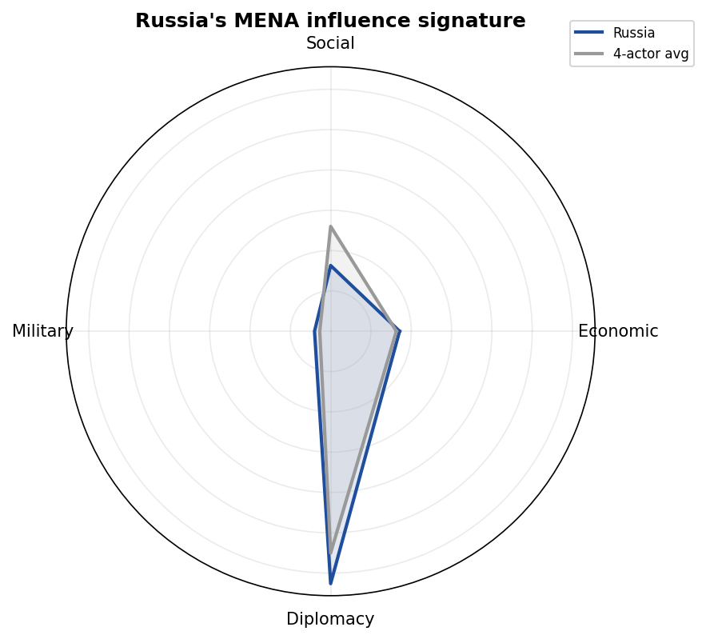
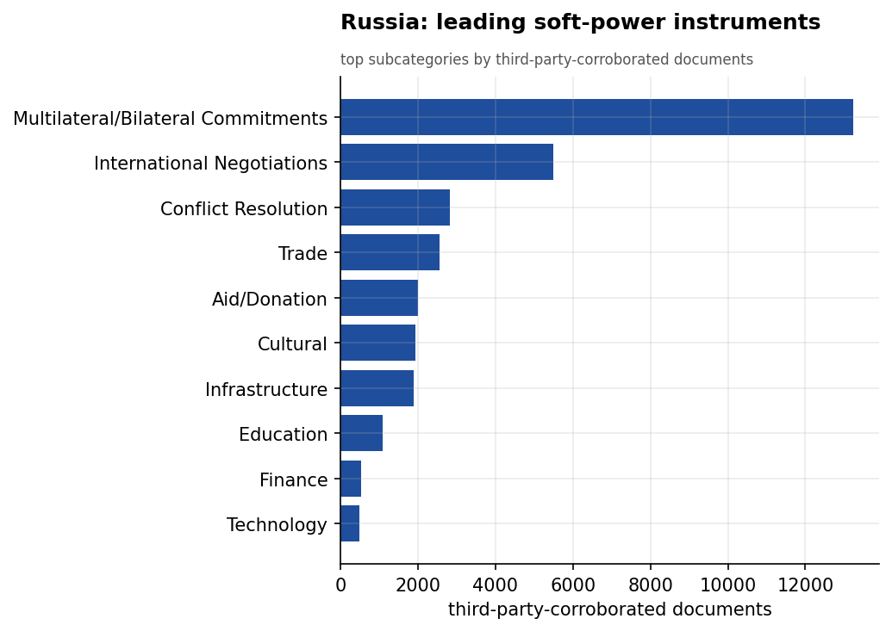
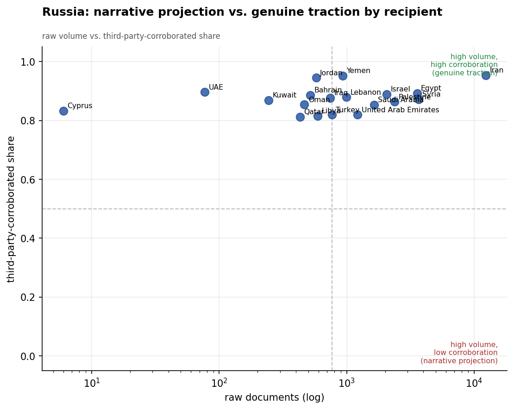
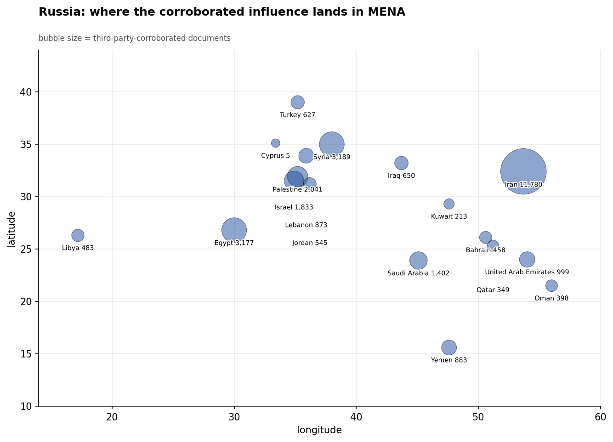
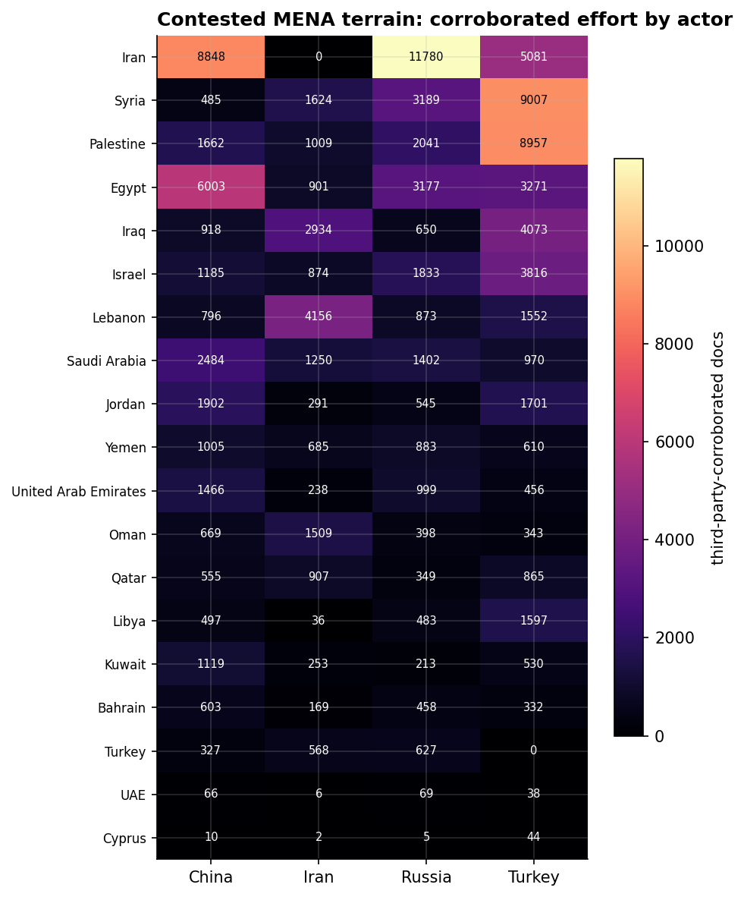
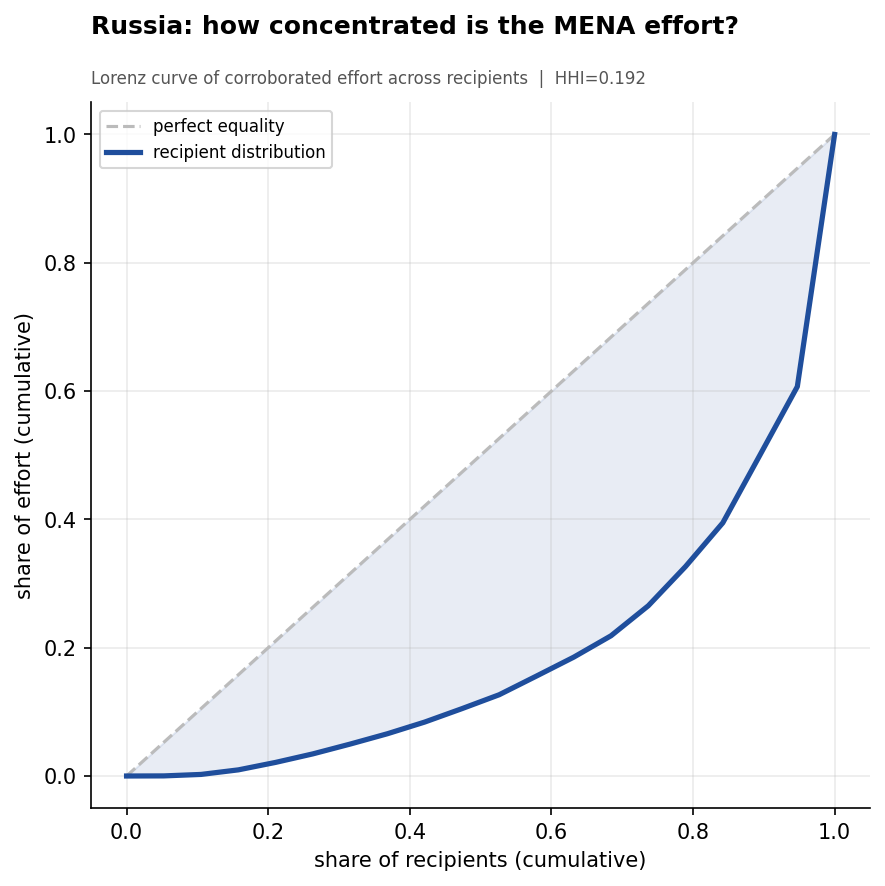
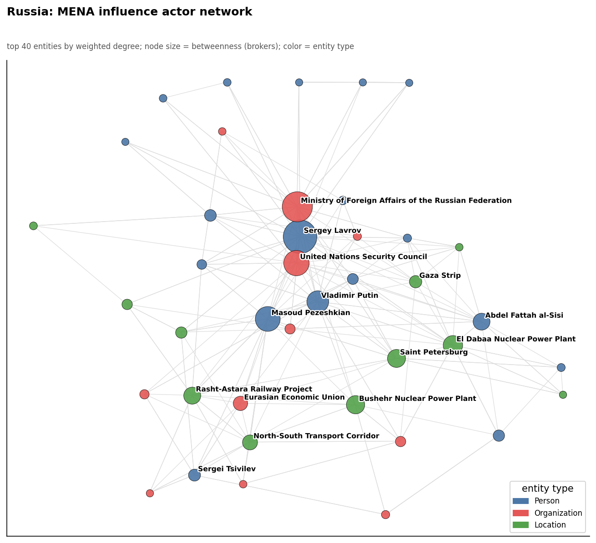
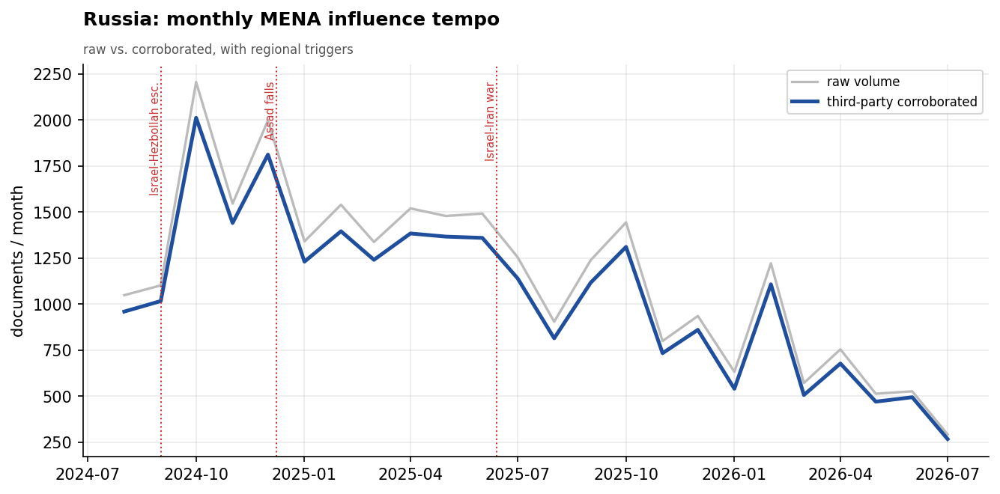

# Russia's Soft-Power Influence in the Middle East & North Africa
### A Strategic Influence Assessment for Policy Analysis

*Observation window: 2024-08-01 to 2026-07-31 (open-source media corpus; refreshed 2026-08-25). Prepared from the
Soft Power Analytics database; method, scope, and caveats per `docs/INSIGHT_REPORT_PROMPT.md`.
Intensity is measured in **third-party-corroborated** documents unless noted. Confidence tags:
**(H)** high, **(M)** moderate, **(L)** low.*

---

## 1. Key Findings (BLUF)

- **Russia's MENA influence is diplomacy-dominated and highly credible.** Diplomacy alone is
  62.6% of its profile — the most diplomacy-heavy posture of the four actors — and its coverage
  is overwhelmingly third-party (self-report share just 0.09, as virtually no Russian-geofocus
  media is in the corpus). Russia's corroborated footprint (25,267 docs) is the third-largest
  in MENA, behind China (26,005) and well behind Turkey (36,518). **(H)**
- **Iran is Russia's single most important MENA relationship by a wide margin** — 11,780
  corroborated docs at a 0.95 corroboration share, exceeding even China's engagement with
  Tehran. Russia, not China, is the dominant external partner in the Iran influence space. **(H)**
- **The El Dabaa Nuclear Power Plant is Russia's flagship strategic anchor in the region.** It
  is the most prominent Russian infrastructure entity and recurs across Russia's highest-
  materiality events — a multi-decade, Rosatom-built nuclear commitment that ties Egypt to
  Moscow far beyond the conflict cycle. **(H)**
- **Russia concentrates on a tight set of partners: Iran, Syria, and Egypt**, with secondary
  reach into Palestine, Israel, and the Gulf. It is a focused, relationship-deep actor rather
  than a broad one. **(M)**
- **Foreign Minister Sergey Lavrov is the personal hub** of Russia's influence network, with the
  Lavrov–Araghchi axis anchoring the Russia-Iran alignment and the UN Security Council serving
  as Russia's preferred multilateral stage. **(H)**
- **Russia leverages great-power conveners** — the St. Petersburg International Economic Forum
  ranks among its top-materiality events as a venue for courting Arab and MENA partners. **(M)**

---

## 2. Strategic Posture

Russia plays MENA as a **great-power broker and energy-security patron**. Its theory of
influence is to present itself as an indispensable diplomatic counterweight to the West — at the
UN Security Council, in conflict mediation, and through marquee economic forums — while binding
key states to Moscow through long-horizon strategic assets, above all nuclear energy. Because
the corpus contains essentially no Russian domestic media, Russia's measured footprint reflects
how the *region and the world* report its activity: a strong indicator that its influence is
real rather than self-narrated.

Russia's posture is notably **narrow and deep**: rather than spreading effort across all 19
recipients, it invests heavily in a handful of strategic relationships — Iran above all, then
Syria and Egypt — where it can convert diplomatic and energy ties into lasting leverage.

---

## 3. Categorical Breakdown

**Diplomacy (62.6%).** *Multilateral/Bilateral Commitments* (13,241 corroborated docs),
*International Negotiations* (5,484), and *Conflict Resolution* (2,832) dominate. Russia
positions as a mediator on Gaza and a partner-of-choice for states seeking alternatives to
Western alignment; the Russian MFA and Lavrov co-occur heavily with the UNSC and the Gaza
file. **(H)**

**Economic (17.1%) — anchored by nuclear energy.** The **El Dabaa Nuclear Power Plant** in Egypt
is the centerpiece: it appears repeatedly among Russia's score-9 events, including direct
engagement between Egypt's Minister of Electricity Mamdouh Ismat and Rosatom CEO **Alexey
Likhachev**, and it co-occurs with the Suez Canal Economic Zone. Trade is a secondary instrument
(2,552 docs). Russia's economic statecraft is concentrated and strategic, not broad. **(H)**

**Social (16.3%).** Aid/Donation and Cultural diplomacy reinforcing the partner narrative. **(M)**

**Military (4.0%).** Low in the soft-power lens, though higher than China's. Russia's hard-power
presence (Syria basing, arms) sits largely outside this dataset; the visible items are defense
diplomacy. **(M)**

---

## 4. Recipient Matrix

| Tier | Recipients (corroborated docs) | Read |
|------|-------------------------------|------|
| **Lead** | **Iran (11,780)** | Russia's #1 MENA relationship; 0.95 corroboration share |
| **Strong** | Syria (3,189), Egypt (3,177) | Legacy ally (Syria) + flagship energy partner (Egypt) |
| **Moderate** | Palestine (2,041), Israel (1,833), Saudi Arabia (1,402) | Great-power balancing across the divide |
| **Light** | UAE (987), Yemen (868), Gulf | Opportunistic |

- **The Russia-Iran axis is the defining feature** — denser and more corroborated than any other
  Russian tie, reflecting deepening strategic alignment (the Government-of-Russia ↔
  Government-of-Iran partnership is Russia's top network edge). **(H)**
- **Egypt is Russia's economic keystone** via El Dabaa; this is the rare case where Russia owns
  a concrete, multi-decade infrastructure asset rather than just diplomacy. **(H)**
- **Russia balances both sides of the Israel question** — meaningful corroborated activity with
  both Palestine (2,033) and Israel (1,830), consistent with its broker posture. **(M)**

---

## 5. Actor & Network Analysis

Russia's network couples **personal diplomacy with one dominant infrastructure node**. **Sergey
Lavrov** is the human hub, his relationship with Iran's **Araghchi** anchoring the Russia-Iran
alignment, while the **Russian MFA** and **UN Security Council** structure the multilateral
posture. Uniquely, a piece of infrastructure — the **El Dabaa Nuclear Power Plant** — sits among
the top entities, brokered by Rosatom's **Alexey Likhachev** and linked to the Suez Canal
Economic Zone. The picture is a two-pillar network: elite diplomacy (Lavrov/MFA/UNSC) plus a
flagship strategic asset (El Dabaa) that gives Russia durable, non-diplomatic leverage in Egypt.
**(H)**

---

## 6. Temporal Dynamics

Russia's raw and corroborated lines track closely (little self-report inflation), and its tempo
is steady with diplomacy-driven peaks rather than crisis spikes. Activity around the El Dabaa
file persists into 2026 (e.g., the April 2026 Ismat–Rosatom engagement), confirming the
nuclear partnership as a *standing* rather than episodic driver. Russia's calendar is set by
summitry (St. Petersburg Forum) and its Iran/Egypt files. **(M)**

**July 2026 (now in-window).** Russia's corroborated tempo fell to 293 docs in July — its
lowest full month on record — consistent with, and reinforcing, the structural-decay finding.
Russia→Iran, its flagship channel, slid 268 → 246 → 167 (May→July), and no Russian role
registered in the July U.S.–Iran mediation round, which ran through Switzerland, Doha, Muscat
and a China–Pakistan track — a notable absence for the actor that owned the Iran file. Its
high-material initiative pipeline produced one gated event in July. **(M)**

**Post-window context (August 1–24, 2026).** The corpus extends to 2026-08-24; August is a
partial month with possible ingestion tail-off. The decay continued: 150 corroborated docs in
24 days, Russia→Iran down to 55, and no August event above the 40-article mark on the Russian
file. **(M)**

---

## 7. Data Gaps & Coverage Priorities

- **Hard power is out of frame.** The soft-power lens omits Russia's military footprint (Syrian
  bases, arms transfers, PMC activity). The 4% military-category share badly understates
  Russia's true security role. **Coverage priority:** fuse this with basing/arms/PMC reporting.
- **Watch El Dabaa as a strategic indicator.** It is Russia's most durable MENA asset; milestones
  and financing on the plant are leading indicators of Russia-Egypt alignment.
- **The Russia-Iran axis is the key relationship to monitor** — its depth here (the densest
  corroborated tie in the dataset) suggests a partnership that increasingly structures both
  actors' regional behavior.
- **No AidData-equivalent for Russia.** Unlike China, there is no verified financial ground-truth
  layer; Russian deal figures rest on media reporting and should be treated as announced.

---

*Visuals plot third-party-corroborated metrics; underlying numbers persisted as sibling CSVs
under `assets/`. Derived analytics documented in `docs/reports/_derived/manifest.md`.*
