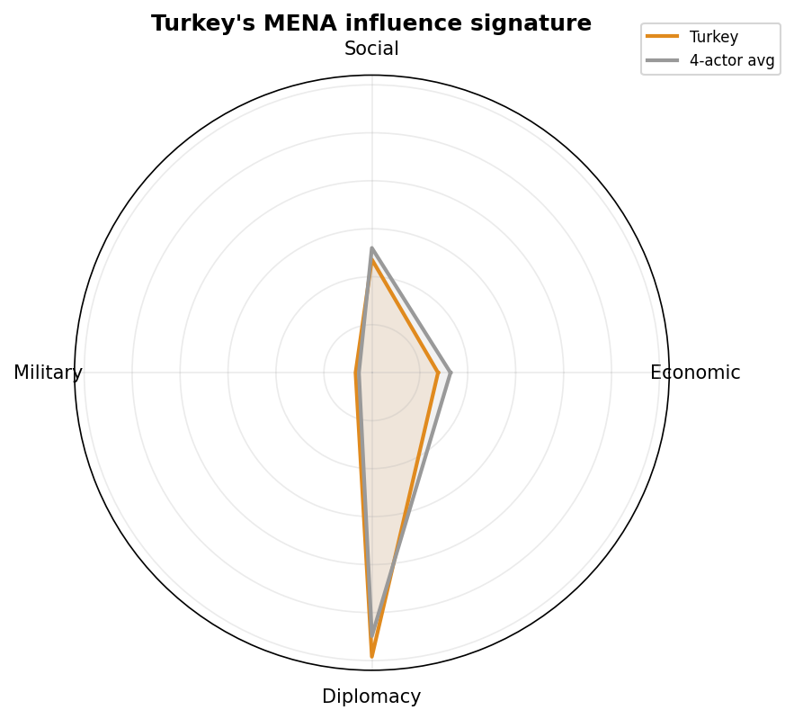
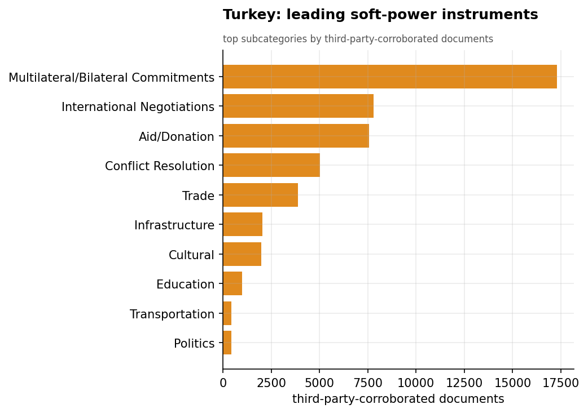
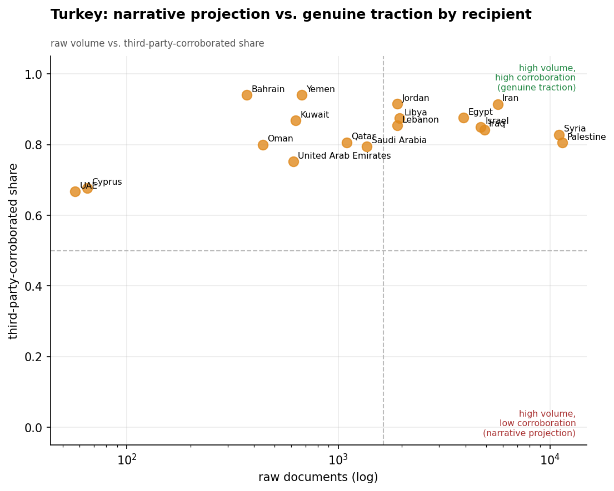
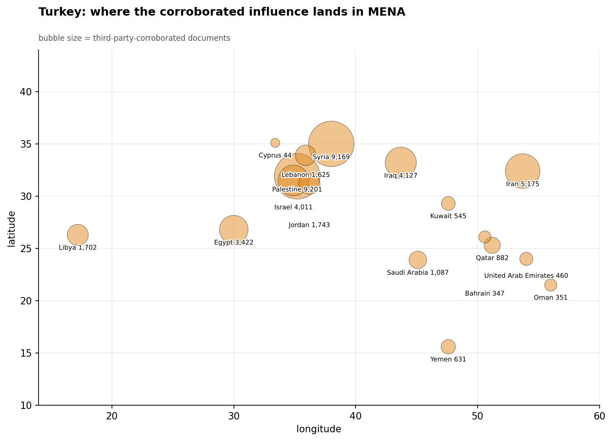
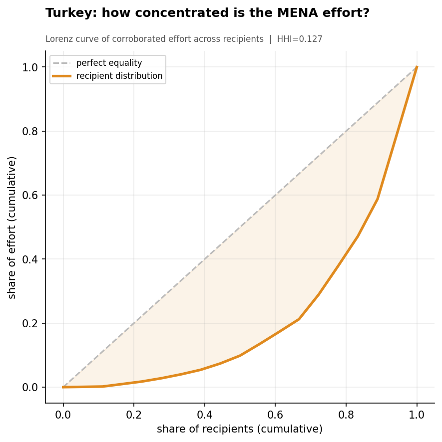
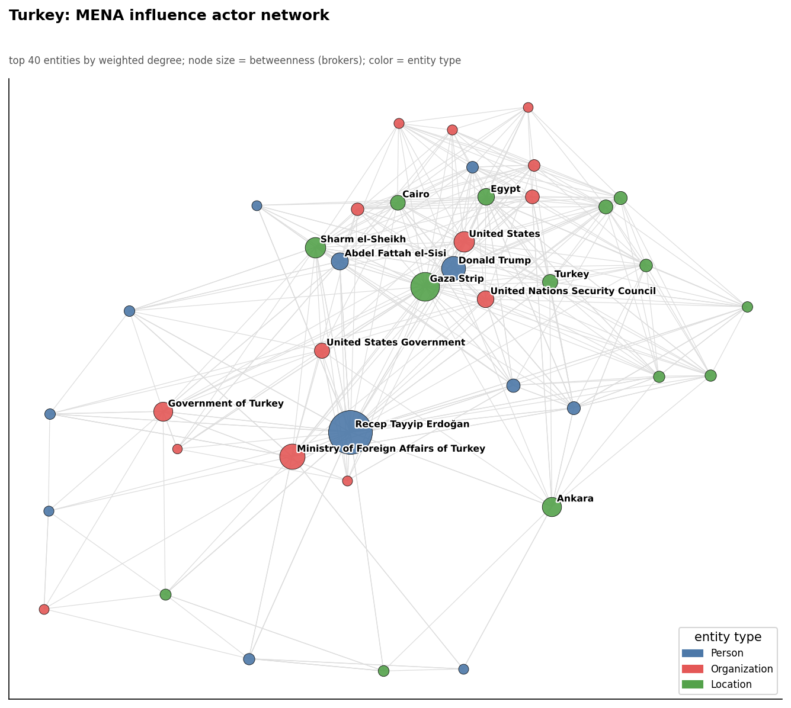
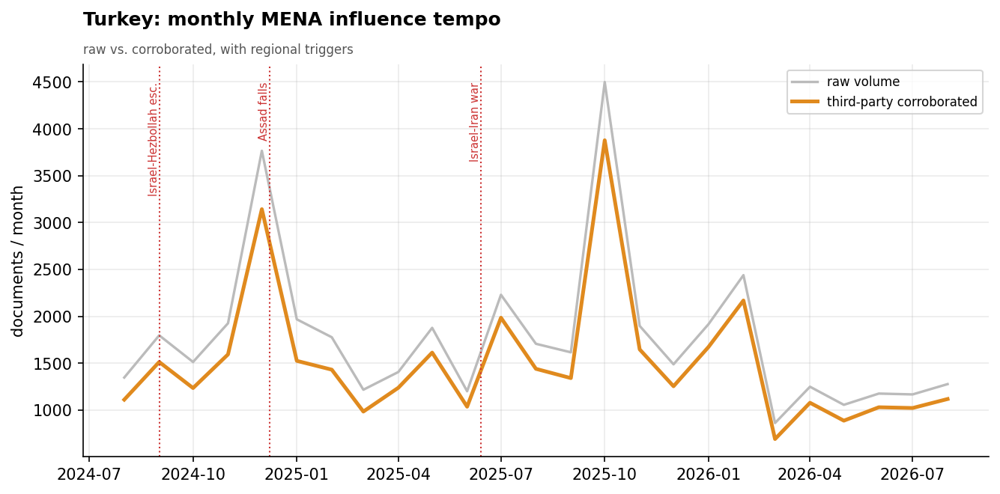

# Turkey's Soft-Power Influence in the Middle East & North Africa
### A Strategic Influence Assessment for Policy Analysis

*Observation window: 2024-08-01 to 2026-07-31 (open-source media corpus; refreshed 2026-08-25). Prepared from the
Soft Power Analytics database; method, scope, and caveats per `docs/INSIGHT_REPORT_PROMPT.md`.
Intensity is measured in **third-party-corroborated** documents unless noted. Confidence tags:
**(H)** high, **(M)** moderate, **(L)** low.*

---

## 1. Key Findings (BLUF)

- **Turkey has the largest credible soft-power footprint in MENA of the four actors assessed** —
  36,518 third-party-corroborated documents, ahead of China (26,005), Russia (25,267), and Iran
  (13,854). Its coverage is overwhelmingly externally validated (self-report share 0.15). **(H)**
- **Turkey owns the region's two highest-salience conflict files: Syria and Palestine.** It
  leads all four actors decisively in Syria (9,007 corroborated docs) and Palestine (8,957) —
  roughly 2.5–4× the next competitor — positioning itself as the indispensable Sunni patron of
  post-Assad reconstruction and the Gaza cause. **(H)**
- **Turkey is the region's premier mediator-convener.** Its top-materiality events are
  diplomatic: hosting Gaza peace negotiations between Israel and Hamas at Sharm el-Sheikh
  (October 2025), the 2026 Gaza Reconstruction "Peace Council," and the **$216B Syria
  reconstruction** commitment alongside Saudi Arabia and Qatar. **(H)**
- **Turkish foreign policy is intensely personalized in President Erdoğan**, the single largest
  entity in Turkey's network (1,783 documents) and the face of its Gaza and Syria diplomacy.
  **(H)**
- **Turkey operates through a Sunni patron-coalition**, especially the **Turkey-Qatar axis** and
  a working **rapprochement with Egypt** — a multi-patron model distinct from Iran's hub-and-spoke
  or Russia's bilateralism. **(M)**
- **A distinctive domestic-regional wildcard: the Öcalan/PKK peace process.** Imprisoned PKK
  founder **Abdullah Öcalan** is a top Turkish entity, reflecting a Kurdish-settlement track that
  carries cross-border implications for Syria and Iraq. **(M)**

---

## 2. Strategic Posture

Turkey pursues **leadership of the Sunni Muslim world through humanitarian diplomacy and
conflict mediation**. Its theory of influence is to convert championing of the Palestinian cause,
sponsorship of Syrian reconstruction, and high-tempo humanitarian aid into the role of
indispensable regional power-broker — a posture that blends Islamic solidarity, neo-Ottoman
ambition, and pragmatic coalition-building. Its footprint is the most externally-corroborated
and the broadest-yet-deepest of the four: Turkey is simultaneously the volume leader *and* the
leader in the region's most contested theaters.

Where China leads on economics and Russia on great-power diplomacy, Turkey leads on the
**conflict and humanitarian agenda** — precisely the files (Gaza, Syria) that dominate MENA's
salience in this period.

---

## 3. Categorical Breakdown

**Diplomacy (59.2%).** *Multilateral/Bilateral Commitments* (17,149 corroborated docs —
the largest single instrument count of any actor), *International Negotiations* (7,768), and
*Conflict Resolution* (5,032). Turkey's diplomacy is mediation-forward: hosting and convening
talks rather than merely issuing positions. **(H)**

**Social (23.7%) — Turkey's force multiplier.** *Aid/Donation* is enormous (7,545 corroborated
docs — the highest humanitarian-aid footprint of the four), the backbone of Turkey's
soft-power brand across Gaza, Syria, and Libya. This is humanitarian diplomacy as strategy. **(H)**

**Economic (13.9%).** Trade (3,858) and Infrastructure (2,041), increasingly fused with the
Syria reconstruction agenda (the $216B Saudi-Qatar-Turkey commitment). Economics is a vehicle
for Turkey's reconstruction-patron role rather than a standalone pillar. **(M)**

**Military (3.1%).** Modest in the soft-power lens; Turkey's defense-industrial exports and
Syrian operations sit largely outside this dataset. **(M)**

---

## 4. Recipient Matrix

| Tier | Recipients (corroborated docs) | Read |
|------|-------------------------------|------|
| **Dominant** | **Syria (9,007), Palestine (8,957)** | Turkey leads all actors here, decisively |
| **Strong** | Iran (5,081), Iraq (4,073), Israel (3,816), Egypt (3,271) | Broad Levant + normalization tracks |
| **Moderate** | Jordan (1,701), Libya (1,597), Lebanon (1,552) | Reconstruction + Mediterranean reach |
| **Light** | Gulf states | Secondary to its Levant focus |

- **Syria is Turkey's defining theater.** Post-Assad, Turkey is the leading external influence
  actor in Syria by a wide margin — reconstruction, humanitarian access, and political
  sponsorship. **(H)**
- **Palestine/Gaza is Turkey's signature cause** — near-parity with Syria, built on hosting
  negotiations and leading reconstruction diplomacy; Erdoğan personally fronts this file. **(H)**
- **Turkey contests Iraq and Iran's neighborhood** — strong corroborated presence in Iraq
  (3,928, leading) reflects both Kurdish/PKK dynamics and economic reach. **(M)**

---

## 5. Actor & Network Analysis

Turkey's network is **personalized at the top and coalitional at the base**. **President
Erdoğan** is the dominant hub, fronting the Gaza Strip file and co-occurring with the region's
mediation venues (notably **Sharm el-Sheikh**, the recurring site of Gaza talks). Beneath him,
Turkey operates through a **Sunni patron coalition**: the **Government of Qatar** and **Government
of Egypt** are Turkey's top partnership edges, with a Qatar-Turkey-Egypt triangle anchoring its
reconstruction and mediation diplomacy. The presence of **Abdullah Öcalan** as a top entity marks
the distinct Kurdish-settlement track. This coalition model — multiple co-patrons rather than a
single spoke — gives Turkey reach and legitimacy across the Sunni Arab world that Iran cannot
match. **(H)**

---

## 6. Temporal Dynamics

Turkey's corroborated tempo is high and rises with the Gaza/Syria agenda. Activity intensifies
around the **fall of Assad (December 2024)** and the subsequent Syria reconstruction push, and
around the **October 2025 Gaza negotiations** at Sharm el-Sheikh and the 2026 Gaza Reconstruction
council. Turkey's calendar is driven by the region's two central conflict files — it surges
precisely where and when the Levant's crises peak, consistent with a mediator that derives
influence from being present at every inflection point. **(M)**

**August 2026 (now in-window).** Turkey's corroborated tempo rose to **1,118 docs** — with
China's summitry surge (1,214) it made August the window's first month with two actors above
1,100. (a) **Turkey→Egypt set a third consecutive record** — 48 → 94 → 151 corroborated docs
Jun→Aug — now Turkey's clearest growth vector. (b) The **Mecca Joint Defense Agreement** (36
docs, 30 outlets, corroboration 1.00) formalized the Turkey–Saudi–Pakistan defense triangle,
capping the Saudi rebound. (c) **Iran's Qatar lead held through August** (934 vs 882 among
the four actors; both files quiet in the month itself). (d) "Gaza Ceasefire and Reconstruction
Diplomacy" (materiality 8.0) stayed live on the mediation franchise, alongside the Lebanon
re-engagement (UNIFIL cooperation, South-Lebanon reconstruction). On the full window,
**Palestine (9,201) edged past Syria (9,169) as Turkey's largest corroborated file** — the
Gaza track overtaking the Syria-reconstruction anchor. **(M)**

**Post-window context (September 1–9, 2026).** Nine days of data: the Gaza and Lebanon
mediation threads carry over (a US-brokered Lebanon–Israel detainee release and a Rome
dialogue push are the file's live items); no new Turkish initiative above ~30 articles yet.
**(M)**

---

## 7. Data Gaps & Coverage Priorities

- **Defense-industrial influence is under-captured.** Turkey's drones and arms exports — a major
  real-world influence vector — barely register in the soft-power lens. **Coverage priority:**
  pair this with defense-trade reporting (Bayraktar/Baykar, naval, etc.).
- **Track the Syria reconstruction coalition.** The $216B Saudi-Qatar-Turkey commitment is the
  region's largest reconstruction undertaking and the centerpiece of Turkey's post-Assad
  leverage; disbursement and Turkish project share are key indicators.
- **The Öcalan/PKK track is a strategic wildcard** with cross-border consequences for Syria and
  Iraq; monitor for shifts that could reshape Turkey's Kurdish-region posture.
- **Turkey-Qatar-Egypt coalition durability.** Turkey's influence is coalition-dependent;
  fractures in the Qatar axis or the Egypt rapprochement would materially reduce its reach.
- **No financial ground truth.** As with Russia and Iran, Turkish figures (e.g., the $216B
  commitment) are media-reported announcements, not verified disbursements.

---

*Visuals plot third-party-corroborated metrics; underlying numbers persisted as sibling CSVs
under `assets/`. Derived analytics documented in `docs/reports/_derived/manifest.md`.*
