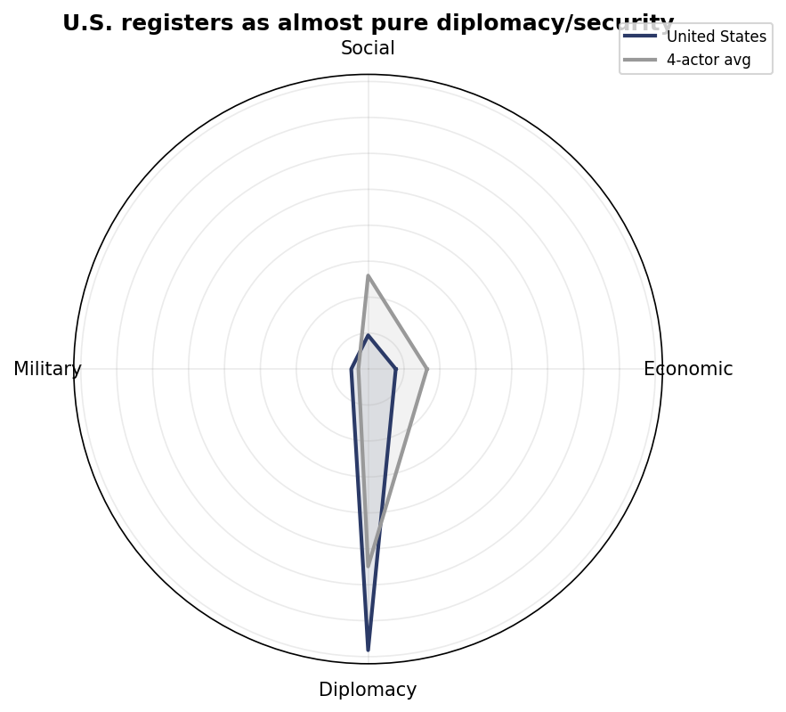
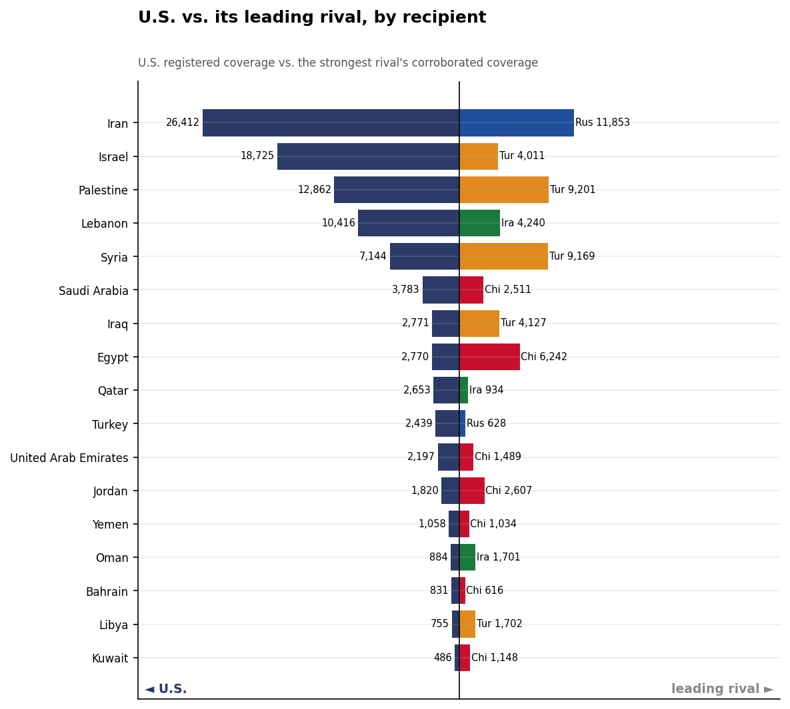
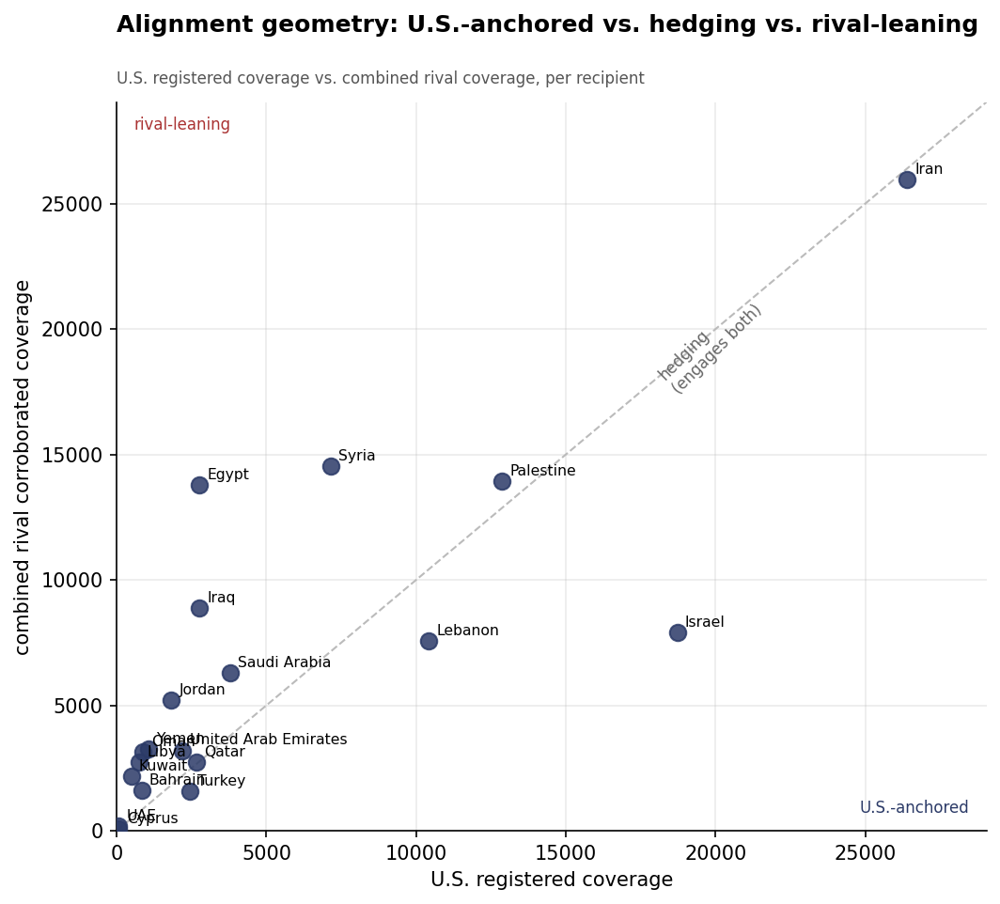
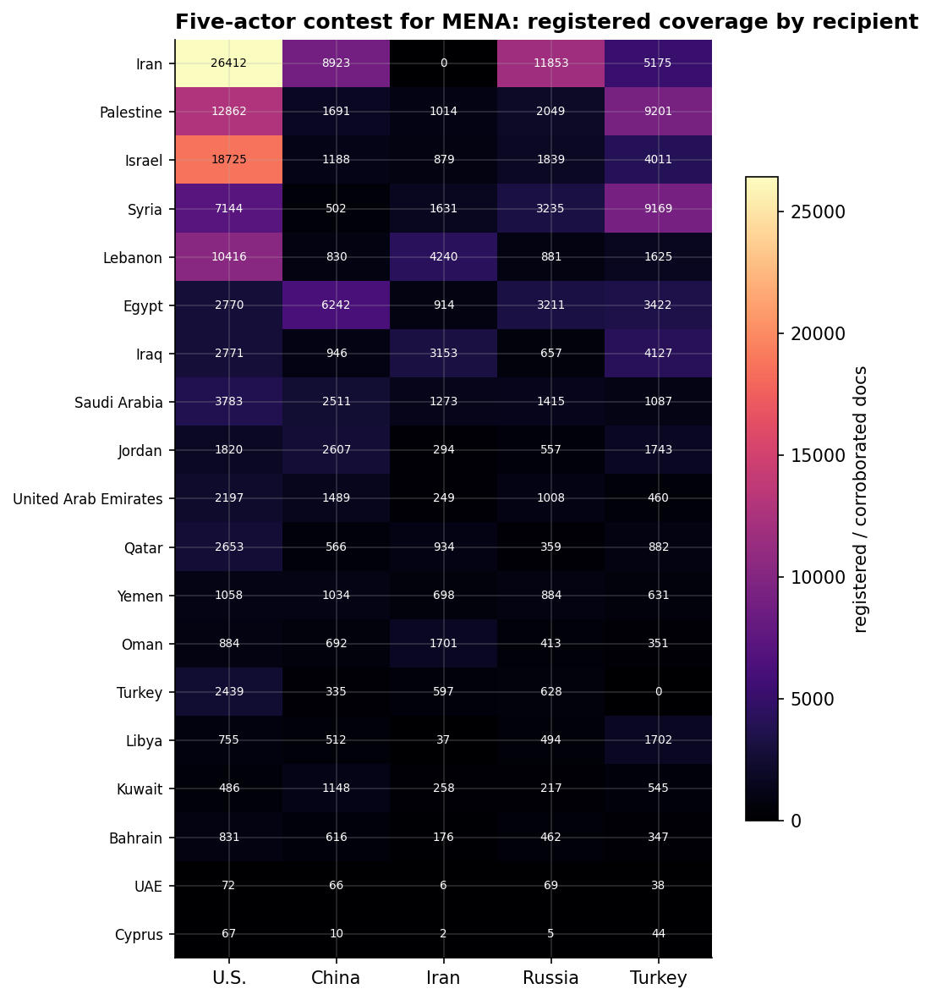
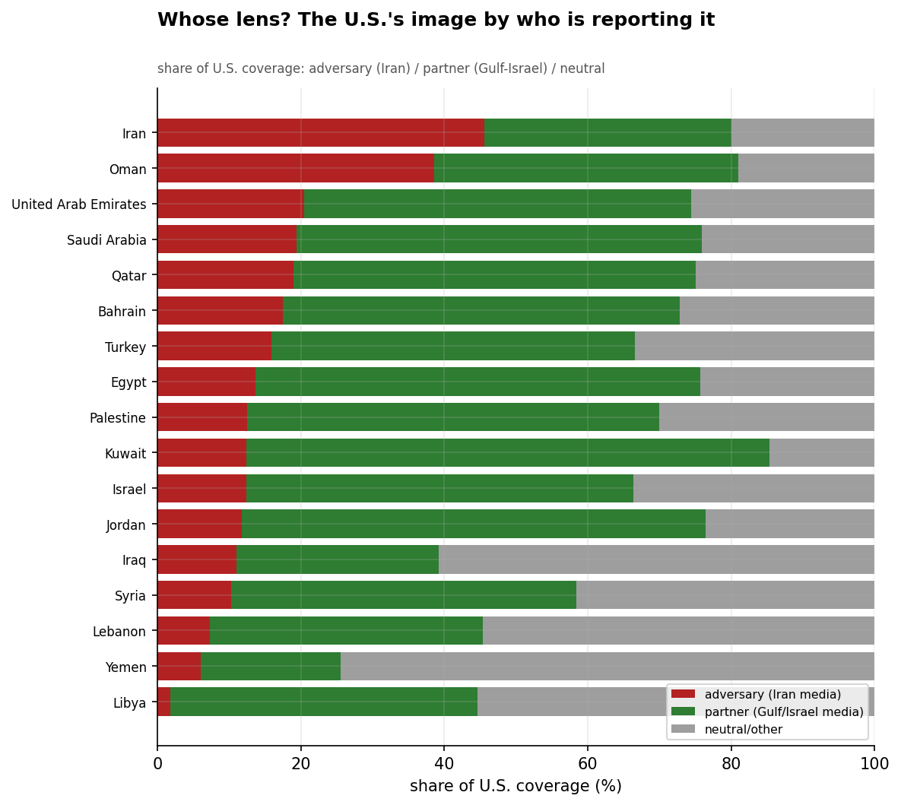
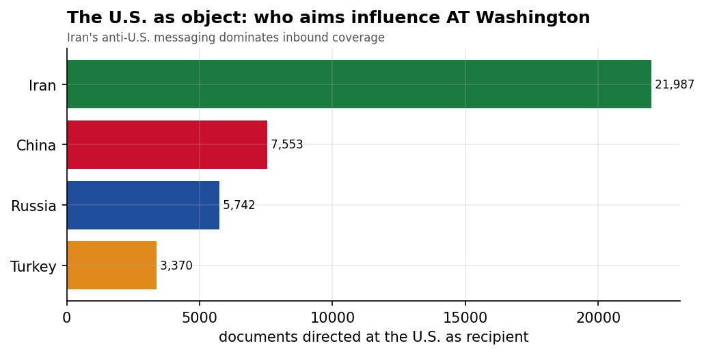
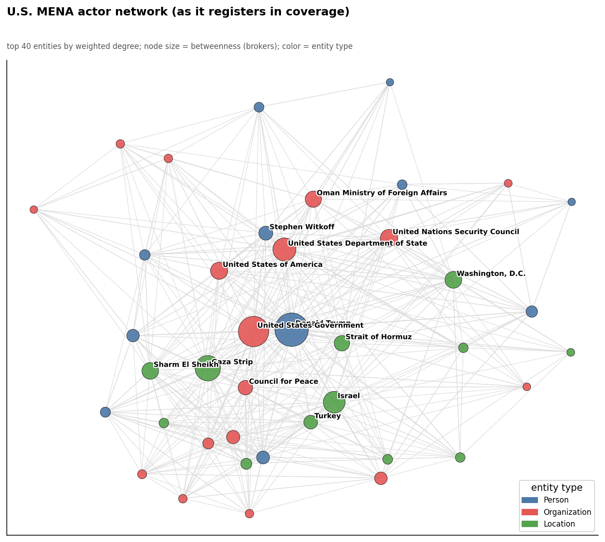
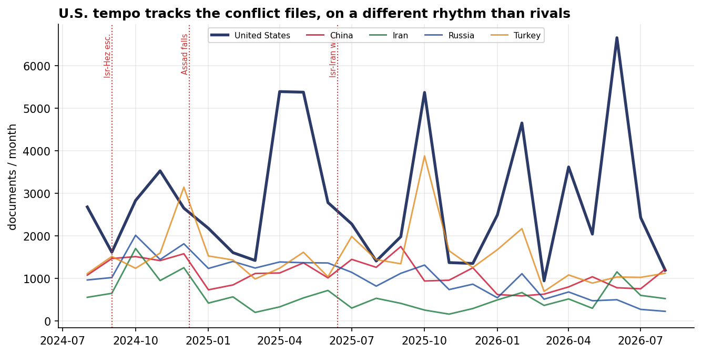

# How U.S. Soft-Power Efforts Register in the Middle East & North Africa
### A Relational Assessment Against China, Iran, Russia & Turkey — for Policy Analysis

*Observation window: 2024-08-01 to 2026-07-31 (open-source media corpus; refreshed 2026-08-25). Method, scope, and
caveats per `docs/INSIGHT_REPORT_PROMPT.md`. Confidence tags: **(H)** high, **(M)** moderate,
**(L)** low.*

> **Read this first — the organizing caveat.** The United States was **not** a collection target.
> This corpus was built to study the soft power of China, Iran, Russia, and Turkey; the U.S.
> appears only as **incidental capture** — wherever its activity intersects one of those four
> actors' stories, refracted through whatever outlet covered that story (~26% of U.S. records
> co-tag one of the four as a co-actor). This is therefore an assessment of **how U.S. efforts
> register in a corpus built around its rivals**, not a measure of U.S. influence in absolute
> terms. The U.S.'s apparent instrument mix is shaped by *what bled through*, and — because the
> corpus contains **zero U.S.-geofocus outlets** — the U.S. has no self-projection signal here:
> its entire image is written by regional, partner, and adversary media.

---

## 1. Key Findings (BLUF)

- **The U.S. registers as a near-pure diplomacy/security actor — the structural inverse of
  China.** 78.3% of its captured footprint is Diplomacy, with Social (9.6%), Economic (7.5%),
  and Military (4.7%) trailing far behind. Where China bleeds through as an economic patron, the
  U.S. bleeds through as a crisis manager. (Treat the share itself as partly a selection
  artifact.) **(M)**
- **The U.S. out-registers every rival on the region's security and conflict files**, but **cedes
  the development files.** It leads on Iran, Israel, Palestine, Lebanon, and Saudi Arabia; it is
  out-registered by **China in Egypt**, and by **Turkey in Syria and Iraq.** **(H)**
- **A quarter of the U.S.'s regional image is written by its adversary.** 24.8% of U.S. coverage
  is carried by Iranian state media; 44.0% by partner (Gulf/Israel) media; 31.2% neutral/other.
  The adversary lens is **not** spread across the Levant — it concentrates on the **U.S.–Iran
  bilateral itself (46.5% Iranian-framed)** and on **Oman (39.9%), the U.S.–Iran mediator.** **(H)**
- **The U.S.–Iran antagonism is the single axis that organizes both actors' footprints.** Iran
  is the U.S.'s most-covered counterpart (25,946 docs) and the U.S. is Iran's most-covered target
  (21,951). Each is substantially defined, in this corpus, by its confrontation with the other.
  **(H)**
- **That confrontation pivoted to a brokered de-escalation in mid-June 2026** — a June 14
  ceasefire Memorandum of Understanding (187 articles, materiality 8.0), U.S.–Iran negotiations
  at Bürgenstock, Switzerland (June 17), a Doha meeting (June 26), and GCC–U.S. joint diplomatic
  engagement on regional security (June 25). This is the strongest confirmation yet of the
  "crisis manager" thesis — and the driver of the U.S.–Iran counterpart file's growth to 25,946
  registered docs. The death of Ayatollah Khamenei in mid-June 2026 reshapes the channel's
  context; succession is an open question. **(M)**
- **U.S. economic engagement is small in share but large in the deals that do register** — the
  **US-Qatar $96B aircraft agreement** and **Trump's 2025 Gulf economic agreements** rank among
  the highest-materiality U.S. events, alongside Gaza peace diplomacy. **(M)**
- **U.S. activity is intensely personalized in President Trump and the Gaza peace process** —
  the Sharm El-Sheikh summit, the "Board of Peace," and a $10B Gaza reconstruction commitment are
  the signature high-impact events. **(M)**

---

## 2. Thread 1 — Influence-Model Contrast: the lane the U.S. owns

Set against the four rivals, the U.S. occupies a distinct and largely **uncontested lane:
security and crisis diplomacy.** Its captured activity is overwhelmingly diplomatic, and what
diplomacy registers is conflict-centric — the Gaza war, the Iran confrontation, the
Israel relationship. This is the mirror image of **China's** economic-patron model (China leads
on trade/infrastructure, ~0% military) and distinct from **Russia's** great-power brokerage,
**Turkey's** humanitarian-mediation model, and **Iran's** confessional projection.

The **lane the U.S. cedes is economic development.** It barely registers on the
trade/infrastructure terrain where China dominates — a structural division of influence labor
visible across the Gulf, where the U.S. supplies security and China supplies capital. The one
place U.S. economics *does* register is in **large transactional deals** (arms and Gulf
investment), not development finance.

---

## 3. Thread 2 — Recipient Tug-of-War & Alignment Geometry

Head-to-head, the U.S. is the leading registered actor in the region's **highest-salience
theaters** — but those are precisely the files defined *by* U.S. involvement:

| Recipient | U.S. registers | Leading rival | Who leads |
|-----------|---------------:|---------------|-----------|
| Iran | 25,946 | Russia 11,780 | **U.S.** |
| Israel | 18,365 | Turkey 3,816 | **U.S.** (dominant) |
| Palestine | 12,623 | Turkey 8,957 | **U.S.** |
| Lebanon | 10,228 | Iran 4,156 | **U.S.** |
| Saudi Arabia | 3,742 | China 2,484 | **U.S.** |
| **Syria** | 7,008 | **Turkey 9,007** | Turkey |
| **Iraq** | 2,747 | **Turkey 4,073** | Turkey |
| **Egypt** | 2,746 | **China 6,003** | China |

The alignment geometry sorts the region into three groups:
- **U.S.-anchored:** Israel (overwhelmingly), and the security-defined files (Iran confrontation,
  Palestine/Gaza, Lebanon). **(H)**
- **Hedging:** the **Gulf states (Saudi, UAE, Qatar)** — they engage the U.S. on security while
  simultaneously absorbing Chinese economic influence; the clearest "both-patrons" behavior in
  the dataset. **(M)**
- **Rival-leaning:** **Egypt** (China's economic flagship), **Syria** (Turkey's reconstruction
  theater), and **Iraq** (Turkey/Iran) — the development and post-conflict files the U.S. does
  not contest. **(H)**

---

## 4. Thread 3 — The U.S.–Iran Counterbalancing Axis

The corpus makes the **U.S.–Iran confrontation the gravitational center** of both actors'
regional presence. The U.S.'s single most-covered relationship is Iran (25,946 docs — adversarial,
not cooperative), and Iran's single most-covered target is the U.S. (21,951). The shared
interlocutor that bridges the two networks is Iranian FM **Abbas Araghchi**, who appears as a top
entity in *both* the U.S. and Iran records — the diplomatic conduit of the antagonism (nuclear
talks, prisoner/sanctions diplomacy, Gaza-war messaging). **Oman** surfaces as the structural
mediator: 39.9% of its U.S. coverage is Iranian-framed, reflecting its role hosting U.S.–Iran
back-channels. The practical implication: a large fraction of what looks like "U.S. influence" in
MENA is the U.S.–Iran duel playing out across third-party venues. **(H)**

---

## 5. Thread 4 — "Whose Lens?" The U.S.'s Image by Who Reports It

Because the U.S. has no media of its own in the corpus, *who reports it* is itself a finding.
Overall, the U.S.'s image breaks down as **44.0% partner-framed** (Gulf/Israel outlets), **31.2%
neutral/other** (recipient-state and unaligned media), and **24.8% adversary-framed** (Iranian
state media). The adversary lens is sharply concentrated:

- **Iran (46.5% Iranian-framed)** and **Oman (39.9%)** — the bilateral confrontation and its mediator.
- **Gulf states (18–21% adversary, 54–57% partner)** — Washington's image in the Gulf is written
  mainly by friendly local media, with a meaningful Iranian counter-narrative.
- **Lebanon (7.6%), Syria (10.3%), Libya (1.8%)** — contrary to a first hypothesis, the Levant's U.S.
  coverage is dominated by *local* media, not Tehran's.

The signal: the U.S.'s exposure to adversarial framing is **a direct function of how much it
engages Iran**, not a generalized regional condition. **(H)**

---

## 6. Thread 5 — The U.S. as Object: Who Aims Influence at Washington

The U.S. is not only an actor but a **target**. Among the four, **Iran directs by far the most
influence at the U.S. (21,951 docs)** — an anti-U.S. narrative that is itself one of Iran's
largest single "soft-power" outputs — followed by **China (7,431)**, **Russia (5,705)**, and
**Turkey (3,274)**. For Iran, antagonizing Washington is a core influence activity; for China and
Russia, the U.S. is a great-power reference point in their messaging. **(M)**

---

## 7. Actors, Events & Tempo

The U.S. network is **institutional and venue-centric**: the **U.S. Government**, the **State
Department**, the **UN Security Council**, and **Washington, D.C.** as a recurring venue, with
the **Gaza Strip** as the dominant issue-node and **Araghchi** as the bridge to Iran. President
**Trump** personalizes the high-materiality events. Those events split into two baskets: **Gaza
peace diplomacy** (the 2025 Sharm El-Sheikh Peace Summit, the "Board of Peace," a $10B Gaza
reconstruction commitment, the US-EU Gaza reconstruction initiative) and **transactional Gulf
deals** (the US-Qatar $96B aircraft agreement; Trump's 2025 Saudi/Qatar economic agreements).

Temporally, U.S. activity **tracks the conflict files** — rising with Gaza diplomacy and the
Israel-Iran confrontation — on a rhythm distinct from China's summit-driven cadence and closer to
Turkey's crisis-driven one. The U.S. surges where the region's security crises peak, consistent
with its registered role as the indispensable crisis actor. **(M)**

The window's final fortnight — June 16–30, 2026, missed by the prior cutoff — shows the
U.S.–Iran confrontation pivoting to a **brokered de-escalation**: a June 14 ceasefire
Memorandum of Understanding (187 articles, materiality 8.0), U.S.–Iran negotiations at
Bürgenstock, Switzerland (June 17), a Doha meeting (June 26), and GCC–U.S. joint diplomatic
engagement on regional security (June 25). The sequence is the strongest confirmation yet of
the crisis-manager thesis — and the driver of the U.S.–Iran counterpart file's growth to
25,946 registered docs. The context of that channel was simultaneously reshaped by the death
of **Ayatollah Khamenei** in mid-June 2026, with funeral ceremonies extending from late June
into July; succession remains an open question. **(M)**

### August 2026 (now in-window) and post-window context (September 1–9)

*The analysis window now closes 2026-08-31; the corpus extends to 2026-09-09, and September
is nine days of data — context, not analysis-grade.*

- **August, in-window: the U.S.–Iran channel narrowed to the Strait of Hormuz.** The month's
  largest U.S.-file events are two Hormuz negotiation rounds ("US-Iran Negotiations on
  Strait of Hormuz," 85 articles, and "US-Iran Strait of Hormuz Negotiation," 81 — both
  materiality 7.5) and a "Proposal to reopen the Strait of Hormuz" (47). On the Gaza file, a
  **"Gaza Agreement"** (52 articles, materiality 8.0) and the "second phase of President
  Trump's plan" (50) carry the ceasefire-diplomacy thread opened July 31. The
  **Lebanon–Israel framework track cooled sharply** through August after July's peak. Iran
  (466 registered docs), Israel (360) and Palestine (239) remain the top U.S. counterpart
  files — the crisis-manager profile unchanged.
- **September post-window: the Lebanon–Israel track re-warmed in Rome** — a US-brokered
  **detainee release** and a push to resume the **Rome dialogue** are the U.S. file's only
  sizable September items (alongside a U.S.-linked training program at the Egyptian Military
  Academy), consistent with the framework moving in stop-start rounds rather than dying.

---

## 8. Data Gaps & Coverage Priorities

- **Selection bias is the master caveat.** The U.S.'s diplomacy-heavy, conflict-centric profile is
  partly an artifact of appearing only inside stories collected about its rivals. The U.S.'s
  development, cultural, and economic engagement that does *not* intersect the four actors is
  systematically under-captured. **Do not read this as a complete picture of U.S. soft power.**
- **No U.S. self-projection signal.** With zero U.S.-geofocus outlets, this corpus cannot measure
  how the U.S. *narrates itself* — only how others narrate it. Pair with U.S.-origin and
  partner-origin reporting to balance the adversary lens.
- **The adversary-framing share is a monitoring metric.** The 25% Iranian-framed share — and its
  concentration on the Iran bilateral and Oman — is a useful gauge of how much of Washington's
  regional image is shaped by Tehran's megaphone; watch it move with the state of U.S.–Iran
  diplomacy.
- **The Gulf hedge is the key strategic dynamic** for U.S. policymakers: Gulf states anchor to U.S.
  security while leaning to Chinese economics. The division of influence labor (U.S. security +
  China capital) is the most consequential pattern this comparative lens reveals.

---

*Visuals plot registered/corroborated coverage; underlying numbers persisted as sibling CSVs
under `assets/`. Derived analytics (incl. `analytics.us_report_base` with framing classification)
documented in `docs/reports/_derived/manifest.md`. Cross-actor synthesis in
[`../README.md`](../README.md).*
